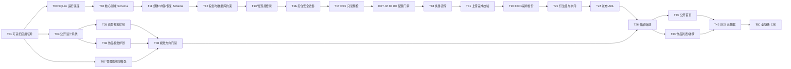

# 任务清单：兽装工作室主页

> **角色**：PLAN 的可勾选分解（对应 spec-kit `/tasks`）；每个 `[ ]` 都是可独立完成、可验证、可留下证据的实施单元。
> **写入日期**：2026-07-29。
> **当前状态**：阶段 4 已于 2026-07-28 获用户明确授权；T01 已完成，下一项为 T02。
> **权威顺序**：`foundation/README.md` → `requirements/SPEC.md` → `planning/PLAN.md` → 本文件。发现契约缺口时回到对应阶段登记 OQ，禁止在代码中猜答案。

## 当前目标

在不增加站内委托表单、交易、支付、多管理员、万能 CMS、自动媒体 worker 或未确认业务规则的前提下，交付一个单 Nuxt 4 全栈应用：公开站以 SSR 和响应式衍生图提供图片主导的作品浏览与基础 SEO；独立后台以 CSR、Nitro、SQLite/Drizzle 和阿里云 OSS 条件直传支持景宸安全维护作品、媒体、状态与站点内容。所有写操作保持幂等，公开投影不泄露敏感字段，原图不覆盖、不匿名公开。

## 阶段 3 入口门禁

- [x] **GATE-01 · SPEC/PLAN OQ 门禁**：计数格式统一为“总计/已答/已搁置/待答”；SPEC `118/96/22/0`、PLAN `23/19/4/0`，待答均为 0；`OQ-010–013` 的已搁置原因不阻塞本地实现。
- [x] **GATE-02 · 技术路线门禁**：单 Nuxt 4 应用、Node.js 24 LTS、Nitro、SQLite/Drizzle/`better-sqlite3`、OSS V4 条件直传/图片处理、单镜像/单进程已锁定。
- [x] **GATE-03 · 设计输入门禁**：公开站与管理端的 Design Brief、IA 和 Token 契约已分别写入 `../.design/public-site/` 与 `../.design/admin-console/`。
- [x] **GATE-04 · 原型边界门禁**：v5 只锁定页面职责、内容顺序和关键交互；几何插画、字体、间距、组件造型、后台弹窗布局和整体完成度不得直接进入生产。
- [x] **GATE-05 · 阶段 3 授权边界**：用户已明确授权形成 TASKS；本门禁不授权实施，本轮不搭建 Nuxt 工程、不创建数据库、不连接 OSS、不写业务源码。

## 执行期外部门禁

- [x] **GATE-06 · 阶段 4 实施授权**：2026-07-28，用户明确授权：“好的 现在允许你进入阶段4 从T01开始实施”。授权范围从 T01 开始，后续任务仍按依赖与逐项验收推进。
- [ ] **EXT-01 · 正式素材门禁**：在 `implementation/notes/` 建立素材 manifest，逐项记录被替换占位、文件路径或受控引用、权利人、公开网页使用授权证据、使用页面，以及桌面/手机焦点与文字安全区；所有一期必需占位均有已确认替换项后才可勾选并开始 T51。
- [ ] **EXT-02 · OSS 30 MB 图片处理配额门禁**：只读记录杭州目标地域的图片处理源图大小配额，确认不低于 30,000,000 字节；若不足，由用户在阿里云配额中心申请，完成后复验。再用 `test/<run-id>/` 下不含个人信息的 20–30 MB 合成图片完成一次 V4 上传、图片信息和 `sys/saveas` 处理冒烟并精确清理。全部 PASS 后才可开始 T18；禁止把景宸例图作为测试上传、静默压缩原图或把产品上限退回 20 MB。

## 执行规则

- 每项任务完成后才把 `[ ]` 改为 `[x]`，并在 `implementation/notes/` 记录日期、变更路径、验证命令、结果和遗留风险。
- 任务中的“创建/修改组件”遵循 designer-skills 的垂直切片：结构、样式、交互、响应式状态和最小验证在同一任务闭环，不拆成“先 HTML、后 CSS、再 JS”。
- Vue 实现统一使用 Vue 3 Composition API、`<script setup lang="ts">`、显式 Props/Emits；路由页保持组合层，复杂状态进入按功能组织的组件和 composable。
- Nuxt 4 应用代码位于 `app/`；`server/`、`shared/`、`db/`、`tests/` 保持根级。公开组件不得依赖后台表格、编辑器或上传组件。
- 每个管理写接口必须有服务端权限/字段校验、幂等键或资源版本、可读错误和集成测试；客户端路由中间件不是权限边界。
- 自动化测试只使用独立临时 SQLite 文件和 `test/<run-id>/` OSS 前缀；任何清理操作先验证当前环境、Bucket 和精确前缀，禁止触碰 `dev/` 或 `prod/`。
- 对用户、景宸或阿里云控制台才能确认的外部事实，任务执行到该门禁即暂停；不得自动修改账号级 Block Public Access，不得用 Nitro 代理上传或双 Bucket 临时绕过。
- 以下脚本名由 T01 建立并保持稳定：`pnpm lint`、`pnpm typecheck`、`pnpm test`、`pnpm test:integration`、`pnpm test:e2e`、`pnpm build`。依赖安装与构建使用 frozen lockfile。
- 本文件中的 `must-fix` 指违反已锁定 SPEC/PLAN/`.design` 契约，或使任一固定视口的主要浏览/编辑路径不可完成的问题；没有对应契约和客观复现步骤的纯偏好不得冒充 `must-fix`。
- “手机轻量能力”固定指登录、查看、状态切换、文字修改、单图上传和发布；不包含复杂裁切、拖拽批量、复选下载或永久原图档案管理。

## 依赖主链

未在主链展示的任务按各条目的“依赖”执行。

## A. 工程底座与生产设计门禁

- [x] **T01 · 建立可运行的双访问面最小切片**：创建单 Nuxt 4/Vue 3/TypeScript strict 工程，固定 Node 24、Corepack/pnpm、`pnpm-lock.yaml`、`pnpm-workspace.yaml` 的依赖构建许可和六个标准脚本；交付一个 SSR 首页占位、一个 `/admin/login` CSR 页面、一个 `/api/health`，并确认 `app/`/`server/`/`shared/` 根界限。_创建：应用壳、公开/后台 layout、测试入口；依赖：GATE-06；验证：执行 `pnpm install --frozen-lockfile` 及 `pnpm lint`、`pnpm typecheck`、`pnpm test`、`pnpm test:integration`、`pnpm test:e2e`、`pnpm build`，全部退出码为 0；SSR HTML 非空，`/admin/**` 不做 SSR。证据：[`notes/T01-2026-07-28.md`](./notes/T01-2026-07-28.md)。_
- [ ] **T02 · 收敛运行配置、Host 与安全日志边界**：用服务端 Schema 校验 `PUBLIC_BASE_URL`、`ADMIN_BASE_URL`、`MEDIA_BASE_URL`、`OSS_UPLOAD_BASE_URL`、`DATABASE_FILE`、OSS、Session、SMTP 等配置，提供不含真实值的 `.env.example`；建立公开/后台 Host allowlist、开发 Host 映射和敏感字段日志脱敏。_创建：runtime-config Schema、Host 中间件、日志工具；依赖：T01；验证：缺失/非法配置快速失败；公开 Host 精确拒绝 `/admin/**`、`/api/admin/**`、`/api/auth/**` 与 `/preview/**`，后台 Host 隔离规则符合 PLAN，`/api/health` 的允许 Host 有显式测试；日志不出现凭据、签名查询串或客户敏感字段。_
- [ ] **T03 · 建立共享契约与错误语义**：建立 Zod 枚举、请求/响应 Schema、公开 DTO、管理员 DTO、资源版本/幂等键和统一错误格式；数据库行对象禁止直接跨到客户端。公开 DTO 允许已发布领养/掉落作品的人民币价格与有序短属性，其他作品不得误投影价格。_创建：`shared/schemas`、`shared/types`、服务端 mapper；依赖：T01；验证：类型检查、短属性 0–8 条/1–24 字/去重 Schema 单测、价格适用性单测，以及“公开 DTO 不含联系方式/付款备注/原图键/认证字段”泄漏守卫。_
- [ ] **T04 · 实现公开站视觉系统与导航壳**：把 `../.design/public-site/DESIGN_TOKENS.md` 翻译为实际 CSS/Tailwind Token，使用 `#1D2D5A`、`#293C84`、`#324DAF`、`#6274BB`、`#CED3E5` 的受控蓝色阶，创建 `PublicHeader`、`PublicMobileNav`、`PageIntro`、`ResponsiveAsset`、`PublicFooter`；首页覆盖态与内页白底态、390/768/1440 响应式、键盘焦点和减少动效同时完成。_创建：公开基础组件；依赖：T01–T03；验证：三视口截图、Token 值检查、公开站无后台入口/内部文案/横向溢出，公开组件 Bundle 不包含后台组件。_
- [ ] **T05 · 用类型化夹具完成首页生产级视觉样张**：按设计简报实现使用用户授权开发夹具（非生产素材）的全幅作品首屏、3–6 件精选轨道、图片式委托/领养入口、营业状态和可选领养推荐；完成箭头、触控滑动、键盘浏览、主图安全区与减少动效。_创建：`HeroMedia`、`FeaturedWorkRail`、`ImageRouteCard`、`BusinessStatus`；依赖：T04；验证：390/768/1440 截图、首屏后第一个区块为精选作品、无自动轮播、文字不遮挡夹具主体焦点。_
- [ ] **T06 · 用类型化夹具完成作品列表与详情视觉样张**：实现用途 × 装型交集筛选、结果数、人工顺序、等大 3:4 网格、空结果和 `/works/{slug}` 详情图集；详情是独立路由，灯箱只服务图集。样张覆盖有/无人民币价格、有/无作品短属性两种状态，并使用全装掉落 `¥15,600` 作为已确认示例。_创建：`WorkFilterBar`、`WorkGrid`、`WorkCard`、`WorkDetailGallery`；依赖：T04；验证：1440 × 900 四列、768 × 1024 三列、390 × 844 两列，筛选不改变人工顺序，缺省价格不留下空标签/占位，普通链接在关闭 JavaScript时仍进入详情。_
- [ ] **T07 · 用类型化夹具完成管理端工作台视觉样张**：按 `../.design/admin-console/` 实现独立登录、无数据看板的管理壳、作品列表、四步新建框架、已有作品编辑页与发布检查；常规编辑使用页面而非全屏弹窗，PC 表单/预览关系和手机轻量导航同时验证。_创建：`AdminLoginPanel`、`AdminShell`、`AdminNav`、`WorkTable`、`WorkCreateStepper`、`WorkEditor`、`PublicationChecklist`；依赖：T01–T03；验证：390/768/1440 截图，未登录 DOM 不含管理数据；手机只显示已定义的轻量能力，不显示复杂裁切、批量拖拽、复选下载或永久档案管理。_
- [ ] **T08 · 完成第一次生产设计审查并锁定方向**：运行 designer-skills 的 design-review，对 T05–T07 以 `390 × 844`、`768 × 1024`、`1440 × 900` 截图审查层级、图片节奏、标题断行、裁切、导航、控件状态、响应式，以及 `.design` 已列明的未经许可装饰、占位文案、过强叠层和抢夺作品焦点等反模式；产出 `implementation/notes/T08-design-review-<日期>.md`，每条问题记录 ID、视口、违反条款、严重度、修改前后截图和处置。_修改：T04–T07 组件；依赖：T05–T07；验证：`must-fix=0`，并保存用户明确“通过/不通过”的日期与原话；通过前不得开始 T25–T46，T09–T24 可按各自依赖执行。若意见改变页面职责/CTA，先回 PLAN。_

## B. SQLite、领域模型与认证

- [ ] **T09 · 建立 SQLite 运行与迁移底座**：接入 Drizzle/`better-sqlite3`，实现版本化 SQL 迁移、单连接生命周期、`WAL/foreign_keys/busy_timeout/synchronous` 启动设置与验证；自动化每次使用独立临时文件。_创建：DB 插件、迁移 CLI、测试库工厂；依赖：T01–T03；验证：空库迁移、重复迁移幂等、外键/WAL 检查、开发库不会被测试清理。_
- [ ] **T10 · 建立作品、短属性、业务状态与稳定 URL Schema**：实现 `works`、`work_feature_tags`、`slug_redirects`、`events`、`business_statuses` 及必要约束；一件作品对应一个角色，领养方式、六种业务状态和发布状态分离，`展会出售中` 约束当前展会，首次发布后 slug 默认冻结；作品默认顺序、角色领养列表顺序和首页精选顺序分别持久化。人民币金额使用明确币种/最小货币单位字段，只允许领养/掉落作品填写；美元字段保留但一期禁用。短属性使用固定语义有序子表而非 EAV。_创建：核心 Schema/迁移/夹具；依赖：T09；验证：唯一/检查/事务/并发版本、三类人工顺序独立性、0–8 条短属性/位置/去重、人民币适用性、美元禁用夹具，普通作品可无领养字段，同一角色不产生重复作品。_
- [ ] **T11 · 建立媒体、内容、安全与恢复 Schema**：实现 `assets`、`work_assets`、`publication_operations`、`users`、`password_reset_tokens`、`commission_faqs`、`site_content`、`trash_entries`、`audit_logs`、三类日汇总统计表及索引；`publication_operations` 只持久化发布/下架的意图、逐对象 ACL 进度、补偿状态与人工处置结果，不作为队列或自动 worker；数据库层硬拒绝第二管理员。_创建：扩展 Schema/迁移；依赖：T10；验证：图片来源互斥、数量上限/唯一设定图、单管理员、FAQ 顺序、发布操作中断记录、回收站和敏感字段索引测试。_
- [ ] **T12 · 实现领域服务、公开投影与夹具闭环**：为作品、媒体、站点内容和统计建立服务层与显式 mapper；提供虚构开发夹具和最小公开投影，不把 Vue 页面直接耦合到 Drizzle。公开投影保留有序短属性，并仅为已填写价格的领养/掉落作品输出人民币金额/币种。_创建：服务/Repository 边界、fixture loader；依赖：T10–T11；验证：夹具可重复装载不重复，适用价格公开/缺省价格整区隐藏/非适用作品拒绝价格、短属性顺序、敏感字段泄漏、事务回滚和 SSR 请求间无模块级状态泄漏。_
- [ ] **T13 · 实现唯一管理员初始化与登录切片**：提供受保护、幂等的初始化命令；接入 `nuxt-auth-utils` 密封 Cookie Session，支持用户名或邮箱 + 密码登录、退出和后台 CSR 会话恢复。_修改：T07 登录与管理壳；依赖：T11–T12；验证：相同身份重复初始化无操作、不同身份拒绝、无注册/第二管理员入口、Cookie 为 Host-only/HttpOnly/SameSite，未登录 API 与页面不泄露内容。_
- [ ] **T14 · 实现锁定、无操作过期与会话版本**：连续失败 5 次锁定 30 分钟，错误不泄露账号存在性；有效活动按节流刷新 8 小时无操作过期；改密/找回递增 `sessionVersion` 使旧会话失效。_修改：认证服务与登录状态 UI；依赖：T13；验证：可控时钟覆盖阈值、锁定恢复、有效活动按节流续期、连续无活动超过 8 小时失效、多会话失效；不得把它实现成固定登录后 8 小时的绝对过期，若需绝对最长生命周期先登记 OQ。_
- [ ] **T15 · 实现改密与单次找回邮件**：找回 token 只存哈希、30 分钟单次有效；自动化使用 mock transport，显式 `smtp-smoke` 才允许向注入的测试收件人发送 QQ SMTP 邮件。_创建：账号安全页面、找回/重置 API、邮件模板；依赖：T13–T14；验证：token 过期/重放/改密旧会话失效、错误不枚举邮箱、mock 集成测试；真实 SMTP 冒烟由 T50 执行。_
- [ ] **T16 · 完成后台/认证接口授权、CSRF/Origin、限流与审计底座**：所有 `/api/admin/v1/**` 复核 Session、`sessionVersion`、锁定状态和资源权限；`/api/admin/v1/**` 与 `/api/auth/**` 的写请求实施严格 Origin/Host + CSRF 策略、请求体限制和分层限流，登录/忘记密码/重置分别限制并防止邮件滥用；创建/修改/删除记录账号与时间。_创建：服务端授权中间件、认证接口保护、审计 helper；依赖：T02、T13–T15；验证：伪造 Host/Origin、公开 Host、过期会话、跨站写入、限流/邮件滥用、找回 token 或完整重置 URL 日志泄漏，以及只靠前端隐藏的绕过测试。_

## C. 阿里云 OSS 媒体底座

- [ ] **T17 · 执行 OSS 预检、授权配置与复验门禁**：第一步只读验证杭州 Bucket/region/上传 Endpoint、图片处理源图大小配额、两个完整开发 origin、CORS 方法/请求头、账号级与 Bucket 级 Block Public Access、已发布衍生图 `public-read` 能力、原图 `private` 和 `test/<run-id>/` 前缀隔离；报告逐项记录期望值、实测值和 PASS/FAIL。任一 FAIL 均保持 T17 未完成并停止：配额申请、账号级变更与上传 CNAME 只由用户在控制台处理；Bucket CORS/BPA 等变更必须由用户另行明确授权精确目标后执行或由用户手工完成，随后重新运行只读复验。_创建：preflight/config 命令与脱敏记录模板；依赖：T16；验证：除独立 EXT-02 实测外的预检项目全部 PASS 后才能勾选 T17；不上传生产素材、不静默修改任何设置、不以 Nitro 代理、双 Bucket 或压缩原图绕过。_
- [ ] **T18 · 实现 V4 条件直传会话与浏览器上传**：浏览器校验格式/字节/数量/像素并计算 SHA-256、Content-MD5；服务端创建 5 分钟会话和不可预测私有 Key，签名固定 `Content-Type`、MD5、SHA-256 metadata 与禁止覆盖；客户端直接 PUT 并显示进度。_创建：presign API、上传 composable、`MediaUploader`/`UploadItem`；依赖：T17、EXT-02；验证：30,000,000 字节接受、30,000,001 字节拒绝、错误格式/数量、请求头篡改、重复 PUT/Key 覆盖拒绝，图片二进制不经过 Nitro。_
- [ ] **T19 · 实现上传完成校验与无效对象处理**：完成回调携带会话、ETag 和客户端宽高；服务端 HEAD/图片信息复核 Key、字节、MIME、MD5/ETag、SHA-256、魔数和像素，成功进入待处理，失败保留可读状态并尽力删除无效对象。_创建：complete API、上传会话状态；依赖：T18；验证：伪造 ETag/MIME/元数据、超过 12,000px、错误魔数、删除失败待人工处理清单。_
- [ ] **T20 · 锁定 EXIF 显示坐标与衍生身份算法**：实现 Orientation 1–8（含镜像方向）的显示画布换算、归一化焦点和 3:4/16:9/1:1 裁切；公开衍生 Key 身份覆盖原图摘要、裁切/焦点、尺寸、格式、质量、方向、水印摘要和 recipe version。_创建：纯函数/Schema/夹具；依赖：T19；验证：Orientation 1–8、同一输入确定性、像素变更产生新 Key、长边 >4096 且带旋转/镜像方向的安全缩放与坐标测试。_
- [ ] **T21 · 实现 OSS 另存衍生组与领养水印**：先提交 `recipe-v1` manifest，逐个页面用途声明裁切比例、精确候选宽度（从 320/480/640/960/1280/1600/1920 选择）、格式、质量和水印版本，每个用途至少含适用的手机档与桌面档；在当前管理员请求内调用 OSS 图片处理和 `sys/saveas` 生成 WebP + JPEG/PNG fallback、移除 EXIF，领养设定图追加版本化水印。`READY` 仅表示 manifest 要求的全部对象存在、元数据/像素验证通过且 ACL=`private`。_创建：图片处理服务、recipe manifest/配置；依赖：T20；验证：格式/尺寸/EXIF/水印/Key/ACL 与 manifest 全部匹配，缺少任一对象不得置为 READY，AVIF 不进入门禁，失败不会得到可发布残缺组。_
- [ ] **T22 · 实现发布/下架 ACL、持久进度与失败补偿**：`READY` 不等于公开；OSS 变更前写入 `publication_operations` 意图，逐对象持久化 ACL 进度。发布时逐一设 `public-read` 并验证匿名 GET，全部成功后事务提交发布；下架先记录意图并移除公开投影/Sitemap，再撤销公开 ACL。任何边界失败或进程中断均保留精确状态，供管理员手动继续或回滚；数据库失败时立即尝试回私有。_创建：发布媒体协调器与人工处置入口；依赖：T21；验证：草稿匿名拒绝、发布匿名成功、下架匿名拒绝、原图始终匿名拒绝，并在每个 OSS/SQLite 边界注入失败或进程中断，证明记录可定位且人工继续/回滚后达到一致终态。_
- [ ] **T23 · 实现媒体失败状态机与管理员手动重试动作**：持久化上传、校验、处理、READY、失败和中断状态及可读错误语义；同一完整身份输入的“重试处理”幂等，重新上传必须新建会话/Key；只提供状态查询和手动重试/继续/回滚动作，不在本任务重复实现排序、裁切或批量管理 UI，不增加队列、worker、自动重试或自动扫描。_依赖：T19–T22；验证：处理和发布中容器中断夹具、旧已发布图保持可用、手动动作成功/再次失败、状态不虚构自动恢复。_
- [ ] **T24 · 实现私有预览、开发媒体端点与原图授权下载**：草稿预览和原图下载使用 5 分钟签名 GET；开发 `/__dev/media/{assetId}/{variant}` 只允许已发布内容引用的 READY 衍生图，生产不注册；支持单/多原图复选下载，不在日志打印 URL。_创建：签名 GET API、dev media route、下载 UI；依赖：T16、T21–T22；验证：任意 Key、草稿/已下架/原图匿名请求拒绝，公开站无法获得原图地址，生产构建无 dev route。_
- [ ] **T25 · 完成媒体管理垂直切片**：把 T23 状态机/动作组合进来源分组、拖拽排序、主图、复选、二次确认批量删除、3:4/16:9/1:1 裁切/焦点和原图下载界面；PC 提供完整能力，手机只提供已定义的轻量能力。_创建：`AssetGrid`、`AssetSorter`、`CropFocusEditor`、状态展示与确认组件；依赖：T18–T24、T08；验证：每类数量上限、设定图唯一、出厂照/返图互斥、重新裁切不覆盖原图、失败状态/手动动作展示、键盘/触控与三视口 E2E。_

## D. 管理端业务垂直切片

- [ ] **T26 · 完成作品草稿 CRUD 与四步新建**：将 T07 的四步样张接入真实 Schema/API/SQLite/OSS；按用途动态要求出厂照或领养设定图，并维护该作品的 0–8 条有序短属性和适用的人民币价格；每步可保存草稿并恢复，页面显示真实服务端结果。_修改：`WorkCreateStepper`、作品 API；依赖：T12、T16、T25、T08；验证：普通/领养/展示作品三条创建路径、全装掉落 `¥15,600` 夹具、短属性边界，重复提交不产生重复作品/媒体，关闭后可恢复已保存草稿。_
- [ ] **T27 · 完成作品快速编辑、预览、发布、下架与显式改址**：已有作品直接编辑文字、业务/发布状态、当前展会、领养资料、作品短属性、适用的人民币价格、图片与 SEO；发布检查执行最小矩阵，slug 默认只读，显式纠错写 redirect；预览读取草稿和私有衍生图。_修改：`WorkEditor`、`PublicationChecklist`、预览/发布 API；依赖：T22、T26；验证：所有发布阻断、价格适用性/缺省隐藏、短属性顺序、展会规则、完成交付重开确认、旧 slug 301、下架 ACL/公开投影、并发版本冲突。_
- [ ] **T28 · 完成作品列表、独立人工排序与首页精选**：作品列表展示用途、发布/业务状态、媒体完整性和快捷动作；分别支持作品展示顺序、角色领养列表顺序、首页精选 3–6 件及精选顺序，不实现热度排序或看板。_修改：`WorkTable`、作品/领养排序与精选 API；依赖：T27；验证：三类顺序互不覆盖、拖拽/键盘排序、3–6 边界、重复保存幂等、手机查看和轻量状态操作。_
- [ ] **T29 · 完成返图管理与发布垂直切片**：关联已有作品后批量上传/排序返图，维护可选昵称、日期、主页，保存草稿/发布；不增加授权证明字段。_创建：`ReturnEditor`、返图 API；依赖：T25、T27；验证：无作品关联不能发布、每作品最多 5 张、重复发布幂等、测试数据可清理。_
- [ ] **T30 · 完成领养方式、六种状态与当前展会管理**：实现常规领养/展会掉落切换、六种状态回退、当前展会维护和“已完成交付”重开确认；每件掉落可分别是“头部完成后补全装”或“全装完成、即买即穿”，系统不增加统一制作进度条或展会历史。_创建/修改：`EventEditor`、作品业务状态编辑；依赖：T27；验证：两种掉落形态、展会出售中一致性、切换不要求头部实拍、公开字段只含展会名称及该作品已维护的短属性。_
- [ ] **T31 · 完成委托/领养营业状态与委托 FAQ 管理**：两个营业状态分别维护公开文案与发布；FAQ 维护标题、正文、人工顺序、发布状态和五类固定主题（开始邮件咨询、全装/半装、人工估价、官方渠道、不公开请求）。系统只约束主题与发布状态，不假装自动判断自由文本事实真伪。_创建：`BusinessStatusEditor`、FAQ 编辑器/API；依赖：T12、T16、T08；验证：营业状态不混入单件作品状态，发布后新访客会话立即读取，主题枚举外记录不能发布；内置/夹具不包含未经确认的排期、付款、修改、量体或运输承诺，生产文案由 T53 取得工作室人工确认。_
- [ ] **T32 · 完成首页、关于/约定、联系与站点 SEO 内容管理**：按明确对象维护首页短文/入口、工作室事实、七类基本约定、官方邮箱/QQ/抖音、防诈骗和默认 SEO；中文名固定为“有点小狗工作室”，英文暂用 `dite dog` 并保留后续整体替换，正式 Logo 未到位前不得使用例图狗头闪电；使用受限字段/Markdown，不允许任意脚本或未清洗 HTML。_创建：`SiteContentEditor` 分页与 API；依赖：T12、T16、T08；验证：无万能页面树、无公告/联系消息箱、无景宸个人 QQ 二维码、公开内容不包含占位/内部说明，敏感字段不可写入公开区。_
- [ ] **T33 · 完成回收站与永久原图档案**：业务删除进入 30 天回收站并可恢复；到期清理业务记录/衍生图，原图进入档案；档案保留并可按原文件名、上传时间、原作品名、类型检索，同时记录校验值和操作账号，支持下载、重新关联和三类理由下的二次确认永久删除。_创建：`TrashTable`、`OriginalArchiveTable`、生命周期命令/API；依赖：T11、T16、T24、T27；验证：可控时钟、恢复关联、到期边界、校验值/操作账号、不可恢复删除原因和审计，默认不运行自动敏感资料清理。_
- [ ] **T34 · 完成 UTF-8 BOM CSV 与原图复选导出中心**：分别导出业务数据和图片清单的 SPEC 最低字段；业务 CSV 包含人民币价格与按顺序连接的作品短属性，排除二进制、凭据、Object Key、校验值和结构版本；原图仍走短时授权下载。_创建：`ExportPanel`、流式 CSV API；依赖：T12、T16、T24、T30；验证：Excel/文本打开中文正常、短属性顺序、金额最小单位到显示值转换、字段/转义/公式注入防护、公开客户端拒绝、导出内容泄漏守卫。_

## E. 公开 SSR 页面垂直切片

- [ ] **T35 · 接通公开首页真实数据**：把 T05 样张连接公开投影，SSR 输出全幅代表作品、精选、图片式业务入口、两个营业状态和适用领养推荐；无内容时只说明当前没有可公开内容，不伪造作品、不泄露草稿或内部错误。_修改：T05 组件与首页服务；依赖：T28、T31–T32、T08；验证：首页明确回答“工作室是谁、完成过哪些作品、如何继续浏览、如何进入独立联系页”四个问题；发布更新后普通新会话立即可见，首屏主图不懒加载，服务器 HTML 含名称/链接/alt。_
- [ ] **T36 · 接通作品列表、筛选与 canonical 详情**：把 T06 样张连接公开投影；SSR 输出人工顺序网格和 `/works/{slug}` 详情，客户端筛选取交集并显示数量，详情按适用性显示作品短属性和人民币价格，保留未来分页边界。_修改：T06 组件与作品 SSR 服务；依赖：T27–T28、T08；验证：普通/领养/展示作品、`¥15,600`、无价格整区隐藏、短属性顺序、空结果、无 JavaScript、错误/下架 404、公开 DTO 无敏感字段。_
- [ ] **T37 · 完成自设委托 SSR 页面**：代表作品宽图、全装/半装、委托营业状态、邮件人工估价、可复制邮箱、五类 FAQ 和基本约定入口；不出现委托例图类型、站内表单或自动报价。_创建/修改：委托页面组件；依赖：T31–T32、T08；验证：mailto/复制反馈、FAQ 键盘与 SSR 正文、禁用业务词守卫。_
- [ ] **T38 · 完成角色领养 SSR 列表**：展示领养营业状态、水印设定图/作品图、方式、六种状态、适用展会、该作品短属性和已填写的人民币价格，并读取独立的领养列表人工顺序；卡片使用普通链接进入 `/works/{slug}`，不增加筛选、登记、支付或第二详情正文。_创建/修改：`AdoptionGrid`/`AdoptionCard`；依赖：T27–T31、T08；验证：常规/掉落/已交付、全装掉落 `¥15,600`、缺省价格整区隐藏、无头部实拍仍可展示，领养顺序不受作品展示默认顺序影响，公开投影无领养人敏感资料。_
- [ ] **T39 · 完成返图墙真实空态与发布展示**：零数据时 SSR 输出设计明确的空状态；有隔离测试数据时使用不等高照片墙，显示关联作品和有值的可选署名/日期/主页。_创建/修改：`ReturnMasonry`、`ReturnEmptyState`；依赖：T29、T08；验证：管理员上传 → 关联 → 发布 → 公开显示 → 清理 E2E，加载骨架不冒充真实内容。_
- [ ] **T40 · 完成关于我们/基本约定与联系页面**：关于页呈现工作室事实、制作范围、官方渠道和经确认/审阅的七类约定；联系页以邮件为主行动并展示 QQ、抖音与反诈提示。_创建：`TermsSections`、`ContactChannels`；依赖：T32、T08；验证：无占位/虚构故事/竞品条款，`/terms` 锚点目标存在，联系行动在目标设备可达或可复制。_
- [ ] **T41 · 完成公开页面错误、加载与内容新鲜度策略**：为 SSR 404/500、图片失败、空筛选、空返图和后台发布后的新请求建立一致状态；不启用共享 HTML 缓存，不要求管理员清缓存。_修改：公开错误/空态组件；依赖：T35–T40；验证：发布前后请求对照、数据库/媒体暂时失败的可读降级、无布局跳变和内部错误泄露。_

## F. SEO、隐私、交互质量与性能

- [ ] **T42 · 完成页面级 Meta、canonical、分享信息与重定向**：首页、所有一级页和作品详情输出独立 title/description/canonical/Open Graph；`/adoptions/{slug}`、`/terms`、旧作品 slug 永久重定向且无重复正文；中文名固定为“有点小狗工作室”，英文暂用 `dite dog` 并从站点设置统一输出。_修改：页面 SEO composable、服务端 redirect；依赖：T35–T40；验证：状态码、Location、canonical、内部链接、品牌名、分享图只使用公开衍生图。_
- [ ] **T43 · 完成 Sitemap、robots、结构化数据与无 JavaScript 门禁**：Sitemap 从 SQLite 公开投影生成页面、作品和图片项；后台/预览/API/dev noindex；只实现有真实依据的 Organization、BreadcrumbList 和作品展示实体。若输出价格，必须与同页可见的实际人民币金额完全一致，不声明在线购买或库存。_创建：SEO modules/data sources；依赖：T42；验证：关闭 JavaScript仍有标题/正文/链接/alt/适用价格，兼容路径和下架内容不进 Sitemap，无虚构评价/库存/购买能力。_
- [ ] **T44 · 完成最小化访问统计**：服务端只累计页面浏览量、去查询参数/片段的来源站点/内部页面或归一化渠道，以及手机/平板/桌面；不存完整 IP、标识 Cookie、精确位置或指纹，也不建设后台看板。_创建：归一化纯函数、汇总写入服务；依赖：T11–T12、T35–T40；验证：恶意/超长 referrer、查询串/片段剥离、设备三枚举、Schema 中无访客身份字段。_
- [ ] **T45 · 完成响应式图片、SSR hydration、动效与性能审查**：公开图片只使用预生成衍生组和准确 `srcset/sizes`；首屏图设优先级和尺寸，其余懒加载；修复 hydration mismatch，请求间无共享 Vue 状态；Motion 仅用于已定义轻动效并响应 `useReducedMotion`。_修改：`ResponsiveAsset` 与动效 composable；依赖：T35–T41；验证：公开请求无原图 Key、无重复数据请求；固定 E2E 视口无未预期布局位移或横向溢出，控制台错误和 hydration 错误为 0，禁用动效后核心状态仍清楚。_
- [ ] **T46 · 完成基础键盘、焦点与表单可用性复核**：虽然完整无障碍专项后置，仍确保导航、筛选、FAQ、精选轨道、图集、登录、步骤器、上传、对话框和排序具有可见焦点、标签/错误关联与关闭后焦点恢复；不宣称完整 WCAG 合规。_修改：T04–T07、T25–T40 组件；依赖：T45；验证：仅键盘核心路径、焦点顺序、状态不只靠颜色、触控目标与减少动效。_

## G. 数据恢复、镜像与完整质量门禁

- [ ] **T47 · 完成迁移、CSV、SQLite 一致性备份与新路径恢复闭环**：实现 SQLite Backup API 或 `VACUUM INTO`，迁移前备份；验证“空库迁移 → 夹具 → 导出 → 备份 → 新路径恢复 → 核心记录/关联/管理员校验”，不把复制活跃 WAL 主文件当备份。_创建：备份/恢复命令与集成测试；依赖：T09–T12、T34；验证：哈希/记录数/关联/登录恢复，失败不覆盖现有库。_
- [ ] **T48 · 完成可重复 Docker 镜像与运行时安全切片**：多阶段构建运行 `.output/server/index.mjs`，Debian slim、非 root、只读根、`/tmp` tmpfs、`/app/data` 卷、capability drop/no-new-privileges；镜像不含 SQLite 数据和秘密。_创建：Dockerfile、本地运行样例、镜像检查；依赖：T01、T09、T47；验证：开发机构建、容器健康、frozen lockfile、只读文件系统、卷重启保留数据、镜像内容/secret scan。_
- [ ] **T49 · 补齐单元、SQLite 与 Nitro 集成矩阵**：覆盖状态矩阵、发布校验、slug/redirect 冲突、公开投影、统计归一化、Key/recipe、认证锁定/找回、迁移/外键/事务、管理 CRUD、预览、发布、邮件 mock、回收站、导出与备份恢复。_修改：`tests/unit`、`tests/integration`；依赖：T33–T34、T44、T47；验证：标准脚本全绿，测试库/对象隔离，无跳过的核心契约用例。_
- [ ] **T50 · 完成真实 OSS 契约与全业务浏览器 E2E**：在 `test/<run-id>/` 覆盖 V4 条件 PUT、30 MB 源图边界、HEAD、图片信息、`sys/saveas`、水印、草稿/发布/下架 ACL、短时 GET、CORS 和精确清理；浏览器覆盖登录 → 新建/编辑 → 上传/处理 → 裁切/排序 → 预览/发布 → 公开 SSR，以及短属性、适用人民币价格/缺省隐藏、返图、领养/展会、营业状态、回收站、导出、原图下载、找回 mock。QQ SMTP 仅显式冒烟。_依赖：T35–T49、EXT-02；验证：run-id 清理前缀守卫、完整 E2E 证据、无残留测试对象/数据；真实邮件只发给注入测试收件人。_
- [ ] **T51 · 用正式授权素材完成第二次设计审查、真实使用验证与浏览器兼容抽样**：按 EXT-01 替换 OC/几何占位，接入最终正式 Logo（不得用例图狗头闪电替代），重新校准首页/详情/委托主图的桌面/手机焦点与文字安全区；在 Android Chrome、iPhone Safari、Windows Chrome/Edge 当前稳定版抽样。另由未参与设计的目标访客在无口头提示下完成“理解工作室 → 浏览作品 → 找到官方联系”，由景宸实际完成一次内容更新/发布。Windows 在 1080p/2K/4K 屏幕环境逐项检查导航、网格、详情大图和后台核心操作，并记录实际 CSS viewport。_修改：内容、Token 和公开组件；依赖：T50、EXT-01；验证：`must-fix=0`；目标访客能以同义表述说明这是兽装工作室且作品是展示主体、打开至少一个作品详情并找到或复制官方邮箱；景宸能独立修改一次文字、发布，并在新的普通访客请求中看到结果；三视口截图和真实设备/Windows 三档检查通过。任一步失败均保持 T51 未完成；前一大版本问题只记录为非阻断。_
- [ ] **T52 · 完成资源、依赖与安全探测**：记录 Node 冷启动、稳态/峰值 RSS、首个 SSR、后台上传完成和并发公开请求；本地以 512 MiB 容器上限探测；运行依赖审计、构建产物和公开 Bundle 检查。_依赖：T48、T50；验证：512 MiB 下所列场景均完成且无 OOM/进程重启；依赖审计无未处置的 high/critical，secret scan 无确认秘密，公开 Bundle 无后台入口或编辑器/表格重依赖。发现项必须修复或取得用户带日期的明确风险接受后才能勾选；报告保留环境、命令和原始数据，且不把本地结果外推为 2C/2GB 生产容量结论。_
- [ ] **T53 · 完成一期验收映射与阶段 5 交接**：逐项核对 SPEC 一期验收和待真实环境验证，链接测试、截图、OSS、恢复、资源、内容确认、访客任务与景宸操作记录；T01–T52 必须全部完成。若任务无法完成则保持未勾选并登记阻断；任何范围放弃都必须有用户带日期的明确批准，影响 SPEC/PLAN 时先返回对应阶段变更契约，不能在 T53 静默豁免。_修改：TASKS、ARTIFACTS、STATE、REVIEW；依赖：T01–T52；验证：SPEC ↔ PLAN ↔ TASKS ↔ 代码 Reader Test 的 blocker=0、P1=0；P2/P3 逐项记录处置与一期影响，进入阶段 5 前不得提前勾选。_

## 验收覆盖矩阵

> 下表只做路由，验收原文仍以 `requirements/SPEC.md` 为唯一真理。

| SPEC 验收主题 | 主要任务 | 必要证据 |
| --- | --- | --- |
| 图片第一层级、全幅首页、精选优先、图片式业务入口 | T04–T08、T35、T45、T51 | 三视口与正式素材截图、design-review |
| 七个公开页面、稳定浏览与真实行动 | T35–T41 | SSR/E2E、邮件/账号可达记录 |
| 作品聚合、装型/用途、三类人工顺序、状态矩阵、展会 | T10、T12、T26–T30、T36、T38 | 单元/SQLite/Nitro/E2E |
| 返图零数据与完整上传发布链路 | T29、T39、T50 | 隔离测试数据全链路与清理记录 |
| 图片限制、30 MB 配额门禁、原图、EXIF、裁切、水印、衍生组 | EXT-02、T11、T17–T25、T50 | 配额证据、合成图片夹具、OSS 契约、匿名访问测试 |
| 草稿/发布/下架、ACL、手动失败恢复 | T22–T23、T27、T41、T50 | 补偿/中断/重试/匿名访问证据 |
| canonical、slug、301、Sitemap、robots、结构化数据 | T27、T36、T42–T43 | HTTP/HTML/JS-off/SEO 自动检查 |
| 适用作品公开人民币价格与有序短属性，敏感字段保持私有 | T03、T06、T10–T12、T26–T27、T30、T36、T38、T43、T50 | 类型/Schema/SSR/E2E/泄漏守卫 |
| 唯一管理员、登录、锁定、过期、改密/找回、认证接口防滥用 | T11、T13–T16、T50 | 可控时钟、Cookie、Host/Origin/限流、邮件 mock/E2E |
| PC 完整后台、手机轻量后台、无看板 | T07–T08、T25–T34、T46、T51 | 三视口与真实设备核心流程 |
| 首页/委托/FAQ/约定/联系可维护 | T31–T32、T35、T37、T40 | 内容 CRUD、发布新鲜度、文案审查 |
| CSV、回收站、原图档案、审计、备份恢复 | T33–T34、T47、T49–T50 | CSV 检查、可控时钟、恢复校验 |
| 最小化访问统计与隐私 | T03、T16、T44、T49 | Schema/归一化/日志/公开投影检查 |
| 响应式、兼容、轻量动效、基础键盘可用 | T04–T08、T45–T46、T51 | 视觉回归、设备抽样、减少动效/键盘测试 |
| Docker、资源与运行安全 | T02、T48、T52 | 镜像检查、容器运行、资源报告 |
| 真实名称、正式素材、法律/业务文本确认 | T32、T40、T51、T53 | 工作室确认记录；缺失时保持未完成 |

## 明确后置，不得在本轮偷做

- **DEPLOY-01**：稳定域名、反向代理、TLS、媒体域名/CDN、香港生产 Bucket、镜像仓库和 CI/CD。部署前重开 `PLAN:OQ-011` 并形成独立任务。
- **DEPLOY-02**：正式 RPO/RTO、备份频率/保留周期、异地副本和恢复演练。部署前重开 `PLAN:OQ-010`。
- **DEPLOY-03**：2C/2GB 正式并发、容器上限、日志轮转和扩容门槛。部署演练重开 `PLAN:OQ-012`。
- **DEPLOY-04**：维护窗口、发布回滚和 SQLite 迁移窗口。部署演练重开 `PLAN:OQ-013`。
- **FUTURE-01**：在线估价、委托统一公开价目表、站内表单、登记、账号、订单、支付、多语言、公告、完整无障碍专项、暗色主题、AVIF、GSAP、自动媒体队列、PostgreSQL/独立 API。

## 闭环结论

- 阶段 4 已获授权；T01 已完成，T02–T53 按依赖顺序继续实施。
- 下一步为 T02 运行配置、Host 与安全日志边界；T08 仍是第一次生产视觉确认点，未通过前不得开始 T25–T46。
- 正式 Logo/其余授权素材、英文名最终确认、基本约定法律/适用性审阅和真实设备可达性属于最终验收门禁；中文正式名“有点小狗工作室”与临时英文名 `dite dog` 已可进入实现，不再继续使用占位工作室名。
