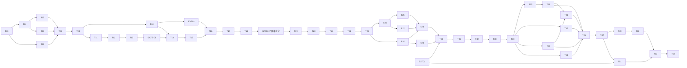

# 任务清单：兽装工作室主页

> **角色**：PLAN 的唯一可勾选实施分解。
> **状态**：T01–T20、GATE-06、GATE-07 与 EXT-02 已完成。T19/T20 已于 2026-08-02 完成最终工程审查、完整自动化门禁、真实 OSS、空库迁移、发布/下架、泄漏扫描和精确清理。T21 保持未勾选，等待独立门禁审查。任务编号保留 T01–T53。

## 当前目标

GATE-07 已将 `brand-standard-v1` 小型四角水印升级为可由管理端选择 Logo 候选的 `brand-centered-v2`，并完成真实预览、全站进度、原子切换和用户验收。T19/T20 的服务端契约、公开 SSR 页面、首页双源轮播、首页管理、活动 profile 约束与浏览器证据已收口；下一步仅准备并执行 T21 独立门禁。

## 门禁

- [x] **GATE-01 · 需求与计划已收敛**。
- [x] **GATE-02 · 技术主线已锁定**：Nuxt 4、Node 24、Nitro、SQLite/Drizzle、单镜像/单进程。
- [x] **GATE-03 · 生产设计输入已建立**。
- [x] **GATE-04 · 原型边界已锁定**。
- [x] **GATE-05 · 阶段 4 已授权**。
- [ ] **EXT-01 · 正式素材与品牌衍生门禁**：确认当前 Logo 源的来源、可使用范围和最终导出；形成完整组合标、图形标、favicon/Touch Icon、正式水印候选与跨素材安全区 manifest；同时确认正式作品图和返图的公开使用范围。通过后解除 T30 与 T51 的素材门禁。
- [x] **EXT-02 · 双 Bucket 30 MB 媒体门禁**：双 Bucket、30 MB 永久私有原图、内嵌 FFmpeg 私有处理源、OSS 水印、跨 Bucket `sys/saveas`、匿名边界与精确清理已实测通过。
- [x] **GATE-06 · T13 认证前端接线**：Kimi 已接入登录、Session、退出和改密，并完成真实浏览器 Cookie/CSRF/Host/no-store 证据。
- [x] **GATE-07 · 可配置居中水印迁移**：
  - 工程侧：新增站点级 `watermark_logo` 候选、不可变 `watermark_profiles`、活动/草稿 `site_branding`、profile 来源引用、受保护管理 API、真实 OSS 私有预览、`brand-centered-v2` 生成器和原子再生成/切换/清理；默认 `g=center`、50% 不透明度、60% 缩放；旧 v1 variant 不再满足当前发布检查。
  - UI 侧：实现 `/admin/site/branding` 的候选上传/选择、受限参数、四比例真实预览、影响摘要、应用确认、进度和失败恢复；移除作品编辑器的四角安全锚点控件。
  - 门禁：更换一次 Logo 候选和一次参数后，已发布作品及首页目标 variant 完整生成并原子切换；失败保持旧活动 profile；三视口与私有信息泄漏检查通过；用户确认大型居中视觉结果。
  - _依赖：T18。通过后开始 T19。_

## 执行规则

- 当前模型职责和批次见 [`EXECUTION_ROUTING.md`](./EXECUTION_ROUTING.md)。
- 每项完成后才勾选，并在 `implementation/notes/` 记录变更、命令、结果和风险。
- 发现业务冲突先更新上游文档，不在代码中猜事实。
- 自动化只使用临时 SQLite 和独立 OSS `test/<run-id>/` 前缀；清理前验证环境、Bucket 和完整前缀。
- 私有 Bucket 和公开 Bucket 是硬边界，不得退回单 Bucket ACL。
- FFmpeg 只处理超过 OSS 20 MB 输入上限的私有处理源；OSS 是公开 variant、最终格式和水印的唯一像素权威。
- 私有原图、私有处理源和水印 Logo 候选保持私有；公开 variant 烘焙活动 profile。
- Logo 候选只能通过 `assetId` 管理，不允许任意路径、Object Key、外链或脚本。
- profile、Logo 摘要、位置、不透明度和缩放进入 identity；变化生成新 Key，不原位覆盖。
- 首页横版/竖版是独立资产；设定图、出厂照、返图和水印 Logo 是独立角色。
- P1/P2 页面未实现前不得出现在可点击导航中。
- 所有用户可触发的长耗时操作必须提供持续、可访问、基于真实服务端状态的任务进度；未知总量显示不定进度，已知总量显示完成量/总量，失败持续可见，可恢复任务支持刷新后继续查看。按钮禁用、Spinner、Toast 或最终结果不能单独充当进度反馈。
- E2E 门禁按用户路径质量评审，不按用例数量评审。关键用例必须覆盖操作、中间状态、成功/失败、重载恢复和实际页面结果；图片解码、布局溢出、焦点/键盘与关键请求按风险断言，并在异常时检查截图、浏览器日志或 trace。只看 HTTP 状态、元素/记录数量、选择器存在或通过总数不得宣布页面完成。
- 标准门禁：`pnpm lint`、`pnpm typecheck`、`pnpm test`、`pnpm test:integration`、`pnpm test:e2e`、`pnpm build`、适用时 `pnpm verify:production`。

## 依赖主链

T43–T48 在 T34 后可按价值并行，不阻塞 T42。

## A. 已完成底座与视觉门禁

- [x] **T01 · 可运行双访问面最小切片**。
- [x] **T02 · 运行配置、Host 与安全日志工具**。
- [x] **T03 · 共享契约与错误语义初版**。
- [x] **T04 · 公开站设计系统与导航壳**。
- [x] **T05 · 首页生产视觉样张**：完成单图 Hero 和精选方案比较；没有实现双源轮播或当前水印配置。
- [x] **T06 · 作品列表与详情生产视觉样张**。
- [x] **T07 · 管理端作品工作台视觉样张**。
- [x] **T08 · 生产视觉方向门禁**：精选横向轨道定稿，`must-fix = 0`。

## B. 第一件作品垂直切片

- [x] **T09 · 修正 T03 契约与代码审查问题**。
- [x] **T10 · 双 Bucket 早期可行性预检与最小权限说明**。
- [x] **T11 · SQLite 运行底座与迁移框架**。
- [x] **T12 · P0 最小 Schema、媒体角色与公开投影**。
- [x] **T13 · 唯一管理员最小认证**。
- [x] **T14 · 角色化私有原图条件直传**。
- [x] **T15 · 上传完成校验与用途预览数据**。
- [x] **T16 · `recipe-v1` 跨 Bucket 衍生图与基础水印**：历史实现已完成 `brand-standard-v1` 的 18% 宽度、70% 不透明度和四角水印。新需求通过 GATE-07 增量迁移，不取消 T16 的历史完成状态。
- [x] **T17 · 最小作品创建与编辑**。
- [x] **T18 · 双 Bucket 发布与下架操作**。
- [x] **T19 · 作品详情 SSR**：`/works/{slug}` 输出真实主图、出厂照图集、事实、短属性和适用 CNY 价格；公开媒体只消费当前活动 `brand-centered-v2` profile 的 variant；为后续领养作品预留设定图/出厂照分区；404/500 为 HTML；无私有 Key/联系人。_依赖：GATE-07。_
- [x] **T20 · 首页双源轮播、首页与作品列表真实投影**：实现 `/admin/site/home` 的 1–5 项横竖配对、alt、排序、启用、可选作品关联，以及使用活动 profile 的启用前横竖真实水印预览；首页 SSR 使用 `<picture>/<source>`；已发布作品进入首页精选与 `/works`；所有公开媒体必须匹配活动水印 profile。_依赖：T19。_
- [ ] **T21 · 第一垂直切片门禁**：从空库初始化管理员 → 创建作品 → 私有上传 → OSS 生成活动居中水印 → 发布 → 配置首页横竖轮播 → 新访客横/竖屏浏览 → 在 `/admin/site/branding` 更换一次 Logo 候选并原子再生成 → 验证旧 profile 在切换前持续可用、新 profile 完整切换 → 下架/精确清理。私有匿名读取失败、原图/Logo 候选无公开泄漏、公开图使用正确居中水印。_依赖：T20。_

## C. P0 可部署核心

- [ ] **T22 · 完整作品字段与约束**：用途、装型、基础领养状态、排序、精选、CNY 和短属性矩阵。_依赖：T21。_
- [ ] **T23 · 多图关系、角色约束与配方按需生成**：最多 5 张出厂照、1 张领养设定图；分角色顺序/主图/完整画布；使用当前活动水印 profile。_依赖：T22。_
- [ ] **T24 · 管理端作品列表与角色化快速编辑**：按设定图/出厂照分区，显示当前活动居中水印和真实公开预览，不恢复四角锚点。_依赖：T23。_
- [ ] **T25 · 横版领养设定图与常规领养发布**：完整横版/contain、活动 `brand-centered-v2` 水印、`/adoptions` 主图和详情分区。_依赖：T23。_
- [ ] **T26 · 委托页与营业状态**。_依赖：T24。_
- [ ] **T27 · 关于、基本约定与联系页**。_依赖：T24。_
- [ ] **T28 · 首页完整内容顺序**。_依赖：T25–T27。_
- [ ] **T29 · 作品筛选、详情导航和重定向基础**。_依赖：T25。_
- [ ] **T30 · 基础 SEO、Sitemap 与品牌图标**：从 EXT-01 确认的图形标生成 favicon/Touch Icon；不得把水印候选任意等同于站点图标。_依赖：T28–T29、EXT-01。_
- [ ] **T31 · 备份、恢复与迁移冒烟**：覆盖作品、首页轮播、站点品牌 profile 和活动引用。_依赖：T30。_
- [ ] **T32 · P0 安全门禁**：覆盖 Session、CSRF、Host、DTO、双 Bucket、私有水印源、profile API 和 secret scan。_依赖：T31。_
- [ ] **T33 · P0 性能与三视口媒体回归**：轮播按需加载、横竖请求、SSR P95、无溢出；验证大型居中水印可辨识且不破坏关键内容。_依赖：T32。_
- [ ] **T34 · P0 全链 E2E 与可部署版本**：公开 P0、后台核心、品牌 profile、首页轮播、角色化媒体、发布/下架、备份恢复和错误路径全部通过。_依赖：T33。_

## D. P1 一期完整增强

- [ ] **T35 · 返图模型与可选授权记录**。_依赖：T34。_
- [ ] **T36 · 返图上传、轻量水印、管理与公开墙**：复用品牌候选/不可变 profile 机制，但使用独立 `brand-subtle-v1`，不默认套用大型中心水印。_依赖：T35。_
- [ ] **T37 · 展会掉落、当前展会与完整状态矩阵**。_依赖：T34。_
- [ ] **T38 · 受限站点文字内容编辑**：不接管首页媒体或品牌水印配置。_依赖：T34。_
- [ ] **T39 · Slug 显式改址**。_依赖：T34。_
- [ ] **T40 · 30 天回收站**：处理作品、返图、文字和品牌候选引用；活动水印源不得被普通删除。_依赖：T36、T38。_
- [ ] **T41 · 手机轻量维护闭环**：品牌配置复杂操作明确引导桌面；手机可查看活动 profile 和进度。_依赖：T36–T40。_
- [ ] **T42 · P1 全链路门禁**。_依赖：T41。_

## E. P2 独立后置与上线质量

- [ ] **T43 · 邮件找回密码**。_依赖：T34。_
- [ ] **T44 · CSV 导出中心**：不得导出私有 Key、签名 URL、Logo 私有源或内部 profile 摘要。_依赖：T34。_
- [ ] **T45 · 永久原图档案 UI**：按 `assetId` 和角色检索，包含受控品牌候选；不暴露 Key。_依赖：T34。_
- [ ] **T46 · 最小化访问统计**。_依赖：T34。_
- [ ] **T47 · 高级媒体恢复与批量运维**。_依赖：T42。_
- [ ] **T48 · CDN 专项**。_依赖：T42。_
- [ ] **T49 · 上线前综合审查**：覆盖品牌 profile、迁移/回滚、轮播、媒体角色、数据恢复和 Bucket 策略。_依赖：T42；T43–T48 按实际范围。_
- [ ] **T50 · 全站最终 E2E**。_依赖：T49。_

## F. 正式素材、部署与闭环

- [ ] **T51 · 正式素材、Logo 衍生与二次视觉校准**：EXT-01 后确认最终候选、favicon/Touch Icon、`brand-centered-v2` 跨素材缩放/不透明度及 P1 轻量 profile；位置继续固定居中，不回退四角。_依赖：EXT-01、T42。_
- [ ] **T52 · Docker 与目标环境部署演练**：验证品牌候选私有存储、活动 profile、再生成、回滚、两个 Bucket、媒体域名和备份。_依赖：T50–T51。_
- [ ] **T53 · 景宸真实使用验收与文档闭环**：景宸独立维护作品、首页轮播和站点品牌水印候选/profile；记录问题并闭环。_依赖：T52。_

## 完成定义

每项至少留下变更路径、验证命令、结果、截图/日志位置和风险。视觉任务必须有截图；轮播必须有横竖资源请求与减少动效证据；水印任务必须有真实 OSS 结果、活动 profile identity、原子切换和私有源边界证据；数据任务必须有迁移/恢复证据。E2E 结果必须说明覆盖了哪些用户路径和页面风险，不能只登记通过数量；长耗时操作必须留下进行中进度、完成及失败/恢复证据。
