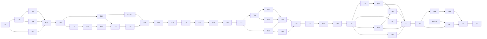

# 任务清单：兽装工作室主页

> **角色**：PLAN 的唯一可勾选实施分解。
> **状态**：T01–T12 与 EXT-02 已完成。P0 最小 Schema、媒体角色、首页横竖配对、variant identity 和显式公开/管理投影已通过验证；下一项为 T13。任务编号保留 T01–T53，T09 之后按垂直切片排序。

## 当前目标

先用 T04–T08 锁定生产视觉，再以 T09–T21 跑通“一件作品从后台创建、角色化私有上传、OSS 水印处理、发布到公开 SSR，并配置一组首页横竖双源轮播”的完整链路。随后完成 P0、P1；P2 不阻塞核心上线。

## 门禁

- [x] **GATE-01 · 需求与计划已收敛**：当前权威顺序为 foundation → SPEC → PLAN → `.design` → TASKS。
- [x] **GATE-02 · 技术主线已锁定**：Nuxt 4、Node 24、Nitro、SQLite/Drizzle、单镜像/单进程。
- [x] **GATE-03 · 生产设计输入已建立**：公开站和管理端分轨。
- [x] **GATE-04 · 原型边界已锁定**：v5 只保留页面职责、顺序和关键交互，不直接进入生产。
- [x] **GATE-05 · 阶段 4 已授权**。
- [ ] **EXT-01 · 正式素材与品牌衍生门禁**：确认 `agent_docs/materials` 中当前 Logo 源的来源、可使用范围和最终导出；形成完整组合标、图形标、favicon/Touch Icon、水印 profile 的轻量 manifest；同时确认正式作品图和返图的可公开使用范围、桌面/手机焦点、文字/水印安全区。Logo 已存在不等于门禁通过，但不得再记为“尚未交付”。通过后开始 T51。
- [x] **EXT-02 · 双 Bucket 30 MB 媒体门禁**：确认两个 Bucket 同账号同地域；私有 Bucket 匿名拒绝且 Block Public Access 开启；公开 Bucket 只用于网页衍生图；接受不超过 30,000,000 字节的永久私有原图；对超过 OSS 20 MB 图片处理上限的合规原图使用应用内固定版本 FFmpeg 生成私有处理源；使用无个人信息的 20–30 MB 合成图完成私有 V4 PUT、图片信息、OSS 水印、跨 Bucket `sys/saveas`、公开匿名 GET 与精确清理。通过后开始 T16。_2026-07-31：29,360,568 字节原图、4,791,024 字节私有处理源和完整 OSS 处理链实测通过，见 `notes/T10-OSS-PREFLIGHT-2026-07-31.md`。_

## 执行规则

- 当前模型职责、任务轨道、短分支批次和独立审查安排见 [`EXECUTION_ROUTING.md`](./EXECUTION_ROUTING.md)。该路由是可变的执行安排，不改变本文件的任务范围、依赖、门禁、编号或完成定义。
- 每项完成后才勾选，并在 `implementation/notes/` 记录日期、变更路径、验证命令、结果和遗留风险。
- 不在代码中猜业务事实；发现冲突先更新上游文档。
- 自动化只使用临时 SQLite 和 `test/<run-id>/`；清理前验证环境、Bucket 与完整前缀。
- 私有 Bucket 和公开 Bucket 是硬边界，不得临时退回单 Bucket ACL 方案。
- 内嵌 FFmpeg 只把超过 OSS 20 MB 输入上限的合规原图归一化为私有处理源；OSS 是公开 variant、最终格式和水印的唯一配方权威。不得引入 Sharp、Nuxt Image 动态 provider 或第二套公开 recipe。
- 私有原图无水印且禁止覆盖；水印只进入公开衍生图。Logo 摘要、profile 版本和锚点必须进入 recipe identity。
- 首页横版/竖版是两个独立资产；设定图、出厂照、返图是三个独立角色。不得用同一 `src` + 两个焦点或一个通用“图片”列表宣称完成。
- P1/P2 页面未实现前不得出现在可点击导航中。
- 标准脚本保持：`pnpm lint`、`pnpm typecheck`、`pnpm test`、`pnpm test:integration`、`pnpm test:e2e`、`pnpm build`。

## 依赖主链

未显示的 P2 任务 T43–T48 在 T34 后可按价值并行，不阻塞 T42。

## A. 已完成底座与视觉门禁

- [x] **T01 · 可运行双访问面最小切片**：Nuxt 4/Vue 3/TypeScript strict、SSR 首页占位、CSR 后台登录占位、健康检查和标准质量脚本。证据：`notes/T01-2026-07-28.md`。
- [x] **T02 · 运行配置、Host 与安全日志工具**：版本化配置、优先级、Host 隔离、日志脱敏工具和秘密扫描。证据：`notes/T02-T03-2026-07-29.md`。
- [x] **T03 · 共享契约与错误语义初版**：Zod 枚举、DTO、mapper、资源版本和错误 envelope。该实现受 T09 修订，不得直接用于数据库建模。
- [x] **T04 · 公开站设计系统与导航壳**：实现公开 Token、Header、MobileNav、PageIntro、ResponsiveAsset、Footer；蓝色常态面积 5%–10%、硬上限 15%；三视口、键盘焦点和减少动效同时完成。_依赖：T01–T03。_
- [x] **T05 · 首页生产视觉样张**：使用类型化夹具完成单图全幅首屏、精选、委托/领养图片入口和营业状态；至少比较“横向轨道”与“编辑型网格”，不得用蓝色营销面板填充页面。该任务没有实现后台轮播、横竖双源或真实水印。_依赖：T04。_
- [x] **T06 · 作品列表与详情生产视觉样张**：完成 3:4 网格、筛选、主图/图集、事实与价格展示、空状态；作品图片是第一层级。该任务没有完成设定图/出厂照角色分区。_依赖：T04。_ 证据：`notes/T06-T07-2026-07-29.md`、`notes/t06-t07/screenshots/`。
- [x] **T07 · 管理端作品工作台视觉样张**：完成登录、作品列表、编辑、通用媒体状态和发布检查的 PC/平板/手机样张；不建设 Dashboard，不展示 P1/P2 假导航。该任务没有实现首页轮播或角色化上传。_依赖：T01–T03。_ 证据：`notes/T06-T07-2026-07-29.md`、`notes/t06-t07/screenshots/`。
- [x] **T08 · 生产视觉方向门禁**：固定三视口截图、对比度、内容密度、真实动作和响应式审查；用户明确选择首页精选方向并确认 must-fix 为 0 后通过。_依赖：T05–T07。_ 结论：2026-07-30 选定横向轨道，T06/T07 视觉基线通过，C1、C3–C5 接受现状；证据：`notes/t06-t07/T08-REVIEW-PREP.md`。

## B. 第一件作品垂直切片

- [x] **T09 · 修正 T03 契约与已知代码审查问题**：删除 `depositNote`、`paymentNote`、禁用美元字段；增加可选返图授权 Schema；管理 DTO 不返回私有 Object Key；API/页面错误分流；接入安全日志；增加生产占位文案守卫；同步配置、测试与 root 摘要。_依赖：T08；验证：泄漏守卫与页面 404/500 HTML 测试。_
  - 工程核心已完成：见 `notes/T09-ENGINEERING-CORE-2026-07-30.md`。
  - OQ-119 已回答：`ownerDisplay` 始终非空，工作室作品显示“有点小狗工作室”，隐私作品显示“不公开”，不增加 `ownerType`。
  - Kimi 界面修补已由用户验收，工程侧完整门禁复核通过：见 `notes/T09-UI-2026-07-30.md` 与 `notes/T09-CLOSURE-2026-07-31.md`。
- [x] **T10 · 双 Bucket 早期可行性预检与最小权限说明**：在数据库/认证大规模实现前，向用户说明 AK/SK 最小权限与本地写入位置；验证 region、endpoint、Bucket 名、BPA、CORS、匿名读取边界、OSS 图片水印、`sys/saveas` 目标和测试前缀，不修改账号级安全状态；协助完成 EXT-02 证据。_依赖：T09。2026-07-31 已完成可重复预检、最小权限说明、内嵌 FFmpeg 大原图预处理和完整 EXT-02 实测，证据见 `notes/T10-OSS-PREFLIGHT-2026-07-31.md`。_
- [x] **T11 · SQLite 运行底座与迁移框架**：Drizzle、`better-sqlite3`、WAL/外键/busy timeout/FULL、迁移命令、临时测试库和一致性备份工具。_依赖：T09。_ _2026-07-31：空库/重复迁移、PRAGMA、临时库隔离、SQLite Backup API 和启动路径校验通过，见 `notes/T11-SQLITE-2026-07-31.md`。_
- [x] **T12 · P0 最小 Schema、媒体角色与公开投影**：`users`、`works`、`work_feature_tags`、`assets`、`asset_variants`、`work_assets`、`site_hero_slides`、`publication_operations`、最小内容/营业状态；定义 `design_sheet`、`studio_photo`、`home_hero_landscape`、`home_hero_portrait`，横竖轮播 1–5 项配对约束，联系人私有，价格固定 CNY；公开投影硬排除私有字段。_依赖：T11。_ _2026-07-31：首个领域迁移、SQLite 约束/触发器、首页发布校验和公开/管理泄漏守卫通过，见 `notes/T12-P0-SCHEMA-2026-07-31.md`。_
- [ ] **T13 · 唯一管理员最小认证**：幂等初始化、登录、退出、改密、受保护命令重置、SessionVersion、锁定、Host/Origin/CSRF 和集成测试；不做邮件找回。_依赖：T12。_
- [ ] **T14 · 角色化私有原图条件直传**：上传会话必须声明作品/站点归属与媒体角色；不可预测 Key、5 分钟 V4 PUT、固定 MD5/SHA-256/Content-Type/禁止覆盖，浏览器直传 `project-furry-forge-private`；同一关系不得静默变更角色。_依赖：T10、T13。_
- [ ] **T15 · 上传完成校验与用途预览数据**：HEAD/图片信息验证大小、格式、摘要与像素；首页横版校验宽大于高、竖版校验高大于宽；保存 EXIF 修正后的焦点、3:4/16:9/9:16/原比例或 contain 参数及水印安全角；失败可读并精确清理。_依赖：T14。_
- [ ] **T16 · `recipe-v1` 跨 Bucket 衍生图与基础水印**：对超过 OSS 20 MB 输入上限的合规原图先用内嵌 FFmpeg 生成私有处理源，再生成 work-card、home-hero-landscape、home-hero-portrait、design-sheet、detail 的受限宽度，WebP + 一种 fallback；使用 OSS 烘焙 `brand-standard-v1` 水印并 `sys/saveas` 到 `project-furry-forge-public`；Logo 摘要/profile/锚点进入 identity，私有原图保持无水印，验证 OSS 为公开 variant、最终格式和水印的唯一配方权威。_依赖：T15、EXT-02。_
- [ ] **T17 · 最小作品创建与编辑**：后台创建一件非领养作品，维护基础信息、联系人、短属性、出厂照和草稿；联系人不出现在公开投影；媒体区明确为“出厂照”，不使用通用图片角色。_依赖：T16、T08。_
- [ ] **T18 · 双 Bucket 发布与下架操作**：记录操作意图，生成并验证带水印公开衍生对象，提交 SQLite 公开引用；下架先隐藏公开投影再删公开对象；不修改 Object ACL。_依赖：T17。_
- [ ] **T19 · 作品详情 SSR**：`/works/{slug}` 输出主图、出厂照图集、事实、短属性和适用 CNY 价格；为后续领养作品预留“设定图/出厂照”分区；404/500 为 HTML 错误页；公开页面不含私有 Key/联系人。_依赖：T18。_
- [ ] **T20 · 首页双源轮播、首页与作品列表接入真实投影**：实现 `/admin/site/home` 的 1–5 项轮播管理，逐项横版/竖版上传、alt、排序、启用、可选作品关联和方向预览；首页 SSR 使用 `<picture>/<source>` 选择正确资源，手动轮播完整、自动轮播默认关闭且可暂停/尊重减少动效；已发布作品进入首页精选与 `/works`，筛选和普通链接可用。_依赖：T19。_
- [ ] **T21 · 第一垂直切片门禁**：从空库初始化管理员 → 创建作品 → 角色化私有上传 → OSS 水印处理 → 发布 → 配置并发布一组横版/竖版首页轮播 → 新访客横/竖屏浏览首页/列表/详情 → 下架/清理，全链 E2E 通过；私有匿名读取失败、原图无水印、公开图有正确水印。_依赖：T20。_

## C. P0 可部署核心

- [ ] **T22 · 完整作品字段与约束**：用途、装型、基础常规领养状态、人工排序、精选、CNY 价格和短属性矩阵；无付款备注和美元列。“展会出售中”与当前展会关联在 T37 启用。_依赖：T21。_
- [ ] **T23 · 多图关系、角色约束与配方按需生成**：每件作品最多 5 张 `studio_photo`；领养作品另有 1 份 `design_sheet`；维护分角色顺序、作品主图、完整画布/裁切和用途驱动 variant，不为每张图生成全部比例；禁止同一关系同时充当设定图和出厂照。返图数量约束留到 T35。_依赖：T22。_
- [ ] **T24 · 管理端作品列表与角色化快速编辑**：保存冲突、预览、发布检查、处理失败和持久反馈；作品编辑器按“设定图”“出厂照”分区并显示比例、水印和公开用途；PC 完整，手机先保证轻量字段。_依赖：T23。_
- [ ] **T25 · 横版领养设定图与常规领养作品发布**：设定图完整横版/contain 衍生图、`brand-standard-v1` 水印和安全角预览；`/adoptions` 以设定图为主图，统一详情把设定图与出厂照分区；基础常规领养状态可发布，展会掉落完整路径留到 T37。_依赖：T23。_
- [ ] **T26 · 委托页与营业状态**：代表作品宽图、制作范围、委托状态、邮件/复制邮箱、已确认 FAQ；无站内表单。_依赖：T24。_
- [ ] **T27 · 关于、基本约定与联系页**：真实工作室事实、官方渠道、反诈提示和待确认法律文本门禁。_依赖：T24。_
- [ ] **T28 · 首页完整内容顺序**：真实双源轮播、真实精选、委托/领养入口、营业状态和当前领养推荐；不插入大段品牌说明。_依赖：T25–T27。_
- [ ] **T29 · 作品筛选、详情导航和重定向基础**：用途 × 装型交集筛选、结果数、前后浏览、`/adoptions/{slug}` 和 `/terms` 兼容重定向。_依赖：T25。_
- [ ] **T30 · 基础 SEO、Sitemap 与品牌图标**：title、description、canonical、OG、alt、robots、Sitemap 和有限结构化数据；价格只来自可见 CNY；从 EXT-01 确认的 Logo 图形标确定性生成并声明 favicon、16/32 像素图标和 Apple Touch Icon，禁止框架默认图标。_依赖：T28–T29。_
- [ ] **T31 · 备份、恢复与迁移冒烟**：空库迁移、夹具、作品/首页轮播发布、Backup API/`VACUUM INTO`、新路径恢复和关联校验。_依赖：T30。_
- [ ] **T32 · P0 安全门禁**：Session、锁定、CSRF/Origin、限流、CSP、Host、日志、DTO、Bucket 匿名边界、原图无水印边界和 secret scan。_依赖：T31。_
- [ ] **T33 · P0 性能与三视口媒体回归**：首屏图优先级、CLS、轮播按需加载、横屏只请求横版/竖屏只请求竖版、图片请求规格、SSR P95 基线、390/768/1440 无横向溢出；验证水印可辨识且不遮挡关键内容。_依赖：T32。_
- [ ] **T34 · P0 全链路 E2E 与可部署版本**：公开全部 P0 页面、后台核心维护、首页双源轮播、角色化媒体、发布/下架、备份恢复和错误路径通过；生成本地 Docker 镜像和运行证据。_依赖：T33。_

## D. P1 一期完整增强

- [ ] **T35 · 返图模型与可选授权记录**：每件作品最多 5 张 `return_photo`；关联作品、昵称/日期/主页、`consentSource`/`consentConfirmedAt`/`consentNote` 均可空；授权记录私有且不阻断发布；返图角色不进入作品设定图/出厂照关系。_依赖：T34。_
- [ ] **T36 · 返图上传、轻量水印、管理与公开墙**：复用双 Bucket 媒体链路；原比例/照片墙 variant 使用 `brand-subtle-v1`，展示水印预览和安全角；真实空状态、撤回/删除和 E2E。_依赖：T35。_
- [ ] **T37 · 展会掉落、当前展会与完整状态矩阵**：启用“展会掉落/展会出售中”，维护当前展会名称与作品关联、切换/回退和发布校验；不建设展会专题 CMS 或历史链。_依赖：T34。_
- [ ] **T38 · 受限站点文字内容编辑**：委托 FAQ、关于/约定、联系/SEO 分对象维护，不允许任意 HTML/脚本；首页轮播媒体继续由 T20 专用编辑器管理，不并入万能页面树。_依赖：T34。_
- [ ] **T39 · Slug 显式改址**：旧 slug 记录、永久 301、冲突和 Sitemap 更新。_依赖：T34。_
- [ ] **T40 · 30 天回收站**：作品/返图/文字内容恢复、到期语义、公开衍生对象清理；原图不随普通内容删除。首页轮播引用的作品/资产删除前必须处理引用。_依赖：T36、T38。_
- [ ] **T41 · 手机轻量维护闭环**：登录、查看、状态、文字、单图上传和发布完整；横竖配对、复杂裁切/水印安全角/批量操作明确引导桌面。_依赖：T36–T40。_
- [ ] **T42 · P1 全链路门禁**：返图、展会、文字内容、改址、回收站和手机轻量 E2E 通过；P0 + P1 达到一期功能闭环；正式上线仍需 T51–T53。_依赖：T41。_

## E. P2 独立后置与上线质量

- [ ] **T43 · 邮件找回密码**：QQ SMTP、token 哈希、单次 30 分钟、枚举防护、旧 Session 失效；自动化默认 mock。_依赖：T34。_
- [ ] **T44 · CSV 导出中心**：业务 CSV 与图片清单 CSV；联系人是否导出由管理员显式选择；不得包含凭据、私有 Key、签名 URL、Session/令牌或图片二进制，返图授权备注默认不导出。_依赖：T34。_
- [ ] **T45 · 永久原图档案 UI**：按 `assetId`、媒体角色检索，短时下载、重新关联和受限永久删除；不得把 Key 直接交给浏览器。_依赖：T34。_
- [ ] **T46 · 最小化访问统计**：只累计页面、去参数来源和设备大类，不存 IP、身份或指纹。_依赖：T34。_
- [ ] **T47 · 高级媒体恢复与批量运维**：仅在真实失败模式需要时实现；仍不引入自动 worker。_依赖：T42。_
- [ ] **T48 · CDN 专项**：公开 Bucket 回源、HTTPS、缓存键、刷新和防盗链；私有 Bucket 绝不授权 CDN 全桶读取。_依赖：T42。_
- [ ] **T49 · 上线前综合审查**：依赖安全、无障碍基线、SEO、轮播性能、媒体角色、水印、数据恢复、Bucket 策略和运维手册。_依赖：T42；T43–T48 按实际启用范围。_
- [ ] **T50 · 全站最终 E2E**：对已启用 P2 能力、失败路径、固定视口、方向媒体请求和生产构建执行最终验证。_依赖：T49。_

## F. 正式素材、部署与闭环

- [ ] **T51 · 正式素材、Logo 衍生与二次视觉校准**：EXT-01 通过后替换全部占位，校准完整组合标、图形标、favicon/Touch Icon、`brand-standard-v1`/`brand-subtle-v1` 的比例/透明度/边距、横竖首屏、设定图/出厂照/返图焦点与水印安全区、蓝色比例和真实设备；不得上线景宸例图中的旧价格、QQ 二维码或非正式狗头闪电。_依赖：EXT-01、T42。_
- [ ] **T52 · Docker 与目标环境部署演练**：开发机构建镜像，生产只运行；挂载 SQLite/配置，验证反向代理、TLS、两个 Bucket、媒体域名、站点图标、水印、备份和回滚。_依赖：T50–T51。_
- [ ] **T53 · 景宸真实使用验收与文档闭环**：让景宸独立完成一件作品维护和一组首页横版/竖版轮播维护；若已有可公开返图则再完成一张返图，否则用明确标注且验收后清理的测试夹具验证返图流程。记录问题并修复，更新 STATE、ARTIFACTS、部署手册和最终验收证据。_依赖：T52。_

## 完成定义

每项任务至少留下：变更路径、验证命令、结果、截图/日志位置和剩余风险。仅“代码已写”不算完成；视觉任务必须有截图，首页轮播必须有横竖资源请求证据和减少动效证据，媒体任务必须有角色/水印/Bucket 边界证据，数据任务必须有迁移/恢复证据。
