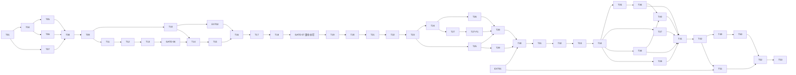

# 任务清单：兽装工作室主页

> **角色**：PLAN 的唯一可勾选实施分解。
> **状态**：T01–T27、GATE-06、GATE-07、EXT-01 与 EXT-02 已完成。T26-F1、T27-F1 于 2026-08-05 完成新上下文独立 Review，结论 `PASS WITH FOLLOW-UP`，两项等待用户验收。当前按用户授权进入 T28。**OQ-120 已整批确认并登记为数据库初始化默认值。**任务编号保留 T01–T53，任务后缀用于用户确认后的同主题增量。

## 当前目标

从已经收口的作品、角色化媒体与常规领养链扩展到 P0 可部署核心。T26-F1/T27-F1 独立 Review 见 [`notes/t26-t27/T26-F1-T27-F1-INDEPENDENT-REVIEW-2026-08-05.md`](./notes/t26-t27/T26-F1-T27-F1-INDEPENDENT-REVIEW-2026-08-05.md)。当前依次实现 T28–T34；T26-F1、T27-F1 和 T34 的最终勾选仍以用户验收为准。T37 展会矩阵不提前实现。

## 门禁

- [x] **GATE-01 · 需求与计划已收敛**。
- [x] **GATE-02 · 技术主线已锁定**：Nuxt 4、Node 24、Nitro、SQLite/Drizzle、单镜像/单进程。
- [x] **GATE-03 · 生产设计输入已建立**。
- [x] **GATE-04 · 原型边界已锁定**。
- [x] **GATE-05 · 阶段 4 已授权**。
- [x] **EXT-01 · 正式素材与品牌源门禁**：用户已确认包括 Logo 在内的当前素材均位于 `materials/picture-examples/`；来源、角色、公开使用边界和衍生职责已登记到 [`../materials/MATERIAL-MANIFEST.md`](../materials/MATERIAL-MANIFEST.md)。T30 负责 favicon/Touch Icon 等正式小图标导出，T51 负责跨素材二次校准，不再等待外部素材交付。
- [x] **EXT-02 · 双 Bucket 30 MB 媒体门禁**：双 Bucket、30 MB 永久私有原图、内嵌 FFmpeg 私有处理源、OSS 水印、跨 Bucket `sys/saveas`、匿名边界与精确清理已实测通过。
- [x] **GATE-06 · T13 认证前端接线**：登录、Session、退出和改密已完成真实浏览器 Cookie/CSRF/Host/no-store 证据。
- [x] **GATE-07 · 可配置居中水印迁移**：
  - 工程侧：站点级 `watermark_logo` 候选、不可变 `watermark_profiles`、活动/草稿 `site_branding`、受保护管理 API、真实 OSS 私有预览、`brand-centered-v2` 和原子再生成/切换/清理；默认 `g=center`、50% 不透明度、60% 缩放；
  - UI 侧：`/admin/site/branding` 的候选上传/选择、受限参数、四比例真实预览、影响摘要、应用确认、持续进度和失败恢复；作品编辑器不再提供四角锚点；
  - 验收：更换 Logo 候选和参数后，已发布作品与首页 variant 完整生成并原子切换；失败保持旧 profile；三视口和私有信息泄漏检查通过。

## 阶段 C 进入确认

- [x] T21 已由用户明确确认完成；
- [x] SPEC 当前无开放 OQ，OQ-119 已答；
- [x] 后续所有写入直接在 `main` 串行完成，不创建功能分支或 PR；
- [x] 后端固定由 GPT-5.6 Sol 负责；前端按任务由用户在 Kimi K3、Claude Opus 5、GPT-5.6 Sol 中选择；
- [x] Review 固定由 GPT-5.6 Sol 使用新的审查上下文，并结合浏览器、视觉、真实点击、console/network、截图或 trace；
- [x] 自动化按风险选取，不用每个小任务机械跑完整五分钟级 E2E，也不以测试通过数量替代人工页面检查；
- [x] 正式素材输入已登记，EXT-01 不再阻塞 T22–T30。

**OQ-120**（T26–T27 真实文案 10 项）已由用户整批确认。0014 迁移将 `requirements/SPEC.md` §6.7 的正式文字作为初始化默认值，只补空字段和缺失营业状态，不覆盖管理员已有内容。最终小图标与部署参数分别在 T30、T34/T52 前确认。

## 执行规则

- 当前模型职责、main 直推纪律、交接和 Review 方法见 [`EXECUTION_ROUTING.md`](./EXECUTION_ROUTING.md)。
- 所有写入直接提交到最新 `main`；后端 → 前端 → Review 串行执行。只读分析可以并行，禁止多个 Agent 同时改同一批文件。
- 每项完成后才勾选，并在 `implementation/notes/` 记录变更、命令、浏览器操作、观察结果和风险。
- 发现业务冲突先更新上游文档，不在代码中猜事实。
- 不允许删除或清空 `.env`，不 force push，不重写已验收历史。
- 自动化只使用临时 SQLite 和独立 OSS `test/<run-id>/` 前缀；清理前验证环境、Bucket 和完整前缀。
- 私有 Bucket 和公开 Bucket 是硬边界，不得退回单 Bucket ACL。
- FFmpeg 只处理超过 OSS 20 MB 输入上限的私有处理源，或经管理员明确确认的低分辨率首页/委托页大图适配源；OSS 是公开 variant、最终格式和水印的唯一像素权威。作品媒体不得借此自动放大。
- 私有原图、私有处理源和水印 Logo 候选保持私有；公开 variant 烘焙活动 profile。
- Logo 候选只能通过 `assetId` 管理，不允许任意路径、Object Key、外链或脚本。
- profile、Logo 摘要、位置、不透明度和缩放进入 identity；变化生成新 Key，不原位覆盖。
- 首页横版/竖版是独立资产；设定图、出厂照、返图和水印 Logo 是独立角色。
- P1/P2 页面未实现前不得出现在可点击导航中。
- 所有用户可触发的长耗时操作必须提供持续、可访问、基于真实服务端状态的任务进度；未知总量显示不定进度，已知总量显示完成量/总量，失败持续可见，可恢复任务支持刷新后继续查看。按钮禁用、Spinner、Toast 或最终结果不能单独充当进度反馈。

### 自动化与浏览器门禁

- 常规基础：`pnpm lint`、`pnpm typecheck`；改动 Nuxt 路由、运行时、迁移或生产输出时执行 `pnpm build`。
- 每项运行与本次 Schema、API、迁移和页面路径直接相关的 unit/integration/E2E；认证、媒体、发布、公开投影或全局契约变化时扩大回归。
- 全量 `pnpm test`、`pnpm test:integration`、`pnpm test:e2e`、`pnpm verify:production` 主要用于 T31–T34、跨层高风险修复和明确总门禁，不作为每个小任务的机械步骤。
- 含 UI、公开投影、媒体或用户操作的任务，GPT-5.6 Sol Review 必须实际启动应用、模拟管理员与新访客点击，检查中间/失败/恢复状态、真实图片解码、三视口、焦点/键盘、溢出、console/network、截图或 trace。
- 只看 HTTP 状态、元素数量、选择器存在、E2E 总数或绿色报告不得宣布页面完成。

## 依赖主链

T43–T48 在 T34 后可按价值串行选择，不阻塞 T42。main 直推阶段不允许多个写入 Agent 按依赖图并行改代码。

## A. 已完成底座与视觉门禁

- [x] **T01 · 可运行双访问面最小切片**。
- [x] **T02 · 运行配置、Host 与安全日志工具**。
- [x] **T03 · 共享契约与错误语义初版**。
- [x] **T04 · 公开站设计系统与导航壳**。
- [x] **T05 · 首页生产视觉样张**：完成单图 Hero 和精选方案比较；没有实现双源轮播或当前水印配置。
- [x] **T06 · 作品列表与详情生产视觉样张**。
- [x] **T07 · 管理端作品工作台视觉样张**。
- [x] **T08 · 生产视觉方向门禁**：精选横向轨道定稿，`must-fix = 0`。

## B. 第一件作品垂直切片

- [x] **T09 · 修正 T03 契约与代码审查问题**。
- [x] **T10 · 双 Bucket 早期可行性预检与最小权限说明**。
- [x] **T11 · SQLite 运行底座与迁移框架**。
- [x] **T12 · P0 最小 Schema、媒体角色与公开投影**。
- [x] **T13 · 唯一管理员最小认证**。
- [x] **T14 · 角色化私有原图条件直传**。
- [x] **T15 · 上传完成校验与用途预览数据**。
- [x] **T16 · `recipe-v1` 跨 Bucket 衍生图与基础水印**：历史实现为 `brand-standard-v1`；当前发布只接受 GATE-07 的 `brand-centered-v2`。
- [x] **T17 · 最小作品创建与编辑**。
- [x] **T18 · 双 Bucket 发布与下架操作**。
- [x] **T19 · 作品详情 SSR**：真实主图、出厂照图集、事实、短属性和适用 CNY 价格；公开媒体只消费活动 `brand-centered-v2`；404/500 为 HTML，无私有 Key/联系人。
- [x] **T20 · 首页双源轮播、首页与作品列表真实投影**：`/admin/site/home` 维护 1–5 项横竖配对、alt、排序、启用和可选作品关联；首页 SSR 使用 `<picture>/<source>`；公开媒体匹配活动 profile。
- [x] **T21 · 第一垂直切片门禁**：空库初始化管理员 → 创建作品 → 私有上传 → OSS 活动居中水印 → 发布 → 首页横竖轮播 → 新访客横/竖浏览 → 更换 Logo/profile 并原子切换 → 下架/精确清理。首次独立审查 NOT PASS 及 findings 保留为历史，修复、人工回归和用户最终确认均已收口。

## C. P0 可部署核心

- [x] **T22 · 完整作品字段与约束**：
  - 把现有数据库中已经预留的用途、装型、领养方式/基础状态、排序、精选、CNY 和短属性接入共享 Schema、管理 API、管理 UI、公开投影与迁移/backfill；数据库已有列不等于任务完成；
  - 支持 `commission | adoption | showcase`，保持 `ownerDisplay` 非空、私有联系人隔离、0–8 条有序短属性、领养作品正整数 CNY、人工排序和首页精选；
  - 实现资源版本冲突、非法字段矩阵和公开 DTO 泄漏守卫；首页精选按人工顺序输出最多 6 项，0 项不渲染空轨道，正式内容目标为 3–6 项；
  - P0 只完成常规领养所需基础字段；`event_drop`/`event_sale` 的完整展会实体和管理体验留到 T37；
  - 不提前实现 T23 的多图关系；**完成状态：后端、前端、独立浏览器 Review 与用户 2026-08-03 人工验收均已收口。** _依赖：T21。_
- [x] **T23 · 多图关系、角色约束与配方按需生成**：最多 5 张出厂照、1 张领养设定图；分角色顺序/主图/完整画布；同一资产不得冒充多个角色；只生成页面实际需要的 recipe，使用当前活动水印 profile。**实现、自动化、独立 Agent Review 与用户人工核验已收口。** _依赖：T22。_
- [x] **T24 · 管理端作品列表与角色化快速编辑**：按“设定图/出厂照”分区，维护顺序、主图、必要焦点/裁切，显示当前活动水印、已保存原图和真实公开预览；点击发布前自动保存页面当前修改，不恢复四角锚点。**原任务实现、自动化、独立 Agent Review 与用户人工核验已收口；2026-08-04 追加体验跟进不改写既有结论：移除可见“作品列表”caption 和表格外框，并增加角色名/物种查找、用途/装型/发布状态筛选与客户端分页。** _依赖：T23。_
- [x] **T25 · 横版领养设定图与常规领养发布**：领养发布要求 1 张横版完整设定图；`/adoptions` 使用设计图主视觉，统一 `/works/{slug}` 详情分开“设定图”和“出厂照”；只有设定图的领养不进入 `/works`；`recipe-v2` 设定图使用不重叠的左右双水印；不提前建设展会掉落完整矩阵。**实现、自动化、独立 Agent Review 与用户人工核验已收口。2026-08-05 用户反馈的高分辨率设定图水印比例缺陷作为收口后修复处理，不改写 T25 历史结论。** _依赖：T23。_
- [x] **T26 · 委托页与营业状态**：代表作品背景引导区、全装/半装范围、真实营业状态、人工估价说明、邮件行动、FAQ/约定入口；原实现复用首页第一项双源图，当前图片来源已由 T26-F1 的独立集合增量接管；无图时整区隐藏；无站内表单、自动报价或未确认价目。**服务端、前端、追加视觉跟进及 2026-08-04 新上下文独立 Review 已完成，结论 `PASS WITH FOLLOW-UP`；OQ-120 正式默认值已由 0014 迁移登记。** _依赖：T24。_
- [ ] **T26-F1 · 委托页独立大图管理与低分辨率适配**：在“大图管理”使用“首页大图 / 委托页大图”Tab；以 `site_hero_slides.placement` 隔离两套集合，复用既有横竖双图上传、alt、排序、启停、私有水印预览和原子公开发布；两套大图的横版公开衍生图均复用设定图比例的左右双水印，竖版公开衍生图均复用作品卡比例的单个居中水印。委托页允许 0–5 项启用，但公开端只使用人工顺序第一项作为单张背景；0 项时隐藏且不得回退首页图。横版推荐 `1920×1080`、竖版推荐 `1080×1920`；方向正确但不足时允许保存并持续提示清晰度风险，启用前由管理员确认，服务端用内嵌 FFmpeg Lanczos 生成可追溯私有适配源，原图保留，失败可重试。尺寸已满足时不处理，作品媒体规则不变。**实现方自测及 2026-08-05 新上下文独立 Review 已完成，结论 `PASS WITH FOLLOW-UP`；任务保持未勾选，等待用户验收，且不改写 T26 既有历史结论。** _依赖：T26。_
- [x] **T27 · 关于、基本约定与联系页**：只写经用户确认的工作室事实、制作范围、官方渠道、基本约定和防诈骗信息；后台使用独立“文案配置”入口维护既有受限字段；不虚构品牌故事，不复制竞品法律文本。**服务端、前端、独立文案配置及 2026-08-04 新上下文独立 Review 已完成，结论 `PASS WITH FOLLOW-UP`；OQ-120 正式默认值已由 0014 迁移登记。** _依赖：T24。_
- [ ] **T27-F1 · 公开信息架构、服务条款与隐私政策增量**：删除页脚重复联系方式，把版权与“服务条款 / 隐私政策 / ICP备案 / Design by Arktouros”放入紧凑右下信息区，署名链接到 `https://github.com/wangminan`；“关于我们”在桌面以 Hover/键盘焦点圆角矩形二级导航、移动端以展开子项指向 `/about` `/service` `/privacy`；`/about` 合并邮件/QQ/抖音/防诈骗并放宽文章宽度，`/contact` 永久跳转到 `/about#contact`；原“基本约定”统一改称“服务条款”并单独落 `/service`，`/terms` 永久跳转；`/privacy` 使用 0015 新增受限纯文本字段与符合本站真实能力的默认值；文案配置 FAQ 新增按钮与末项保留间距；`/commission` 状态框改为圆角矩形；`/adoptions` 在有内容和空状态时都显示 `business_statuses.adoption`。不得复制参考站原文，不新增万能 CMS、访客账号、表单、统计或备案号字段。**实现方自测及 2026-08-05 新上下文独立 Review 已完成，结论 `PASS WITH FOLLOW-UP`；任务保持未勾选，等待用户验收。** _依赖：T25、T27。_
- [ ] **T28 · 首页完整内容顺序**：Hero → 3–6 件精选 → 图片式委托/领养入口 → 营业状态 → 有真实数据时的当前领养/辅助信息 → 页脚；没有数据的模块不渲染假内容或空白轨道。_依赖：T25–T27-F1。_
- [ ] **T29 · 作品筛选、详情导航和重定向基础**：用途 × 装型交集筛选、结果数、详情前后浏览；`/adoptions/{slug}` 基础 301；不重复实现 T27-F1 已落地的 `/contact`、`/terms` 兼容跳转，不提前实现 T39 的显式 slug 改址历史。_依赖：T25。_
- [ ] **T30 · 基础 SEO、Sitemap 与品牌图标**：从 EXT-01 素材清单中的同一品牌源生成 favicon 16/32、Apple Touch Icon 和必要分享图；页面 title/description/canonical/alt/Sitemap/robots 可核对；不得把完整纵向组合标或任意水印候选直接缩成站点小图标。_依赖：T28–T29、EXT-01。_
- [ ] **T31 · 备份、恢复与迁移冒烟**：覆盖作品、短属性、多图关系、首页轮播、站点内容、品牌 profile 和活动引用；验证空库迁移 → 夹具/真实数据 → 发布 → 一致性备份 → 新路径恢复 → 核心关联/公开投影。_依赖：T30。_
- [ ] **T32 · P0 安全门禁**：覆盖 Session、CSRF、Host、DTO、限流/体积边界、双 Bucket、私有水印源、profile API、日志脱敏和 secret scan；实际验证公开 Host 无后台、匿名私有读取失败、公开 Bucket 无原图。_依赖：T31。_
- [ ] **T33 · P0 性能与三视口媒体回归**：轮播按需加载、横竖请求、首屏尺寸/CLS、SSR P95、图片真实解码、无溢出、焦点/键盘/减少动效；大型居中水印可辨识且不破坏关键内容。_依赖：T32。_
- [ ] **T34 · P0 全链、完整自动化与可部署版本**：公开 P0、后台核心、品牌 profile、首页轮播、角色化媒体、常规领养、发布/下架、错误/恢复、备份恢复、生产 build/verify 和真实浏览器全链全部通过；形成首个可部署镜像与用户验收记录。_依赖：T33。_

## D. P1 一期完整增强

- [ ] **T35 · 返图模型与可选授权记录**。_依赖：T34。_
- [ ] **T36 · 返图上传、轻量水印、管理与公开墙**：复用品牌候选/不可变 profile 机制，但使用独立 `brand-subtle-v1`，不默认套用大型中心水印。_依赖：T35。_
- [ ] **T37 · 展会掉落、当前展会与完整状态矩阵**。_依赖：T34。_
- [ ] **T38 · 受限站点文字内容编辑**：不接管首页媒体或品牌水印配置。_依赖：T34。_
- [ ] **T39 · Slug 显式改址**。_依赖：T34。_
- [ ] **T40 · 30 天回收站**：处理作品、返图、文字和品牌候选引用；活动水印源不得被普通删除。_依赖：T36、T38。_
- [ ] **T41 · 手机轻量维护闭环**：品牌配置复杂操作明确引导桌面；手机可查看活动 profile 和进度。_依赖：T36–T40。_
- [ ] **T42 · P1 全链路门禁**。_依赖：T41。_

## E. P2 独立后置与上线质量

- [ ] **T43 · 邮件找回密码**。_依赖：T34。_
- [ ] **T44 · CSV 导出中心**：不得导出私有 Key、签名 URL、Logo 私有源或内部 profile 摘要。_依赖：T34。_
- [ ] **T45 · 永久原图档案 UI**：按 `assetId` 和角色检索，包含受控品牌候选；不暴露 Key。_依赖：T34。_
- [ ] **T46 · 最小化访问统计**。_依赖：T34。_
- [ ] **T47 · 高级媒体恢复与批量运维**。_依赖：T42。_
- [ ] **T48 · CDN 专项**。_依赖：T42。_
- [ ] **T49 · 上线前综合审查**：覆盖品牌 profile、迁移/回滚、轮播、媒体角色、数据恢复和 Bucket 策略。_依赖：T42；T43–T48 按实际范围。_
- [ ] **T50 · 全站最终 E2E 与浏览器视觉复核**。_依赖：T49。_

## F. 正式素材、部署与闭环

- [ ] **T51 · 正式素材衍生与二次视觉校准**：基于已完成的 EXT-01 清单确认最终图形标/组合标、`brand-centered-v2` 跨素材缩放/不透明度及 P1 轻量 profile；出厂照和站点竖版大图保持单个居中水印，横版设定图及站点横版大图保持左右双水印，不回退四角。_依赖：EXT-01、T42。_
- [ ] **T52 · Docker 与目标环境部署演练**：验证品牌候选私有存储、活动 profile、再生成、回滚、两个 Bucket、媒体域名和备份。_依赖：T50–T51。_
- [ ] **T53 · 景宸真实使用验收与文档闭环**：景宸独立维护作品、首页轮播和站点品牌水印候选/profile；记录问题并闭环。_依赖：T52。_

## 完成定义

每项至少留下：

- 变更路径、迁移/契约差异、验证命令和结果；
- GPT-5.6 Sol 实际浏览器操作路径、可见中间/失败/恢复状态、console/network 或 trace 结论；
- 视觉任务的相关视口截图，媒体任务的真实图片解码、请求与 OSS 结果；
- 长耗时操作的进行中进度、完成、失败和刷新恢复证据；
- 安全任务的负路径与泄漏扫描；
- 已知风险、后续任务边界和用户验收结论。

自动化必须解释覆盖的业务风险，不能只登记通过数量；浏览器和视觉 Review 不能被 E2E 绿色报告替代。
