# 截图索引与说明

- 截图日期：2026-07-26。
- 截图均来自桌面端 Chrome 的实际浏览状态。部分站点包含懒加载、骨架屏或当前空白页，这类截图作为可用性问题的证据保留。

本目录共 71 张截图。每张说明按“来源页面 → 视口 / 交互状态 → 可观察内容”组织，方便无法打开浏览器的远端 Agent 复原页面。截图 42–71 是针对作品、返图、领养详情和关键业务动线的第二轮补拍。

## 万物通行委托站

### 01-万物通行-委托站-首页.png

首屏使用全屏兽装实拍，顶部导航直接进入委托、作品、委托人、活动、支持和关于。中间用“立即估价委托 / 进一步了解”双按钮完成转化分层。

### 02-万物通行-委托业务页.png

委托业务页全页截图。用于观察从系列风格、品牌说明、委托人证明到价格方案的完整长页节奏。

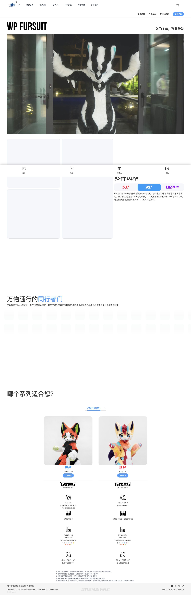

### 03-万物通行-在线估价流程.png

“立即估价”目标页在本次访问中为空白。保留作为入口与终端体验不一致的证据。

### 23-万物通行-委托站-首页中段.png

首页首屏之后的委托业务卡片。使用大字号英文与兽装实拍继续品牌叙事。

### 24-万物通行-委托站-首页下段.png

硬件配件与养护服务被做成并列视觉卡片，说明官网不只承担接单，也承担配件和售后生态展示。

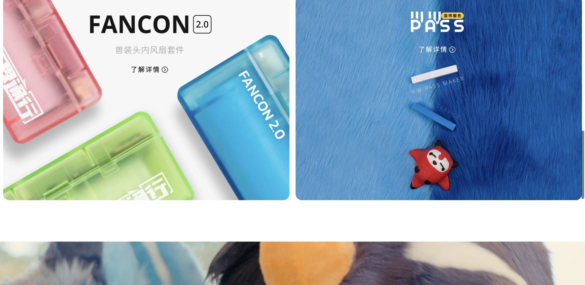

### 25-万物通行-委托系列说明.png

委托页开场使用极简白底、超大英文字和短口号。内容进入前留白很多，强调高级产品感。

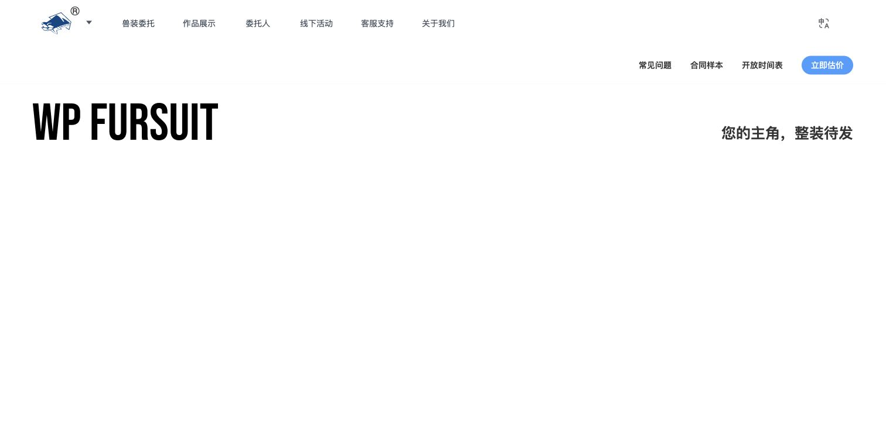

### 26-万物通行-委托价格与周期.png

委托页中段展示不同风格案例和“多样风格”说明，为价格对比做视觉铺垫。

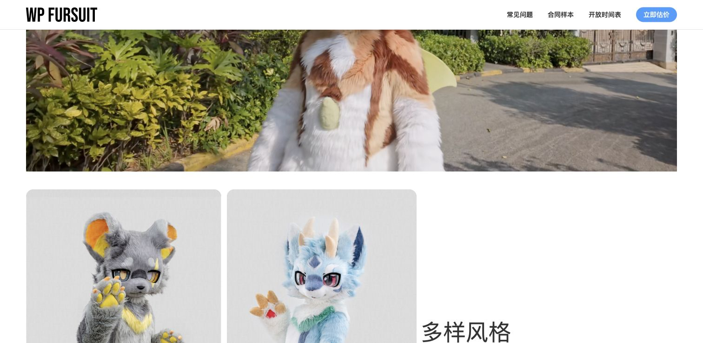

### 27-万物通行-委托价格与周期.png

WP 与 SP 两个系列并列，直接显示 22000+ / 26000+ CNY 与立即估价入口。

### 28-万物通行-委托材质与交期对比.png

两列比较毛布、风扇、涂装、材料和交期。WP 最快约 6 个月、最长不超过 12 个月；SP 最快约 12 个月、最长不超过 18 个月。

## 万物通行角色汤

### 04-万物通行角色汤-领养站-首页.png

独立领养站首屏，入口聚焦“领养角色、设计师、专题”，并保留返回自设委托站的交叉入口。

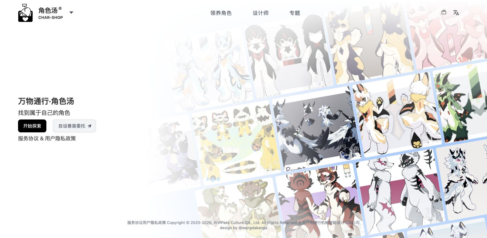

### 05-万物通行角色汤-领养列表.png

领养列表首屏，展示筛选、排序、角色状态、画师、热度与价格。

### 06-万物通行角色汤-展会掉落详情.png

展会掉落详情首屏：设定图、价格、设计师、种族与颜色标签。页面下方的文字浏览记录说明通常头部已经完成、身体按领养人体型制作；该规则不一定全部显示在这张首屏截图内。

### 07-万物通行角色汤-一般领养详情.png

应征领养角色详情首屏。价格和角色信息可见；包含权益、上架时间与“提交后挑选合适委托人”的业务说明来自同页继续浏览的文字记录，不一定全部显示在单一视口内。

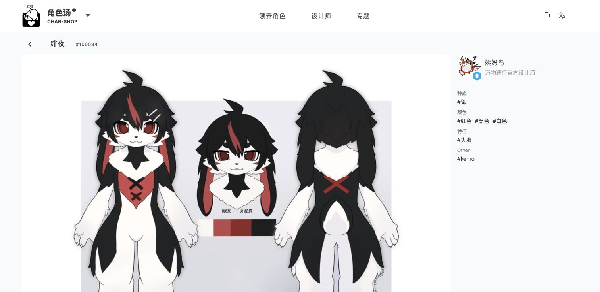

### 29-万物通行角色汤-领养列表下段.png

滚动后的角色卡片。绿色“直接领养”、蓝色“展会掉落”等标签帮助用户快速识别业务类型。

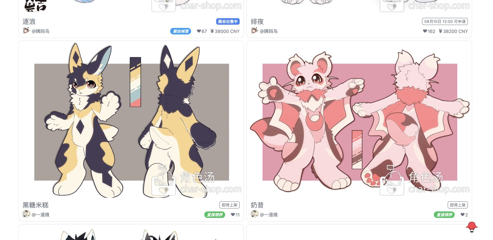

### 30-万物通行角色汤-设计师页.png

设计师列表页，区分官方设计师与合作设计师，并显示每位设计师的可领养 / 已领养数量。

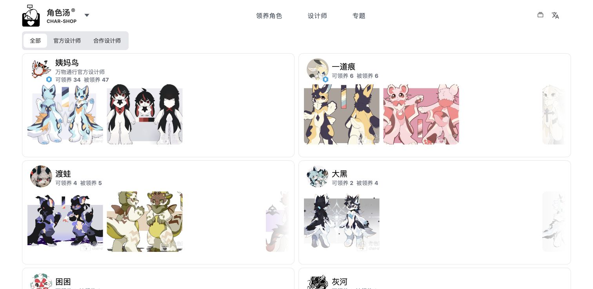

## 鸿萌造物

### 08-鸿萌造物-首页.png

全屏活动实拍、黑色导航与黄橙强调色。右侧固定社交平台入口，整体偏工业与电竞视觉。

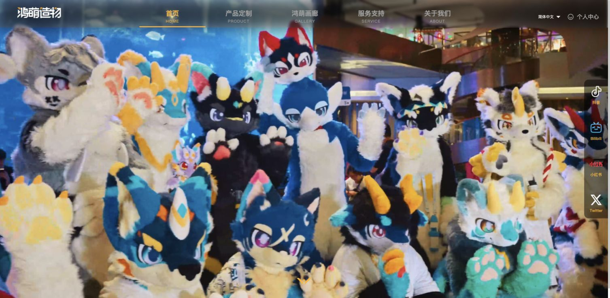

### 09-鸿萌造物-产品定制业务分流.png

产品定制页将领养委托、自设委托、角色风格化并列成三个视觉入口。

### 10-鸿萌造物-领养委托列表.png

领养委托列表首屏，包含搜索、综合 / 时间 / 价格排序、设计师与角色状态。

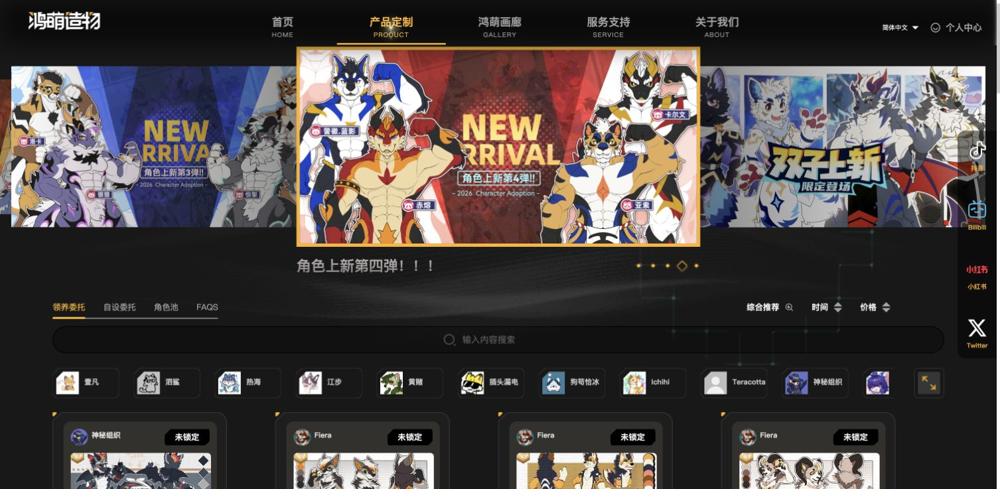

### 11-鸿萌造物-自设委托.png

自设委托表单中段：左侧使用四段折叠导航，右侧集中填写设定、地址和联系人信息。

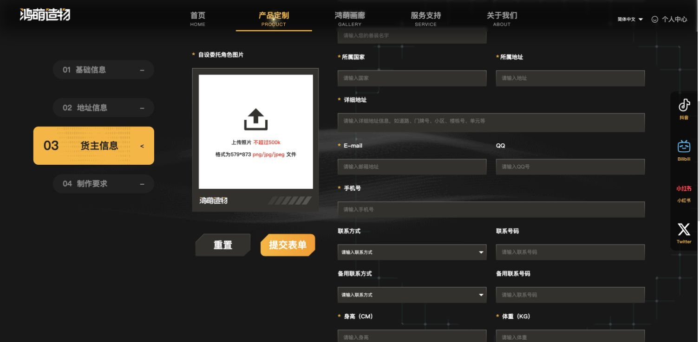

### 12-鸿萌造物-画廊.png

画廊使用暗色大图和“出场照 / 活动照”分类，强调真实穿着效果。

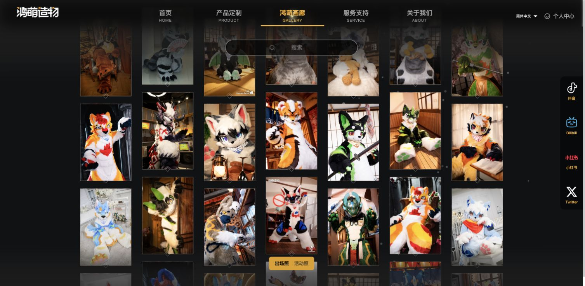

### 31-鸿萌造物-领养列表下段.png

四列角色卡片密集展示设计师、锁定状态、领养状态和价格，适合大量库存，但移动端需要重新降密度。

### 32-鸿萌造物-服务支持流程上段.png

服务支持页用编号侧栏切换委托价格说明、服务条款和隐私政策。主体把锁定、客服联系、DTD、毛布、修改和发货写在一页。

### 33-鸿萌造物-服务支持流程下段.png

滚动后完整展示制作与发货规则。黑黄高对比保持品牌一致，但长文阅读字号偏小。

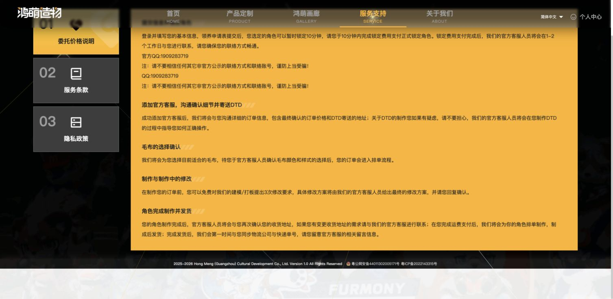

### 34-鸿萌造物-自设委托表单下段.png

表单下段包含身高、体重、头围、脚码、脚型、眼皮、制作要求、备注与提交按钮。

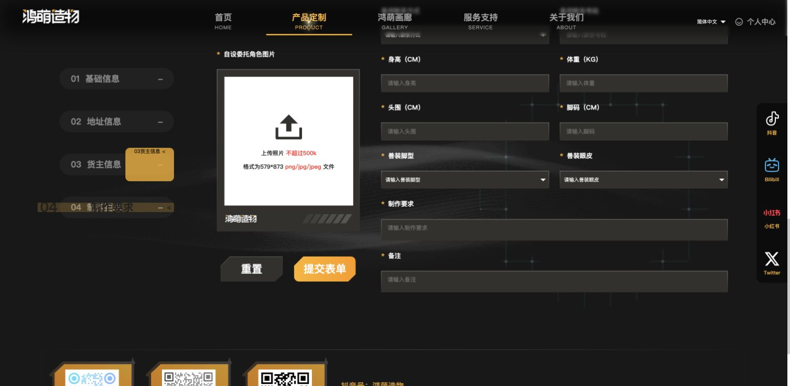

## 渔屋 Fursuit

### 13-渔屋Fursuit-首页.png

首页全屏兽装摄影，顶部导航清楚分为委托投递、动态、作品、返图和关于。

### 14-渔屋Fursuit-自设委托.png

自设委托首屏用两个系列切换、案例链接和立即估价按钮建立转化路径。

### 15-渔屋Fursuit-在线估价.png

三步估价的第一步：选择系列、可选室内脚、上传设定图、填写设定名称与物种。

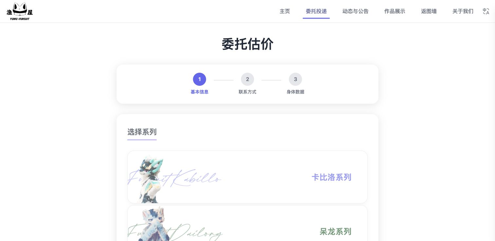

### 16-渔屋Fursuit-设定领养.png

领养列表支持默认视图、画师视图和角色筛选；卡片同时显示画师、价格、系列和状态。

### 17-渔屋Fursuit-领养角色详情.png

开放领养角色详情首屏，设定图是绝对视觉中心。下方提供领养须知、版权和保修信息。

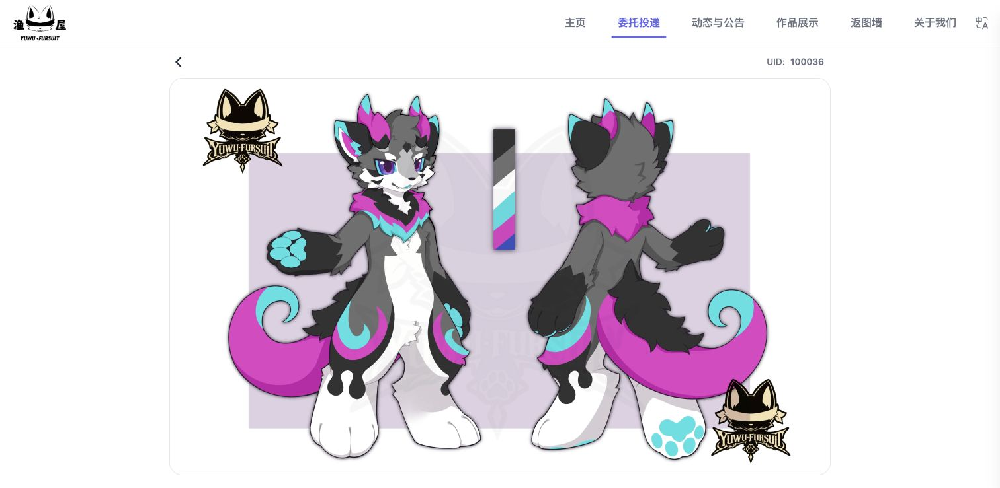

### 18-渔屋Fursuit-作品展示.png

作品页支持系列与全装 / 单头筛选，使用统一卡片呈现角色。

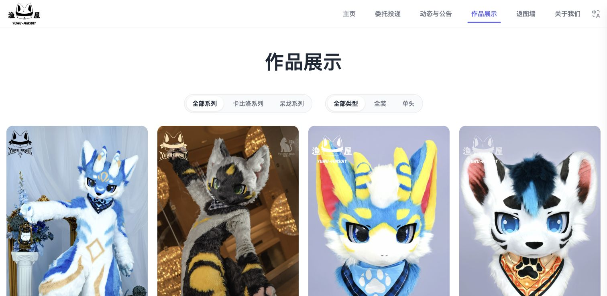

### 35-渔屋Fursuit-自设委托系列说明.png

系列说明末尾展示当前开单状态、结构特点、估价入口和 FAQ 起始区。

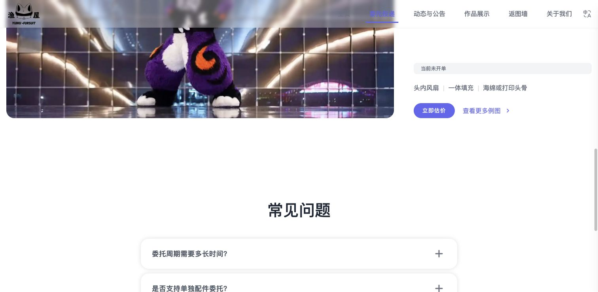

### 36-渔屋Fursuit-常见问题展开.png

FAQ 展开状态，使用大号手风琴卡片，阅读性好。示例公开单头 30 个工作日、全装 60–90 个工作日。

### 37-渔屋Fursuit-关于我们占位内容.png

关于页上段的品牌介绍与照片墙。视觉完整、文字简洁。

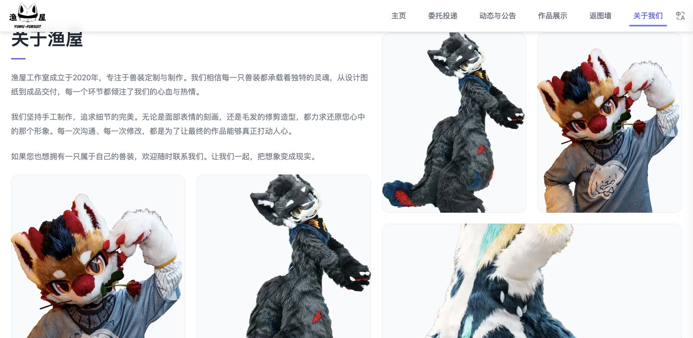

### 38-渔屋Fursuit-成员与联系占位.png

联系区仍保留“联系方式占位符、账号占位符、邮箱占位符”，是上线前内容验收必须拦截的问题。

## 虚构都市

### 19-虚构都市-首页.png

深色赛博首屏，使用粒子、线框角色、系统指标和“申请加入都市”建立完整世界观。

### 20-虚构都市-市民大厅.png

独立市民大厅在本次访问时主体内容空白，只显示标题和分页；首页居民轮播仍可读取角色。

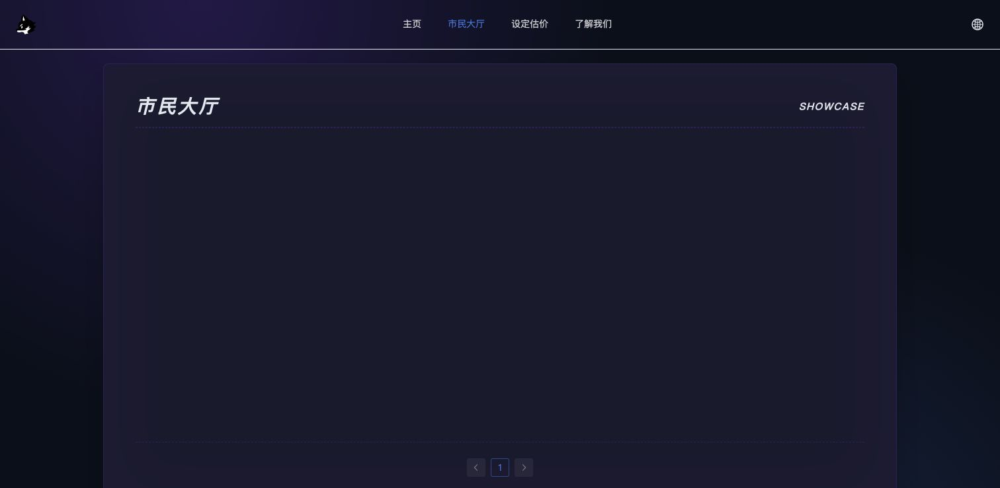

### 21-虚构都市-设定估价流程.png

配置式估价上半区：全装类型、服装设计、脖子毛、手爪、脚爪、肌群填充与设定图上传。

### 22-虚构都市-估价表单下半区.png

估价表单下半区：体测数据、联系人、邮箱、电话、验证码和提交按钮。

### 39-虚构都市-世界观与市民档案.png

“虚构内情 / WORLD SETTING”把委托和角色实体化写进品牌设定，视觉与首页保持一致。

### 40-虚构都市-委托流程概览.png

流程概览公开最快交期、整体周期、20% 定金和报价有效期，是首页最有效的信任模块之一。

### 41-虚构都市-委托流程详情.png

七步委托流程使用折叠卡片，展开时区分“需要您”和“我们会”，适合复杂服务说明。

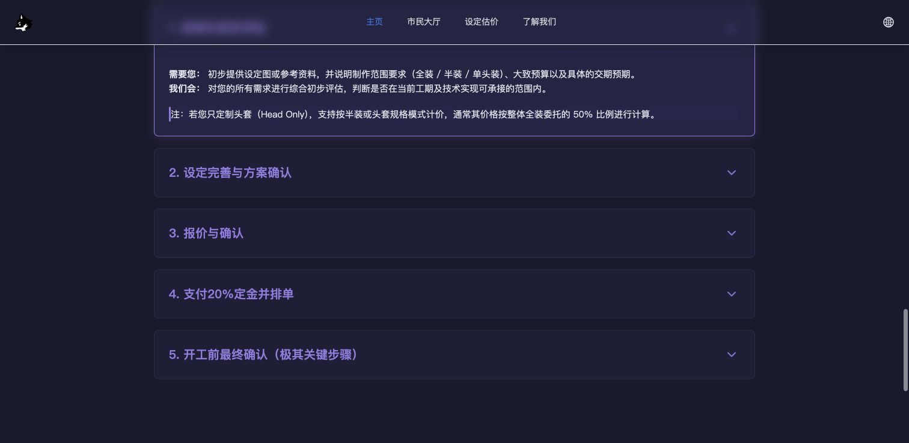

## 第二轮补充：万物通行作品、返图、活动与支持

### 42-万物通行-作品展示-列表顶部.png

来源：`https://www.ww-pass.com/gallery/works/`。作品页顶部同时提供三个系列筛选，主体为四列角色卡片；每张卡片包含主图、照片数量、角色名和系列图标。

### 43-万物通行-作品展示-列表中段.png

同一页面向下滚动后的视口。用于确认作品网格连续排布、卡片尺寸和间距保持一致，适合快速扫描大量案例。

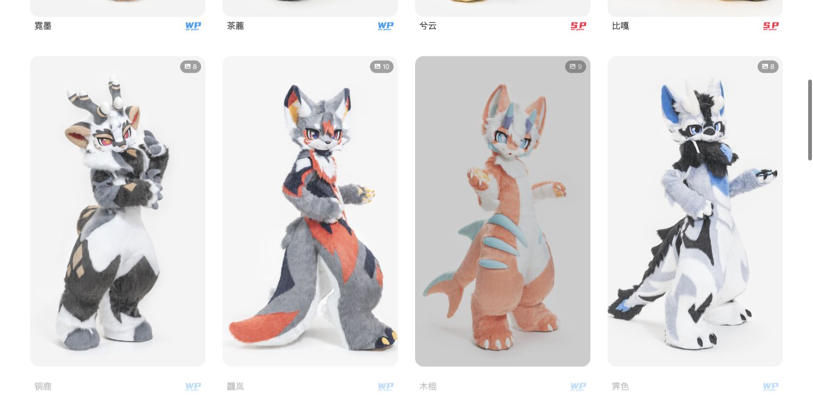

### 44-万物通行-作品展示-图集弹窗.png

点击“霓墨”作品主图后的灯箱。弹窗显示角色名、完成月份、8 张图片缩略导航和当前大图；URL 不变化，属于原页覆盖层。

### 45-万物通行-委托人返图-首页.png

来源：`https://www.ww-pass.com/gallery/char/`。委托人页面先以大幅真实返图推荐角色，并提供“了解委托人”入口；它与标准作品网格的视觉职责不同。

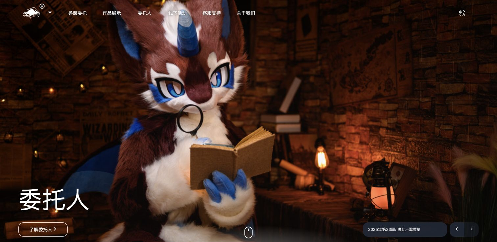

### 46-万物通行-委托人返图-投稿入口.png

同页下滚后的投稿区。“委托人投稿”把用户返图纳入持续运营闭环，不只由工作室单向上传作品。

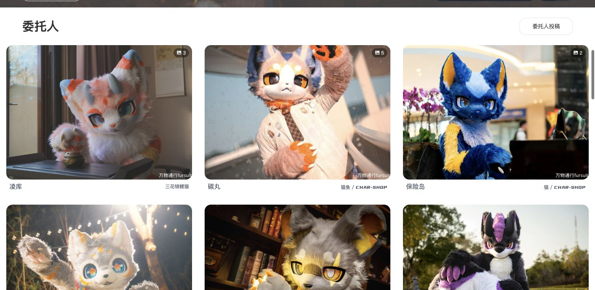

### 47-万物通行-委托人返图-角色详情.png

来源：`https://www.ww-pass.com/gallery/char/67459d115be64a73f05b0c3d/`。从返图首页进入独立角色档案；首屏组合角色照片、名称和外部社交链接。

### 48-万物通行-委托人返图-角色资料.png

角色档案下段包含设计师、生日、活跃城市、特征和角色曲。说明返图详情承担的是角色社区档案，而非仅展示成品工艺。

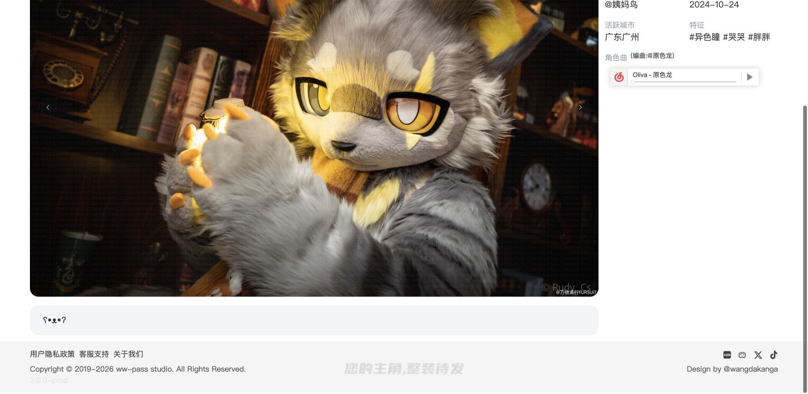

### 49-万物通行角色汤-展会专题-列表顶部.png

来源：`https://www.char-shop.com/album/`。专题页按展会组织内容，卡片显示展会名称、地点、月份和本届掉落角色图片。

### 50-万物通行角色汤-展会专题-历史列表.png

专题页下滚后的历史展会。连续记录不同届次，使展会掉落既是销售入口，也是品牌活动档案。

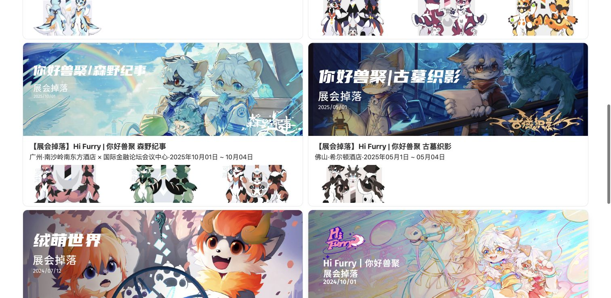

### 51-万物通行角色汤-展会专题-专题详情.png

来源：`https://www.char-shop.com/album/6a520e381ef0b5d5e7054c18/`。专题详情聚合本届掉落角色，卡片显示设计师、展会出售中状态、热度和价格，并可继续进入角色详情。

### 69-万物通行-线下活动-展会记录顶部.png

来源：`https://www.ww-pass.com/hp/event/`。活动页用纵向记录展示活动类型、名称、日期、城市、掉落 / 贩售说明和外部展会链接。

### 70-万物通行-线下活动-历史记录下段.png

活动页继续下滚后的历史记录，覆盖更早展会和聚会。该页面是持续经营与线下活跃度的社会证明。

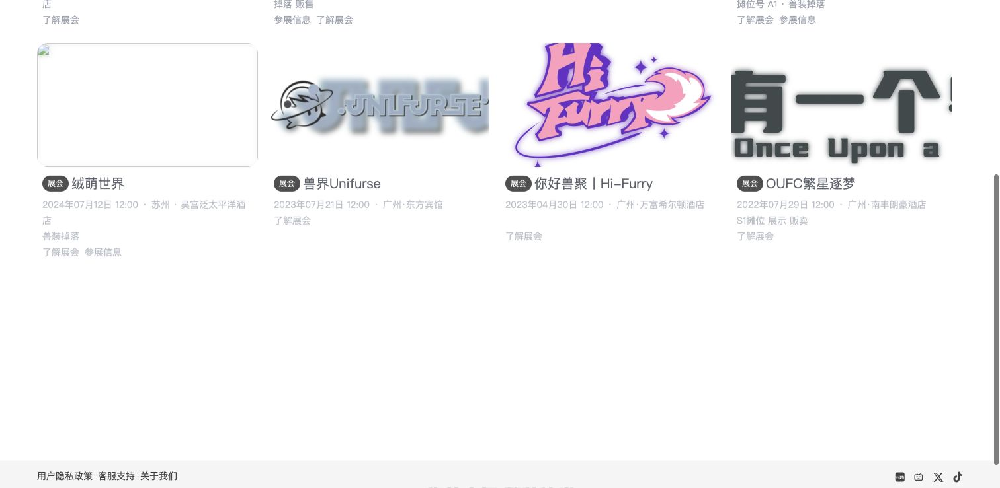

### 71-万物通行-客服支持-业务分流与反诈提示.png

来源：`https://www.ww-pass.com/support/`。支持页用四张大卡片分流兽装委托、装师服务、艾诺风扇和 DRA.s，并在主内容区突出“只认官网公告”的反诈警示。

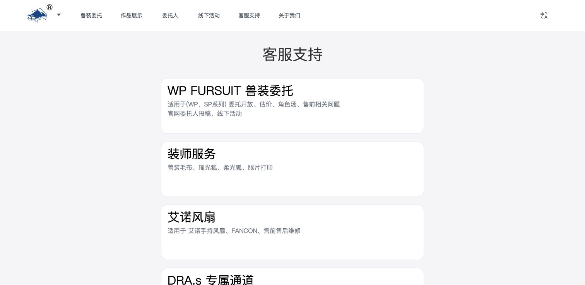

## 第二轮补充：鸿萌造物领养与画廊

### 52-鸿萌造物-领养详情-登录门槛.png

来源：`https://www.furmony.com/product/detail?id=2452&type=LYWT`。未登录进入领养详情时，页面以遮罩和登录弹窗阻断交易；支持密码登录 / 注册、验证码和协议勾选。

### 53-鸿萌造物-领养详情-角色与三档价格.png

关闭登录弹窗后的详情主体。左侧显示角色名、种族、背景和缩略图，右侧为设定图；价格同时给出 20% 定金、最高 12 期总金额和全款优惠，底部是“绑定角色并支付”。

### 54-鸿萌造物-鸿萌画廊-出场照.png

来源：`https://www.furmony.com/gallery`。默认“出场照”状态，使用黑底多列照片墙、顶部搜索和底部分类切换；同屏密度高，强调真实穿着氛围。

### 55-鸿萌造物-鸿萌画廊-活动照.png

点击“活动照”后的分类状态，内容切换为现场活动摄影。本次访问中部分图片未成功加载，保留黑色空框，是懒加载 / 资源可用性问题的直接证据。

### 56-鸿萌造物-鸿萌画廊-活动照网格下段.png

活动照页面继续向下浏览后的照片墙下段。它确认主要浏览交互是纵向扫图，并进一步暴露多张图片加载失败的问题。

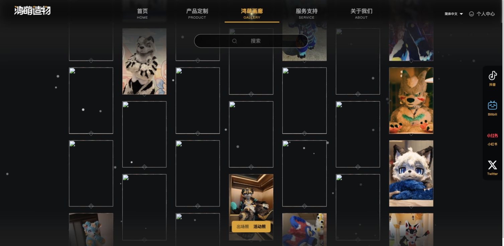

## 第二轮补充：渔屋作品、返图与领养确认

### 57-渔屋Fursuit-作品展示-筛选与网格.png

来源：`https://yuwufursuit.com/gallery`。作品页顶部提供全部 / 卡比洛 / 呆龙系列筛选，以及全部类型 / 全装 / 单头筛选；下方为统一网格。

### 58-渔屋Fursuit-作品展示-列表下段.png

同页向下滚动后的作品卡片与分页，证明筛选结果仍使用固定网格和稳定卡片密度。

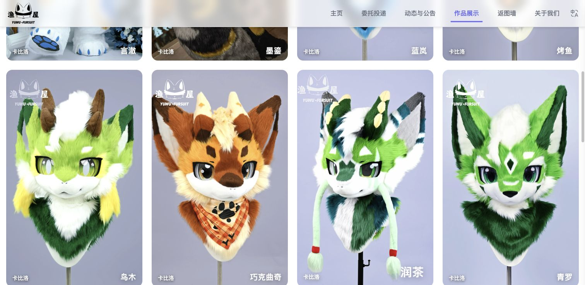

### 59-渔屋Fursuit-作品展示-作品详情弹窗.png

点击“言澈”卡片后的原页弹窗，显示大图、角色名、系列、全装类型和 2026 年 7 月完成时间。

### 60-渔屋Fursuit-返图墙-搜索与回忆卡片.png

来源：`https://yuwufursuit.com/picwall`。返图墙顶部包含按设定名搜索、主题横幅“关于时间和回忆”以及分页入口。

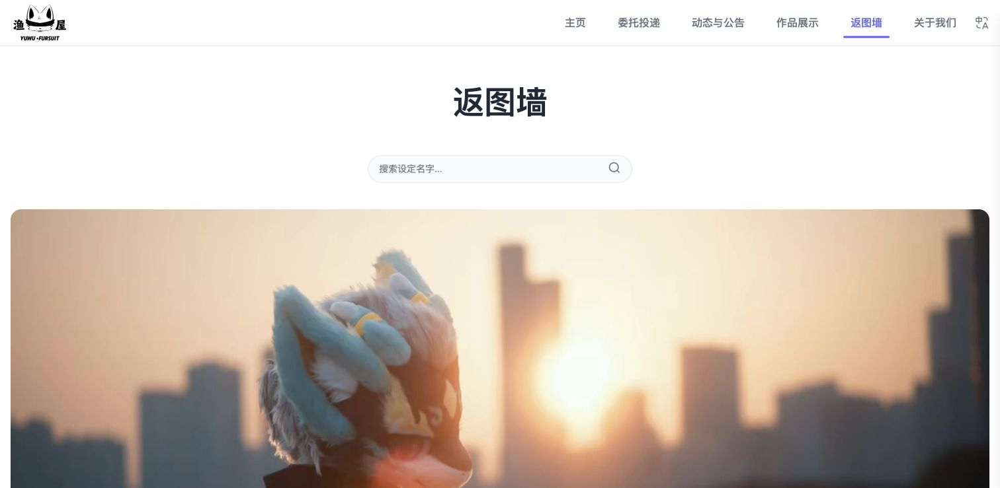

### 61-渔屋Fursuit-返图墙-瀑布流上段.png

返图墙开始下滚后的瀑布流上段。真实穿着照片采用不等高图片卡片，与作品页的规整棚拍网格形成明确区分。

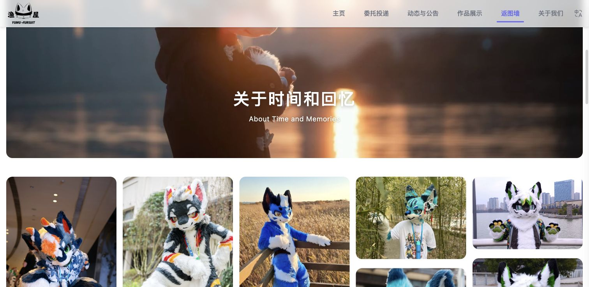

### 62-渔屋Fursuit-返图墙-瀑布流中段.png

继续下滚后的瀑布流中段，用于观察图片密度、列间距和懒加载后的实际内容。

### 63-渔屋Fursuit-返图墙-瀑布流下段.png

继续下滚后的下段，证明单页包含大量用户照片，并通过分页承载后续内容。

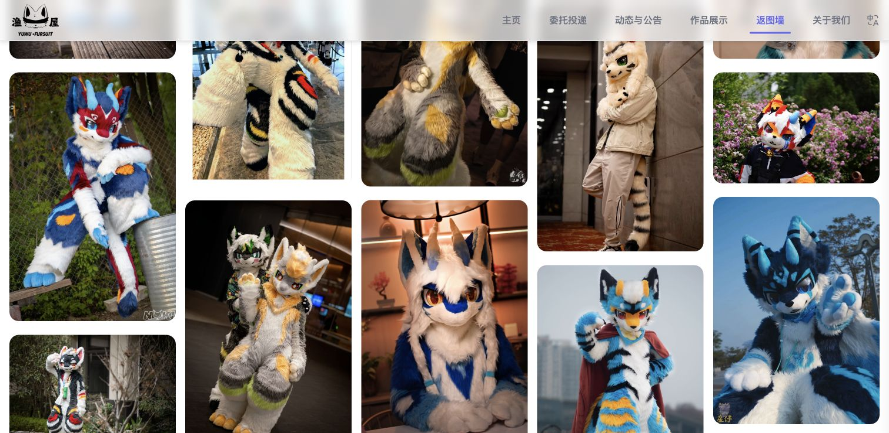

### 64-渔屋Fursuit-返图墙-返图详情与用户主页入口.png

点击第一张返图后的弹窗。除了大图，还显示返图者“三崽”、卡比洛系列、日期和“查看 TA 的主页”，把社会证明连接到用户档案。

### 65-渔屋Fursuit-领养详情-角色资料与领养须知.png

来源：`https://yuwufursuit.com/drop`，点击“咕噜”卡片后的详情。页面包含 UID、角色图、画师、系列、种族、发布时间、价格、简介和领养须知；受单一桌面视口限制，具体条款以正文浏览记录和下一张确认弹窗说明为准。

### 66-渔屋Fursuit-领养详情-提交前确认弹窗.png

点击“开放领养”后的二次确认。用户必须先阅读领养须知与服务条款，再选择“我已阅读，继续领养”；本次调研未继续提交。

## 第二轮补充：虚构都市居民作品

### 67-虚构都市-市民大厅-居民卡片.png

来源：`https://furpolis.com/` 首页“现有居民 / RESIDENTS”区。成品用横向自动跑马灯展示，卡片由全身照、居民名和物种组成。

### 68-虚构都市-市民大厅-居民名片详情.png

点击 GINTAN 居民卡片后的遮罩详情。“VERIFIED CITIZEN”名片包含成品照、居民编号、简介、档案状态和校验编号；这是独立市民大厅空白时仍可使用的作品查看入口。

