# 国内兽装工作室主页调研

- 调研对象：四个品牌组、五个网站——万物通行（委托站 + 角色汤领养站）、鸿萌造物、渔屋 Fursuit、虚构都市
- 调研日期：2026-07-26
- 调研方式：使用桌面端 Chrome 实际访问、展开菜单、进入功能分页并滚动截图；未填写或提交任何表单。

> 本文记录的是调研当时的网站状态。价格、排期、角色状态及页面内容会继续变化，后续正式设计时应重新核对。

## 阅读方式与覆盖范围

这份文档按“无浏览器远端 Agent 也能建立页面心智模型”的标准整理。正文负责解释页面结构、UI、动线与业务规则；`imgs/README.md` 负责逐图记录来源页面、视口位置和交互状态。

- 共保留 **71 张桌面端截图**，分辨率约为 1512 × 739；
- 截图 01–41 为首轮全站扫描，截图 42–71 为本次针对缺口补拍；
- 重点页面均尽量包含“列表 / 入口 → 滚动后的内容 → 详情或弹窗”；没有可用详情或页面本身为空时单独标注；
- 未登录、未填写表单、未提交领养或委托；
- 空白页、占位文案和登录门槛按实际状态保留，不代表漏拍。

本报告可作为**桌面端信息架构、页面原型和内容模型参考**，不能直接作为交易状态机或验收规格：没有验证登录后的支付、最终提交、线下抽选和合同签署，也没有覆盖移动端菜单、响应式卡片、弹窗适配和触控交互。

### 页面覆盖矩阵

| 站点 | 首页 / 业务入口 | 委托 / 估价 | 领养列表 / 详情 | 作品 / 返图 | 其他关键页 | 覆盖判断 |
| --- | --- | --- | --- | --- | --- | --- |
| 万物通行委托站 | 01、23、24 | 02、03、25–28 | 不适用 | 42–48 | 活动 69–70；支持 71 | 页面结构已覆盖；估价终端本次为空白 |
| 角色汤领养站 | 04 | 跳转委托站 | 05–07、29 | 设计师 30 | 展会专题 49–51 | 列表与两类详情已进入；提交 / 现场交易未验证 |
| 鸿萌造物 | 08、09 | 11、34 | 10、31、52–53 | 12、54–56 | 服务 32–33 | 页面结构已覆盖；登录后绑定与支付未验证 |
| 渔屋 Fursuit | 13–15、35–36 | 15、35 | 16–17、65–66 | 18、57–64 | 关于 37–38 | 详情与提交前确认已进入；最终提交未验证 |
| 虚构都市 | 19、39–41 | 21–22、40–41 | 不提供 | 首页居民档案 67–68 | 独立市民大厅 20 | 首页档案可交互；独立大厅本次为空 |

### 给远端 Agent 的最短阅读路径

如果只需要快速建立产品结构，请依次阅读：

1. 本文“一、结论先行”和“二、横向对比”；
2. “五、核心用户动线横评”；
3. “六、作品 / 返图 / 社会证明横评”；
4. 各站逐站观察；
5. 需要复原具体界面时，再按截图编号查看 `imgs/README.md`。

## 一、结论先行

这四组网站共同在解决三个问题：

1. **先让访客相信作品的审美和制作能力**：首屏几乎都用大幅兽装照片、视频或强世界观画面建立第一印象。
2. **再让访客快速找到业务入口**：把“自设委托”“设定领养”“作品展示”“FAQ / 服务条款”放在顶部导航或首页核心区。
3. **最后降低高客单价交易的不确定性**：公开价格或价格区间、制作周期、排单状态、委托流程、修改规则、版权、售后和安全说明。

对于朋友的新工作室，最值得借鉴的不是某一种视觉风格，而是这套稳定的信息顺序：

**品牌气质 → 业务选择 → 作品证据 → 价格与排期 → 流程与规则 → 明确行动按钮。**

建议初版采用一个站点承载委托与领养，只有在领养角色数量、设计师合作和交易运营明显变复杂后，才考虑像万物通行一样拆出独立领养商城。

## 二、横向对比

| 工作室 | 业务组织 | 主要功能 | 视觉语言 | 最值得借鉴 |
| --- | --- | --- | --- | --- |
| 万物通行 | 委托站与“角色汤”领养站分离 | 委托系列、在线估价入口、作品、委托人、活动、领养筛选、设计师、专题 | 委托站偏高级产品官网；领养站偏白底内容商城 | 品牌站与交易站职责清楚；价格、材料、周期对比直接 |
| 鸿萌造物 | 委托与领养合并 | 领养委托、自设委托、角色池、FAQ、画廊、服务支持、个人中心 | 黑黄工业感、电竞感、强动效、信息密度高 | “领养 / 自设 / 角色风格化”三路分流；锁定角色和交易状态完整 |
| 渔屋 Fursuit | 委托与领养合并 | 两个制作系列、三步估价、设定领养、作品展示、返图墙、公告、FAQ | 大面积白色、编辑式排版、淡紫蓝强调、摄影主导 | 信息架构最接近适合新工作室的“一站式官网” |
| 虚构都市 | 只提供委托 | 居民档案、七步委托流程、配置式估价、服务条款 | 深色赛博城市、紫色荧光、系统终端叙事 | 把普通“委托”包装成“居民入市”，品牌世界观贯穿文案与组件 |

## 三、共同点

### 1. 首页不是产品目录，而是品牌海报

四组网站都把最强的视觉资产放在首屏：

- 万物通行、鸿萌、渔屋使用实拍兽装或活动照片；
- 虚构都市使用动态粒子、线框角色和系统终端语汇；
- 标题非常短，首屏只保留一个最核心动作，例如“立即估价”“申请加入都市”。

这说明首页首屏的首要任务不是解释全部业务，而是让用户在数秒内感受到“这家做出来的东西是什么气质”。

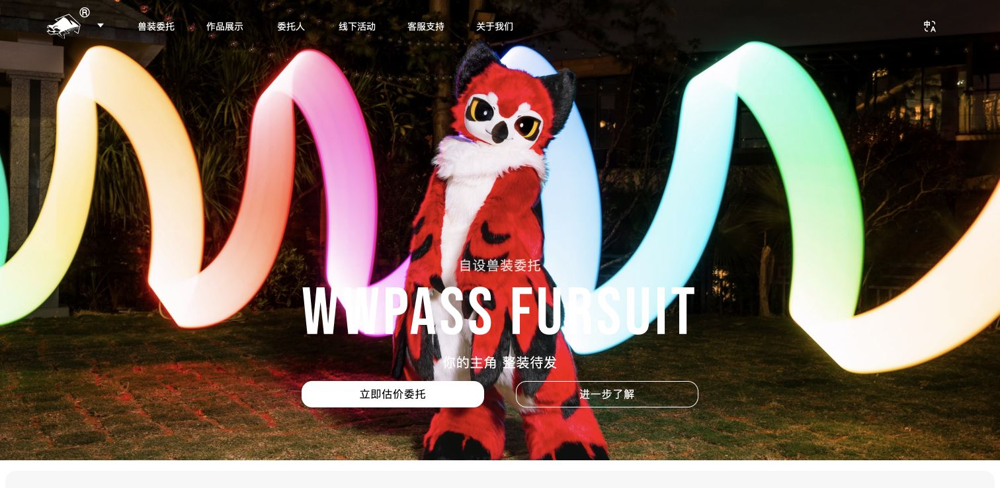

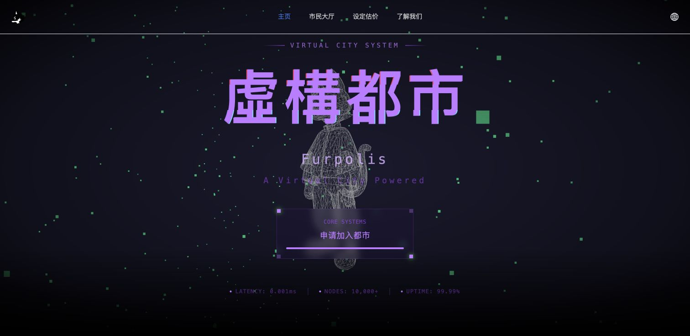

### 2. 委托与领养必须被明确分流

只要同时经营两种业务，网站都会把它们做成不同入口：

- 万物通行直接拆成两个站；
- 鸿萌在“产品定制”内并列“领养委托 / 自设委托 / 角色风格化”；
- 渔屋在“委托投递”下设置“自设委托 / 设定领养”。

用户不应该先理解工作室内部术语，才知道自己该点哪里。首页需要用一句话解释：

- **我已经有设定** → 自设委托；
- **我想挑选现成设定** → 设定领养；
- **我想在展会购买已完成头部的角色** → 展会掉落。

### 3. 作品展示承担“质量证明”

所有样本都有作品或居民展示，区别只在呈现方式：

- 万物通行有作品、委托人和活动；
- 鸿萌有出场照、活动照；
- 渔屋把“作品展示”和“返图墙”分开；
- 虚构都市把成品角色称为“居民档案”。

作品页不只是相册。成熟做法会给每个角色保留名称、系列、种族、画师或制作方等结构化信息，方便用户理解工作室擅长的风格。

### 4. 高客单价交易需要公开规则

四组网站都用不同方式补足信任信息：

- 价格或估价工具；
- 当前排期与制作周期；
- 定金、锁定、付款和发货；
- 制作前后的修改边界；
- DTD / 量体要求；
- 版权、转让和商用范围；
- 售后、保养、保修与安全提示；
- 服务条款、隐私政策与官方联系方式。

这部分往往比“关于我们”的品牌宣言更能影响用户是否愿意提交设定图。

### 5. 都在使用“状态标签”

领养业务尤其依赖状态标签：

- 即将上架；
- 可申请 / 应征领养；
- 直接领养；
- 展会掉落 / 展会出售中；
- 未锁定 / 锁定；
- 未领养；
- 当前未开单。

状态必须同时回答“现在能不能买”和“下一步做什么”，不能只用颜色表达。

## 四、类似的设计语言

### 1. 大图、短文案、强对比

共同模式是大幅视觉、短标题、少量按钮。即使风格差异很大，构图都强调单一焦点：

- 白底站点用黑色大字和大量留白；
- 深色站点用高饱和品牌色制造层级；
- 卡片区则恢复稳定、可扫描的信息结构。

### 2. 中英双语小标题

`COMMISSION`、`PRODUCT`、`GALLERY`、`SERVICE`、`VALUATION`、`REGISTRATION PROCESS` 等英文常被当作装饰性副标题。它能增强专业感和品牌感，但不应替代中文业务说明。

### 3. 卡片化呈现

作品、角色、设计师、服务步骤和价格方案几乎都使用卡片：

- 图片负责审美；
- 标签负责状态；
- 名称、画师、系列负责识别；
- 价格和按钮负责转化。

卡片很适合领养业务，因为用户会快速横向比较多个角色。

### 4. 固定顶部导航

长页面普遍保持顶部导航可见，让用户在作品、价格、FAQ 和表单之间快速切换。导航项数量一般控制在 4–6 个一级入口。

### 5. 情绪区与功能区分层

首页上半段负责“想要”，下半段负责“敢买”：

- 上半段：视觉、角色、世界观、活动氛围；
- 下半段：价格、周期、表单、FAQ、条款、联系方式。

这是后续设计最应该保留的节奏。

## 五、核心用户动线横评

### 1. 自设委托

四站的共同主线是：

**首页主视觉 → 委托类型 / 系列 → 价格与周期 → FAQ / 条款 → 估价或申请表 → 人工确认。**

差异主要在提交前的信息量：

- 万物通行先用 WP / SP 两列回答价格、材料与交期，再进入估价；品牌说服力最强，但本次估价终端未正常渲染；
- 鸿萌造物直接进入高密度表单，基础信息、地址、货主、体测和制作备注一并收集，适合已有客服和订单系统的团队；
- 渔屋使用三步估价，先设定与系列，再联系方式，最后身体数据，认知负担最低；
- 虚构都市把配置选择、体测和联系方式合为一套“申请加入都市”，并在首页先公开 20% 定金、8–9 个月周期和报价有效期。

首版开发建议采用渔屋式分步表单，但在进入表单前放置万物通行式“系列 / 起价 / 周期”对比，避免用户填完才发现预算不匹配。

### 2. 一般领养

页面已实际观察到的 UI 链路是：

**列表筛选 → 角色卡片 → 详情 → 阅读权利与规则 → 申请 / 锁定入口。**

“人工联系或支付”属于页面规则描述或登录后的后续动作，本次没有提交或完成交易。

- 角色汤：卡片进入详情，采用直接领养或“应征领养”；详情强调价格包含内容和权利范围；
- 鸿萌造物：详情同时展示设定图、背景、20% 定金、分期总价和全款优惠；“绑定角色并支付”前要求登录；
- 渔屋：详情展示 UID、画师、系列、种族、发布时间、价格和领养须知；点击“开放领养”后先出现二次确认弹窗。

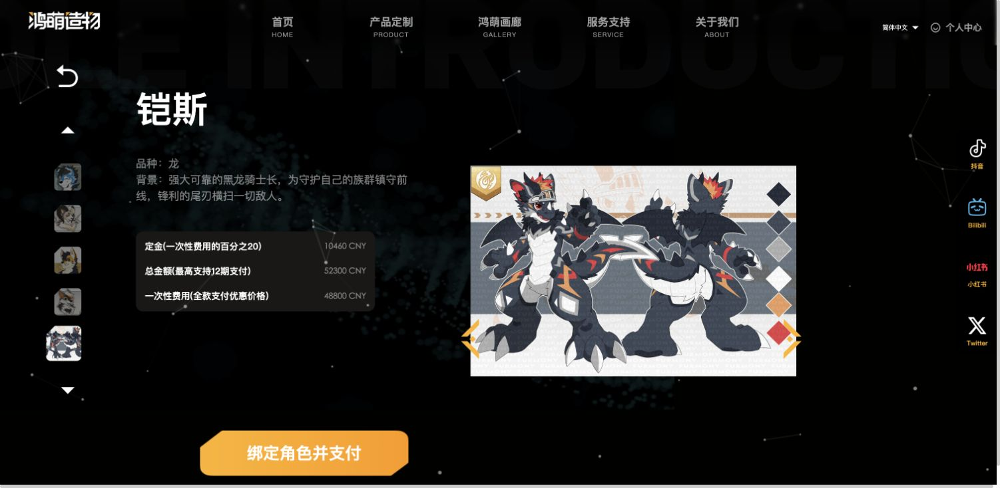

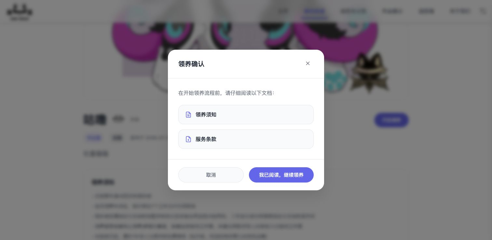

三站共同证明：领养详情不能只是一张设定图和价格。至少要明确年龄门槛、联系时效、设定与兽装权利、转让规则、保修、付款节点以及当前状态。

领养“类型”和交易“状态”应在数据层分开：

| 字段 | 建议取值 | 作用 |
| --- | --- | --- |
| `adoptionType` | 直接领养、应征领养、展会掉落 | 决定规则、提交方式和是否依赖展会 |
| `status` | 即将上架、开放中、已锁定、已领养、已结束 | 决定现在能否操作及按钮文案 |

### 3. 展会掉落

角色汤已截图的站内 UI 链路是：

**专题列表 → 某届展会专题 → 本届掉落角色 → 角色详情。**

角色详情中的页面文字继续说明“现场抽选 → 支付 → 签订合同 → 按领养人体型制作身体”。这些线下步骤来自规则说明，本次没有在现场验证。

专题列表保留展会名称、地点、日期和历史记录；专题详情再聚合本届角色。它把“活动内容”和“可交易库存”绑定起来，比在普通领养列表中只放一个“展会掉落”标签更有营销价值。

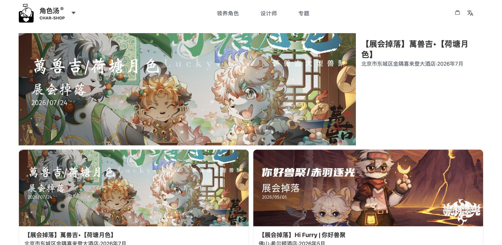

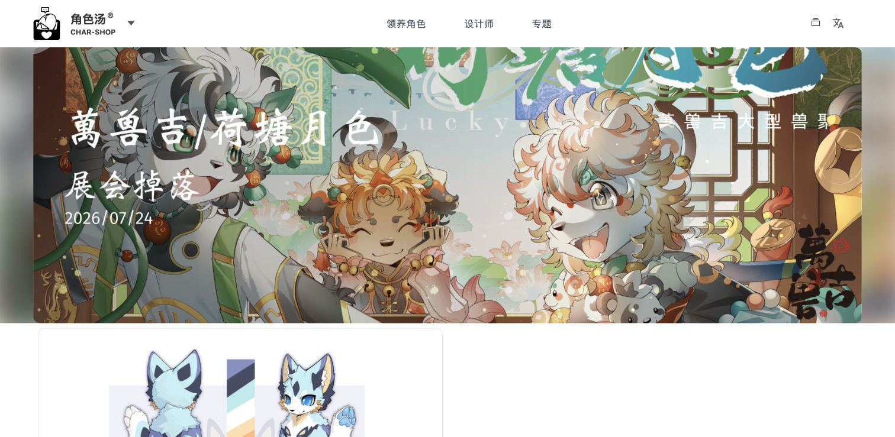

如果新工作室未来参加兽展，建议把展会当作一级内容对象，具备时间、地点、摊位、掉落角色、销售规则和结束状态，而不是只发一篇公告。

### 4. 作品浏览

成熟网站通常不是“点开一张大图就结束”，而是提供结构化浏览：

- 万物通行：系列筛选 → 四列角色卡片 → 角色 8 张图灯箱；
- 鸿萌造物：出场照 / 活动照切换 → 暗色多列照片墙 → 纵向浏览；
- 渔屋：系列与全装 / 单头筛选 → 网格卡片 → 作品详情弹窗；
- 虚构都市：首页居民横向跑马灯 → 居民名片弹窗。

这四种模式分别适合“作品量大”“强调沉浸照片”“需要精确筛选”“品牌世界观强”的团队。

## 六、作品、返图与社会证明横评

### 1. 标准作品与用户返图应分开

标准作品回答“工作室能做多好”，返图回答“真实用户穿起来如何、角色是否活起来”。渔屋把两者拆为独立一级导航，是样本中最清楚的做法：

- 作品展示：统一主图、角色名、系列、全装 / 单头、完成时间；
- 返图墙：真实场景瀑布流、设定名搜索、返图者昵称和个人主页入口。

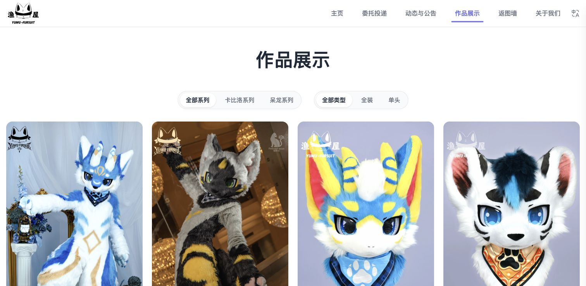

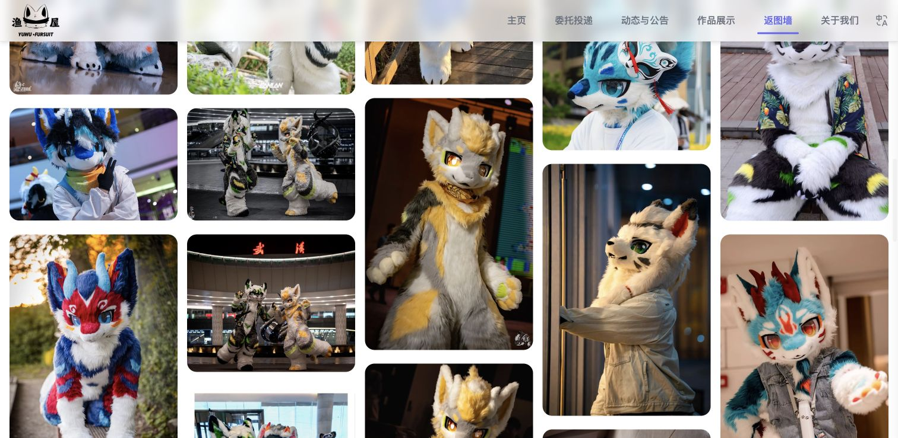

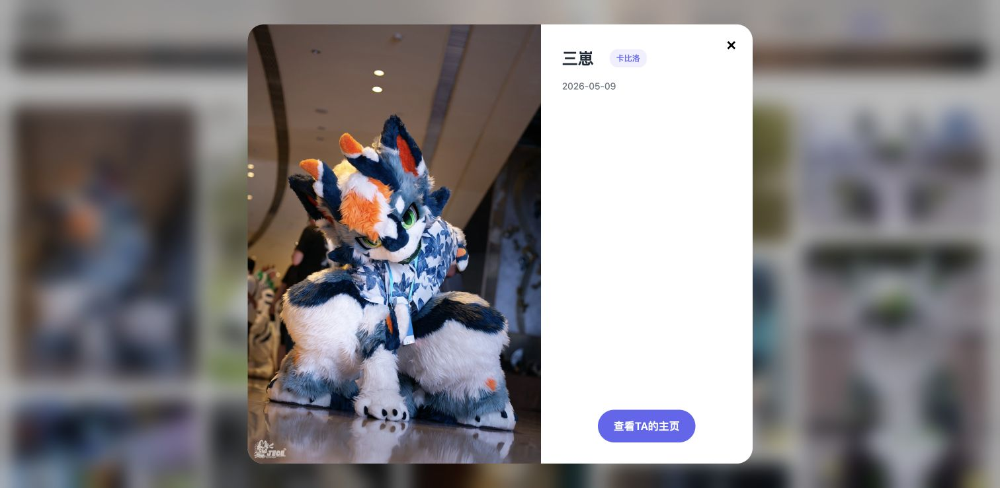

### 2. 作品详情的最小字段

综合四站，建议保留：

- 角色名称、系列、种族；
- 全装 / 半装 / 单头；
- 完成时间；
- 设计师、制作方；
- 3–8 张多角度照片；
- 棚拍 / 出场 / 活动 / 用户返图类型；
- 可选的角色主页或社交账号；
- 若角色来自领养，关联原领养详情或设计师。

### 3. 活动记录是另一种信任证据

万物通行把活动独立成时间线，记录展会 / 聚会类型、日期、城市、摊位、展示 / 贩卖 / 掉落信息，并链接外部展会页。这不仅证明工作室真实活跃，也能为展会掉落导流。

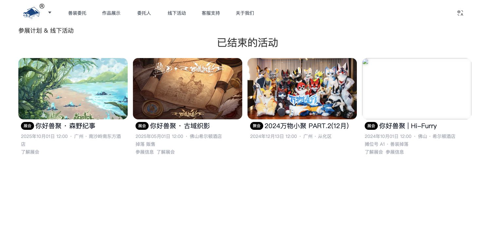

### 4. “作品橱窗”的四种可借鉴形态

| 形态 | 样本站点 | 优点 | 风险 |
| --- | --- | --- | --- |
| 网格 + 灯箱 | 万物通行 | 扫描效率高，可快速看大量角色 | 若无详情字段，搜索和分享能力弱 |
| 暗色多列照片墙 | 鸿萌造物 | 同屏图片多，活动氛围强 | 部分图片加载失败时空洞很明显 |
| 网格 + 结构化弹窗 | 渔屋 | 筛选与详情兼顾 | 需要持续维护元数据 |
| 世界观名片 | 虚构都市 | 品牌记忆强、角色资产感强 | 文案不能遮蔽真实作品信息 |

## 七、逐站观察

### 7.1 万物通行：成熟的“品牌官网 + 领养商城”

#### 委托站

顶部功能包括：兽装委托、作品展示、委托人、线下活动、客服支持、关于我们。委托页进一步提供常见问题、合同样本、开放时间表和立即估价。

委托系列对比非常直接：

- WP：22000+ CNY；3D 打印头，可付费升级海绵；最快约 6 个月，最长不超过 12 个月；
- SP：26000+ CNY；柔软海绵材质、量身定制设计；最快约 12 个月，最长不超过 18 个月；
- 两者都展示毛布、风扇、涂装和售后差异。

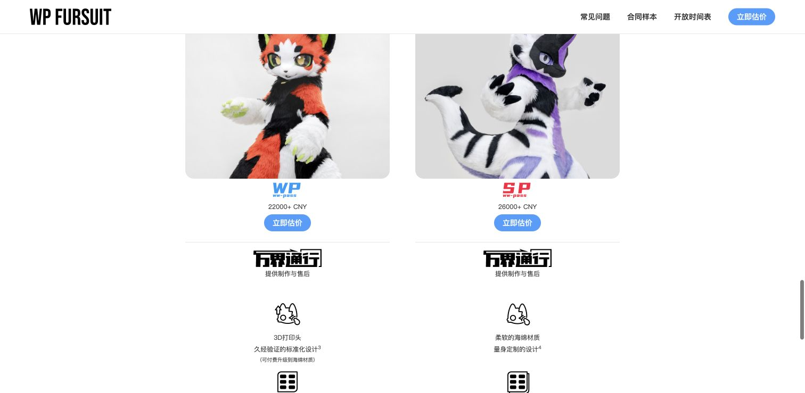

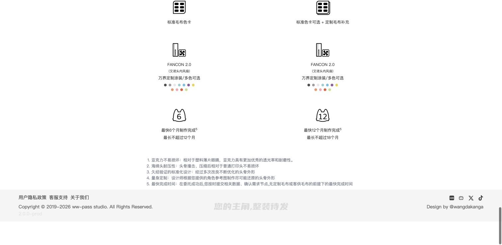

值得借鉴：

- 用并列卡片回答“贵在哪里、慢在哪里、适合谁”；
- 在同一区域展示价格、材料和交期，不让用户来回翻 FAQ；
- 首页中段把委托、硬件配件和养护服务做成不同视觉卡片，形成完整产品生态。

当前问题：

- “立即估价”终端页在本次 Chrome 访问中出现空白，入口存在但未渲染出可操作内容；
- 个别内容依赖图片和动画加载，首次滚动会短暂出现较大空白。

作品与返图在信息架构上被刻意分开：

- “作品展示”是四列网格，卡片显示角色名、系列图标和照片数量；点击主图后在原页打开多图灯箱，不改变 URL；
- “委托人”先用大幅返图做人物推荐，再进入独立角色档案；档案含角色名、设计师、生日、活跃城市、特征、角色曲与社交链接；
- “线下活动”按时间记录展会和聚会，“客服支持”则按兽装委托、装师服务、风扇、DRA.s 四类业务分流，并把反诈警示放在主内容区。

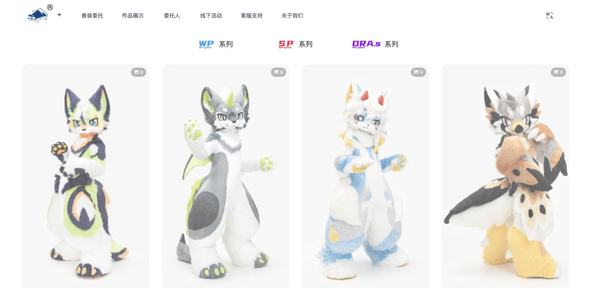

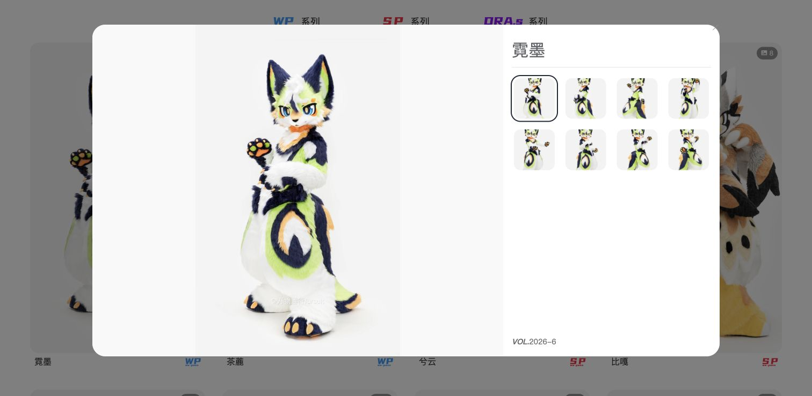

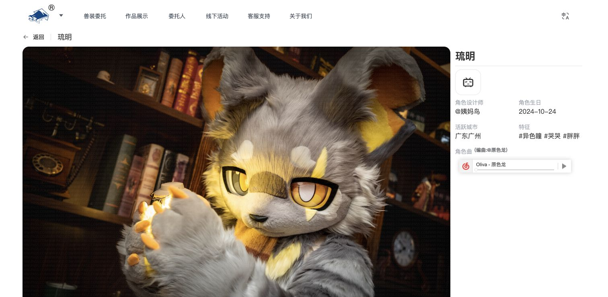

这里最重要的动线判断是：标准作品用“快速浏览 + 灯箱”，用户返图用“可分享角色档案”。前者降低浏览成本，后者增加人物和社区感。

#### 角色汤领养站

角色汤使用独立站点承载领养交易，导航只有领养角色、设计师、专题，目标非常聚焦。

领养列表支持种族、颜色和排序；卡片展示名称、设计师、价格、热度和状态。详情页会写清价格包含内容、版权范围和注意事项。

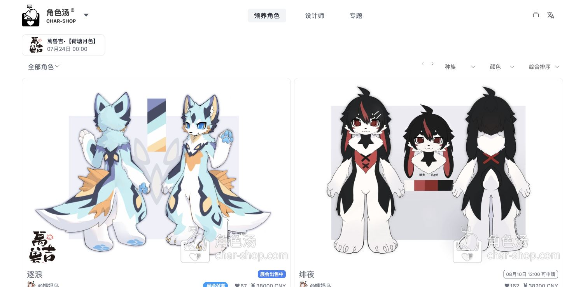

一般领养使用“应征领养”：提交申请后由工作室挑选合适委托人。展会掉落则明确说明：

- 角色在展会现场抽选；
- 通常头部已经制作完成；
- 身体根据领养人体型制作；
- 抽选结束后现场支付并签订合同。

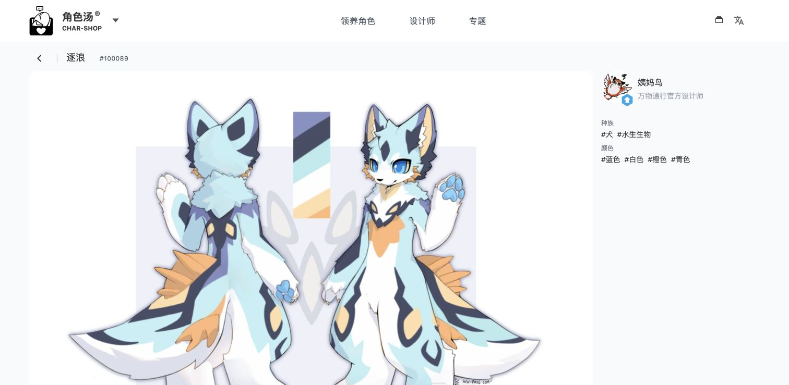

值得借鉴：

- 设计师页展示“可领养 / 已被领养”数量，强化画师资产；
- 专题页按展会组织掉落角色，适合活动营销；
- 领养类型、时间、价格和权利范围都在详情页一次讲清楚。

角色汤的页面视觉从委托站的“高级产品官网”切换为白底商城：卡片密度更高、标签更多、价格与热度更醒目。它保留统一品牌，但没有强迫交易页沿用委托站的大留白和长动画。

专题页不是普通图文文章，而是“展会信息容器”。用户先看地点和日期，再进入本届可领养角色，因此后续开发应把专题、角色和领养类型设计成可关联的数据对象。

### 7.2 鸿萌造物：交易能力最重的一体化站点

“产品定制”首先给出三条业务路径：领养委托、自设委托、角色风格化。

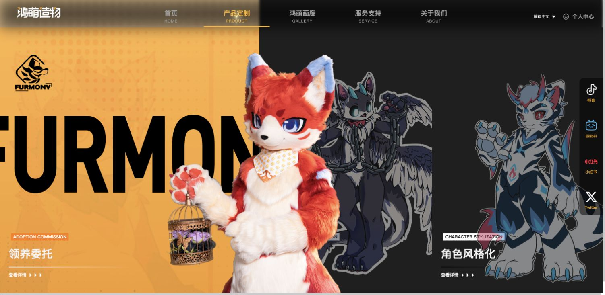

领养区具有明显的商城属性：

- 支持综合、时间、价格排序和搜索；
- 展示设计师、未锁定 / 锁定、未领养和金额；
- 调研时页面显示共 983 条记录；
- 个人中心与角色锁定机制说明站点承担了真实交易流程。

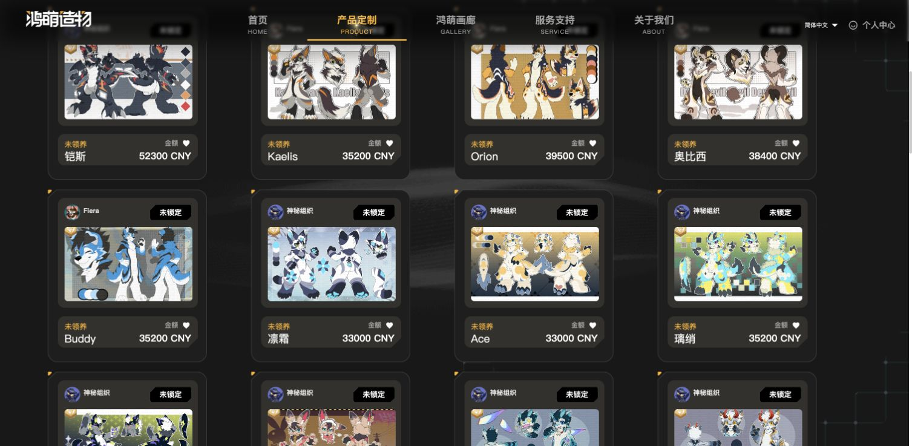

进入领养详情后，页面左侧为角色名、种族和背景，右侧为设定图，下方同时给出：

- 20% 定金；
- 最高支持 12 期的总金额；
- 全款支付优惠价；
- “绑定角色并支付”主按钮。

未登录用户访问详情时会先出现手机号 / 邮箱登录弹窗；关闭后仍可查看角色与价格，但进入交易动作需要账户。这说明鸿萌把详情阅读和交易授权分成两层。

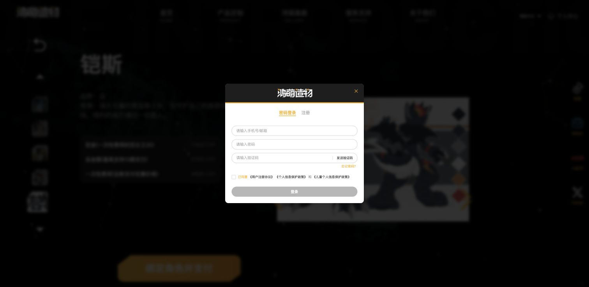

自设委托表单分为基础信息、地址信息、货主信息、制作要求，包含设定图、体型、联系方式和制作备注。

服务支持页把流程写成：

1. 提交信息并锁定角色；
2. 10 分钟内支付锁定费用；
3. 客服 1–2 个工作日联系；
4. 确认订单、寄送 DTD；
5. 确认毛布；
6. 制作前可提出 3 次建模 / 打版修改；
7. 完工、确认地址、支付运费并发货。

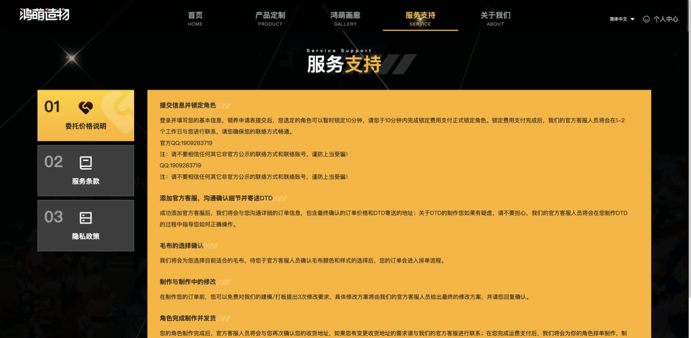

鸿萌画廊使用暗色多列照片墙。顶部提供搜索，“出场照 / 活动照”切换固定在内容区，用户继续向下浏览更多照片。它适合用大量实拍形成氛围，但卡片缺少角色名等结构化元数据；本次没有验证照片是否还能进入独立详情。“活动照”中多张图片在本次访问未成功加载，黑底空框尤其明显，但不能据此推断为长期故障。

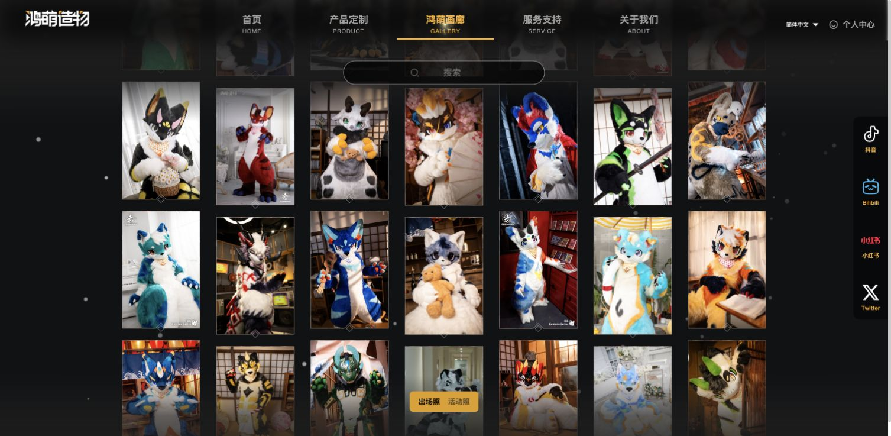

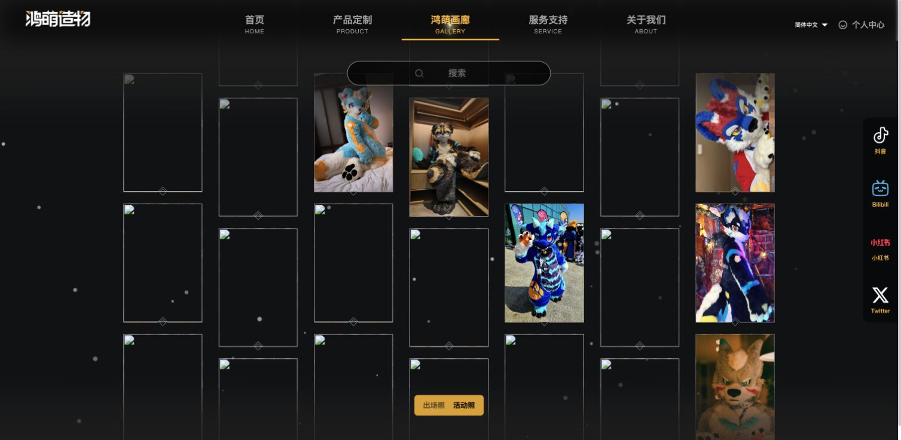

值得借鉴：

- 状态和交易规则最完整；
- 官方联系方式与防诈骗提醒醒目；
- 用服务页承担用户教育，减少客服反复解释。

需要谨慎借鉴：

- 首次加载动画较长；
- 页面信息密度高，黑底小字不利于长文阅读；
- 新工作室若没有真实库存、账户和支付系统，不必一开始复制这么重的交易能力。

### 7.3 渔屋 Fursuit：最接近“新工作室一站式官网”的结构

渔屋首页把自设委托、设定领养、作品、返图、动态和关于我们放在同一站点，整体结构清楚。

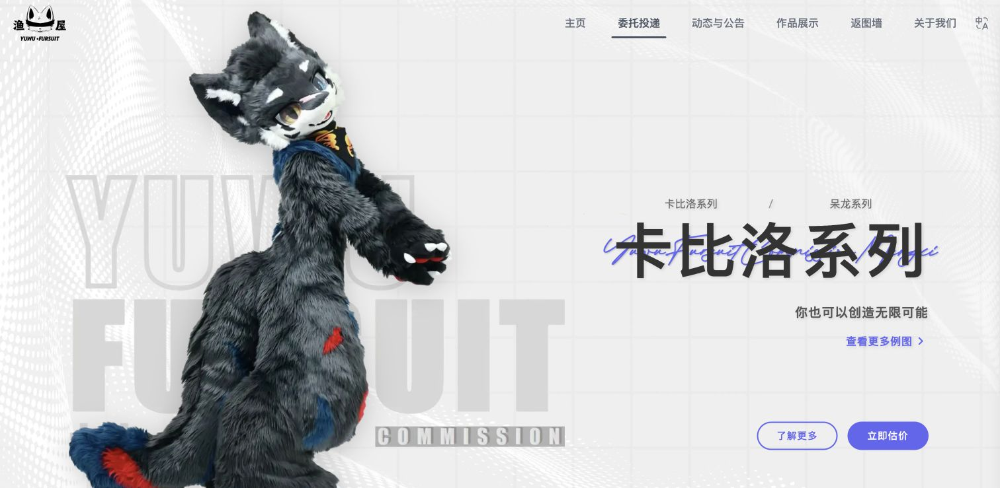

自设委托页包含卡比洛、呆龙两个系列，展示系列风格、头内风扇、一体填充、海绵或打印头骨，并提供立即估价。

FAQ 明确写出：

- 单头约 30 个工作日；
- 全装约 60–90 个工作日；
- 当前不支持单独配件委托；
- 开工后不再接受设定修改；
- 可在线下或展会协助身体数据采集与 DTD；
- 只补全本工作室作品。

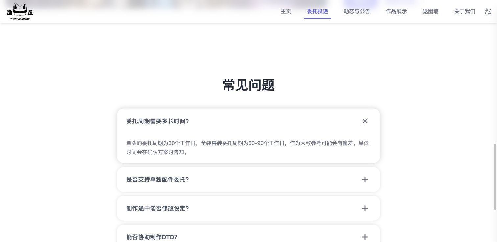

在线估价使用三步流程：

1. 基本信息：系列、设定图、设定名称、种族和可选室内脚；
2. 联系方式：昵称、年龄、QQ、邮箱、电话、社交主页；
3. 身体数据：身高、体重、头围、胸腰臀围和备注。

领养区支持默认视图、画师视图和角色筛选，卡片状态包括开放领养、展会掉落、即将上架。详情页写明 18 岁限制、7 个工作日内联系、版权 / 使用权、转让通知和一年非人为损坏保修。

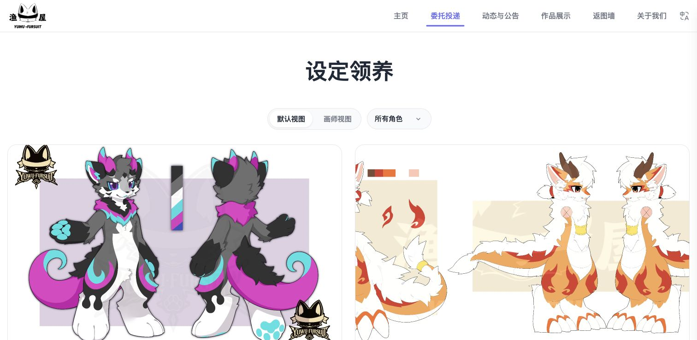

详情页以大幅设定图为中心，同时保留 UID、画师、系列、种族、发布时间和价格。点击“开放领养”不会立即提交，而是出现“领养确认”弹窗，要求先阅读领养须知与服务条款，再进入后续流程。

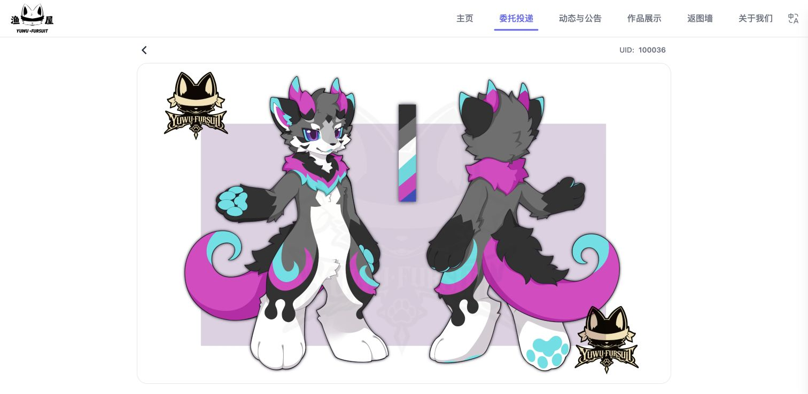

作品和返图是渔屋最值得借鉴的部分：

- 作品页提供系列与全装 / 单头双维度筛选，点击卡片后以弹窗展示角色、系列、装型和完成时间；
- 返图墙提供设定名搜索、30 张/页的瀑布流和分页；
- 点击返图后显示返图者昵称、系列、日期，并可进入“TA 的主页”。

本次只确认了“查看 TA 的主页”入口存在，没有继续进入目标用户页。

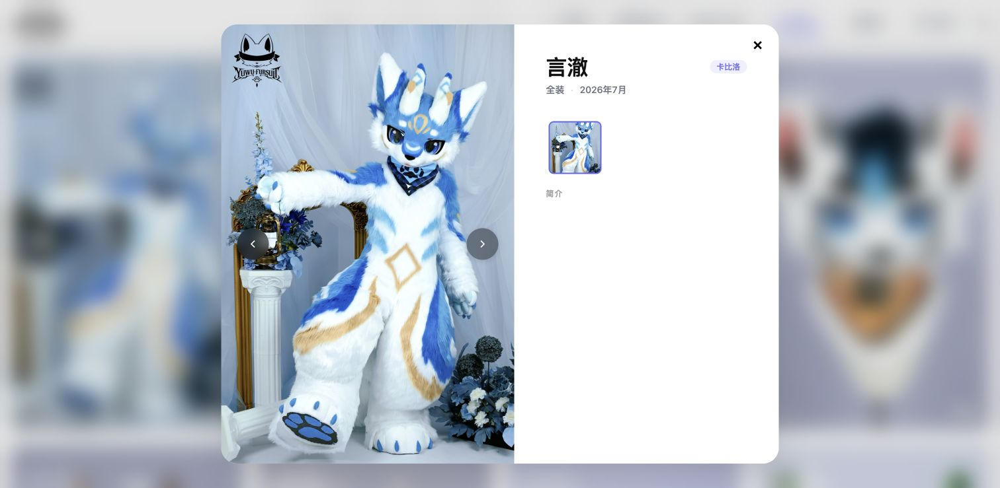

值得借鉴：

- 结构轻，委托与领养都能在两次点击内到达；
- 作品展示可按系列和全装 / 单头筛选；
- “返图墙”把真实用户使用场景与标准棚拍分开，是很好的社会证明。

当前问题：

- 首页出现未翻译键值 `home.viewDetails`；
- 动态与公告页本次访问没有内容；当前截图集中未单独保留该空页；
- 关于我们中的成员、联系方式和邮箱仍存在明显占位文案；
- 多语言入口已经出现，但内容是否完整需要在正式上线前逐项核对。

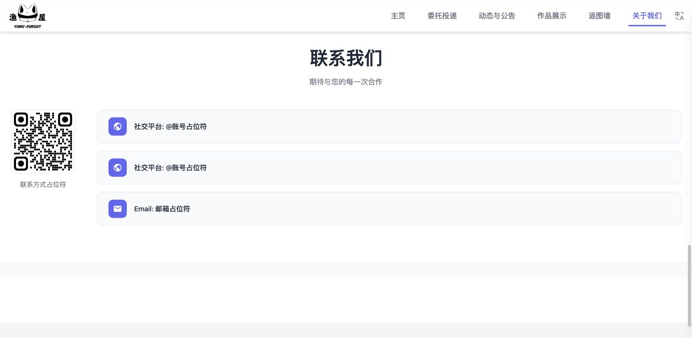

### 7.4 虚构都市：世界观最完整的单业务网站

虚构都市没有领养业务，而是把委托包装成“申请加入都市”、把成品角色包装成“居民”。这不是简单换词，而是从首页、居民档案、按钮、表单到流程说明都保持统一。

首页“现有居民”使用自动横向跑马灯展示成品卡片。点击后在遮罩层打开“VERIFIED CITIZEN”名片，包含成品照片、居民编号、简介、状态和校验编号。它没有单独维护传统作品详情 URL，而是把作品当作世界观中的档案对象。

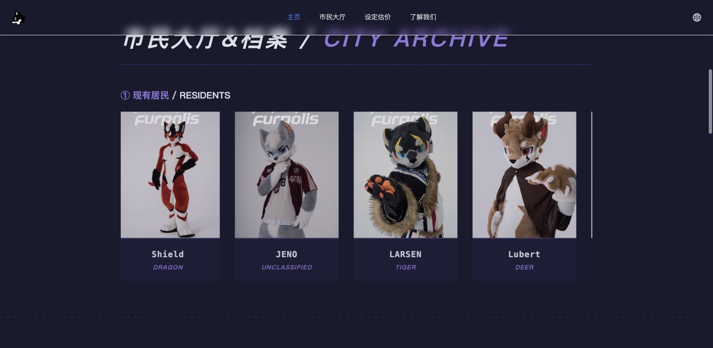

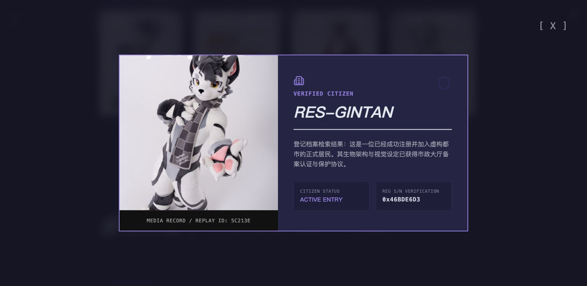

世界观区解释“虚拟居民”如何通过物理同构进入现实，让作品展示和委托流程具有叙事关系。

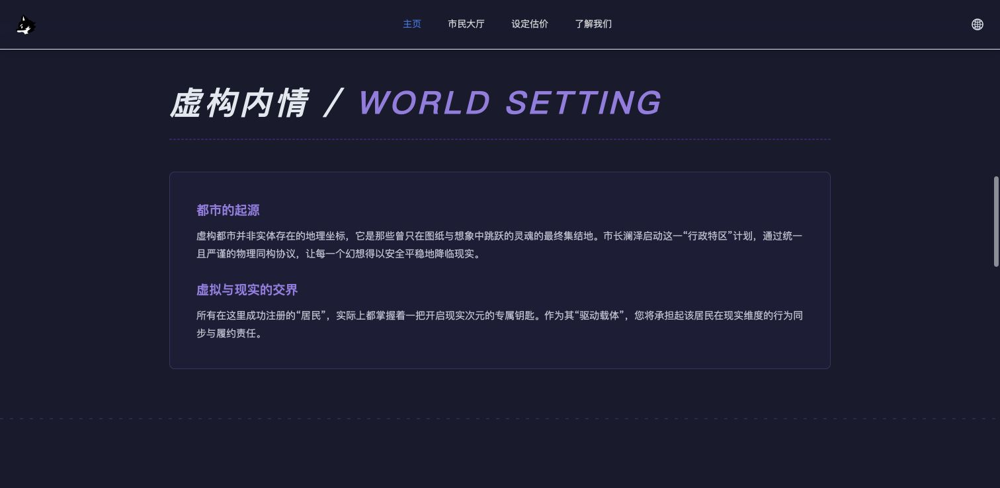

流程概览公开：

- 当前最快交期：2026 年 9 月；
- 整体约 8–9 个月；
- 排单定金：全额 20%；
- 报价有效期：1 周；
- 报价通常以 USD 区间给出。

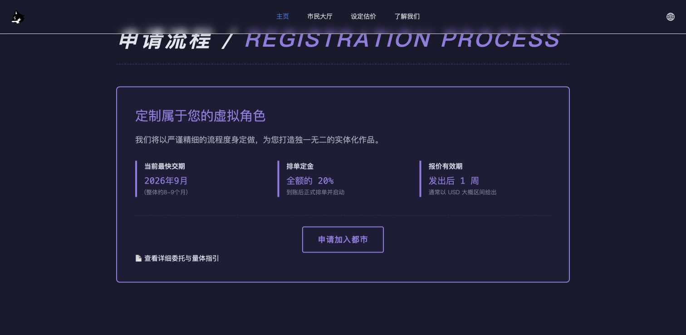

完整流程分为七步：初步评估、设定完善、报价确认、支付定金、开工前最终确认、制作沟通、尾款与发货。还说明：

- Head Only 通常按全装委托约 50% 计价；
- 不符合制作规范的设定可选择 200 USD 改图服务，成功制作后从尾款抵扣；
- 开工前最终确认图是后续制作依据；
- 物流费用不包含在初始报价中。

配置式估价页可选择标准全装、贴身全装、半装、服装设计、脖子毛、手爪、脚爪和肌群填充，随后填写体测数据、上传设定图、填写联络信息与验证码。

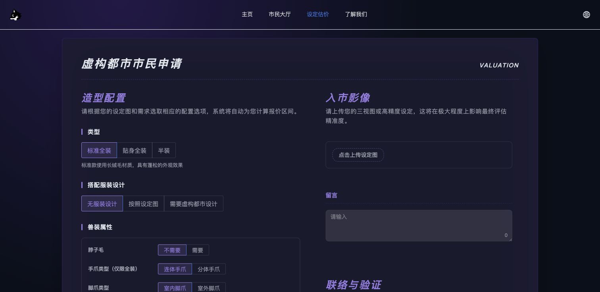

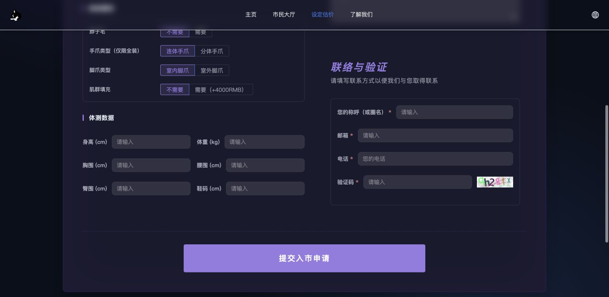

值得借鉴：

- 品牌世界观不是装饰，而是信息架构的一部分；
- 价格、交期和修改边界公开程度高；
- 服务条款还包括数据使用、保养、保修、穿戴安全和作品展示授权。

当前问题：

- 市民大厅独立页在本次浏览中出现内容区域空白，首页的居民轮播仍能读取到角色；
- 深色小字号长文阅读压力较大；
- 世界观文案很强，但转化入口仍需保证“委托 / 估价”含义足够直白。

## 八、给后续主页设计的具体建议

### 推荐信息架构

1. **首页**
   - 品牌主视觉；
   - “我有设定，想委托”与“我想领养设定”两个大入口；
   - 代表作品；
   - 当前开单 / 排期状态；
   - 简短制作优势；
   - FAQ 摘要和联系方式。
2. **自设委托**
   - 系列 / 风格；
   - 制作范围；
   - 起步价与大致周期；
   - 材质、结构和可选配置；
   - 七步以内的流程；
   - FAQ；
   - 分步估价表。
3. **设定领养**
   - 默认视图与画师视图；
   - 类型、价格、画师、状态筛选；
   - 明确区分直接领养、应征领养、展会掉落；
   - 详情页写清“价格包含什么、权利有什么、何时制作身体”。
4. **作品**
   - 标准作品展示；
   - 用户返图 / 活动照片；
   - 可按系列、种族或单头 / 全装筛选。
5. **排期与公告**
   - 当前是否开单；
   - 下一次开放时间；
   - 展会安排与掉落专题。
6. **支持**
   - FAQ；
   - 服务条款、隐私政策；
   - 版权、修改、售后、保养、安全；
   - 官方联系方式与防诈骗提醒。
7. **关于我们**
   - 团队、职责、地点；
   - 真实照片；
   - 社交平台；
   - 不保留任何占位内容。

### 建议的数据与组件边界

为了让后续开发既能复用、又不在首版过度建设，建议只抽象这些真实重复对象：

| 对象 | 关键字段 | 主要页面 |
| --- | --- | --- |
| 作品 `Work` | 名称、系列、种族、装型、完成时间、设计师、图片集 | 首页、作品列表、作品弹窗 |
| 返图 `CustomerPhoto` | 图片、角色、返图者、日期、场景、主页链接 | 返图墙、返图详情 |
| 领养角色 `Adoption` | 角色资料、画师、类型、状态、价格、权利、上架 / 展会时间 | 领养列表、详情、专题 |
| 展会 `Event` | 名称、地点、起止时间、摊位、规则、关联角色 | 公告、展会专题、领养详情 |
| 委托系列 `CommissionTier` | 风格、范围、起价、周期、材料、可选项、开单状态 | 委托页、估价 |
| FAQ / 条款 | 分类、问题、答案、版本、生效时间 | FAQ、提交前确认 |

首版不必把灯箱、弹窗、卡片各自做成复杂内容系统；只要它们读取同一份作品或角色数据即可。

### 关键状态不要只存在于文案

建议领养状态使用明确枚举，并让按钮、标签和可执行动作由状态统一驱动：

`即将上架 → 开放领养 / 应征中 → 已锁定 → 已领养`

展会掉落可作为领养类型，不与状态混用；“未锁定”和“未领养”也不应同时以同等级标签重复表达。状态变化必须有更新时间，避免列表、详情和专题出现不一致。

### 关键事件与转化埋点

后续需要验证的不是“页面是否有人看”，而是用户在哪一步放弃：

- 首页点击自设委托 / 设定领养；
- 查看价格与周期；
- 打开作品详情、返图详情；
- 使用筛选 / 搜索；
- 打开领养须知或 FAQ；
- 开始估价、完成每一步、提交；
- 进入领养确认、登录 / 联系、最终提交。

这些事件足以判断首版动线，不需要一开始建设复杂用户中心。

### 首页必须马上回答的六个问题

1. 你们做什么风格？
2. 现在接不接单？
3. 我该走委托还是领养？
4. 大概多少钱、多久？
5. 我需要准备什么？
6. 下一步点哪里？

### 领养卡片的最小字段

- 角色主图；
- 名称；
- 画师；
- 系列 / 种族；
- 领养类型；
- 当前状态；
- 价格；
- 上架或展会时间；
- 明确按钮。

### 不建议直接照搬

- 没有运营需求时，不做账户、收藏、锁单和支付系统；
- 内容没有准备好时，不提前放多语言、成员卡片和公告入口；
- 不用长加载动画遮住核心内容；
- 不把“未锁定、未领养、可申请”等多个状态混成难懂标签；
- 不让用户在不知道起步价和排期的情况下填写一整页个人资料。

## 九、建议的首版方向

建议首版采用：

- 一个域名；
- 委托与领养两个一级业务入口；
- 白底或浅色内容区，保留朋友工作室自己的一个强品牌色；
- 首页用一张高质量成品主视觉；
- 作品、价格、周期、流程、FAQ 和表单全部可在移动端顺畅阅读；
- 先做内容完整、路径清楚的静态站，再按真实运营需要增加角色库存、账户或支付能力。

如果朋友的品牌世界观很强，可以借鉴虚构都市的“统一命名”，但必须同时保留直白业务词，例如：

**“加入居民档案（自设委托）”**，而不是只写“加入都市”。

全部 71 张截图及逐图说明见 [imgs/README.md](./imgs/README.md)。
