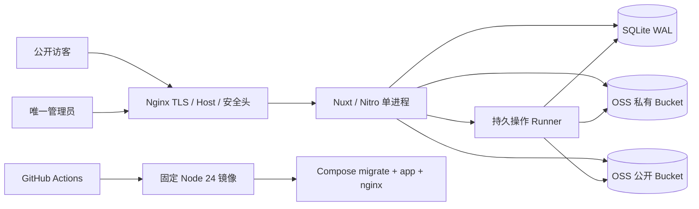

# 实施计划：兽装工作室主页

> **角色**：把 SPEC 转换为可实施的技术架构、迁移顺序和验证方法。
> **当前目标**：阶段 C.1 P0 收口，不进入 T35 之后的 P1。
> **权威输入**：[`../requirements/SPEC.md`](../requirements/SPEC.md) 与 [`../requirements/MEDIA-PUBLICATION-POLICY.md`](../requirements/MEDIA-PUBLICATION-POLICY.md)。

## 1. 当前基线

现有主分支已经具备：

- Nuxt 4 公开 SSR 与管理端 CSR；
- Node 24、pnpm、TypeScript、Zod；
- SQLite/Drizzle、迁移、备份和验证恢复；
- 唯一管理员、Session、Origin、CSRF、账号锁定和日志脱敏；
- 双 OSS Bucket、条件直传、媒体核验、FFmpeg 私有处理源；
- 作品、常规领养、首页、委托、关于、政策页和受限文案；
- 作品发布/下架、Hero 发布/适配、水印 profile 应用；
- unit、integration、Playwright 和最小生产镜像。

本轮不推倒重建这些能力。需要修复的是边界和交付定义：

- 站点 Hero 目前仍与活动水印耦合；
- 首页业务入口复用其他页面的公开媒体；
- 首页入口和状态重复；
- 竖图详情舞台错误；
- 文案管理整包状态和版本耦合；
- 服务和 composable 过大；
- 后台依赖英文错误消息；
- 长任务缺少重启接管；
- 上传过期清理是惰性的；
- 限流使用全进程共享窗口；
- Docker 运行时手工复制依赖且缺少完整运维命令；
- 没有 Compose、Nginx 和远端 CI。

## 2. 目标架构



P0 继续保持单实例、单 SQLite 写者，不引入 Redis、消息队列和多租户。长任务使用 SQLite 操作表、lease 和幂等步骤实现重启恢复。

## 3. 文档与任务收敛

本轮先完成 T34-F0：

- 当前规则只在 SPEC、媒体策略、PLAN、模型、TASKS、设计 IA 和 STATE 中维护；
- 五份 `WATERMARK-CENTERED-V2.md` 只保留归档指针；
- dated notes 保留历史事实，不承担当前规则；
- T34 历史 Review 结果不改写，但上线就绪结论由新的 C.1 总门禁取代。

后续每个任务先更新必要的当前文档，再改代码和测试；不得把实现过程重新复制到多个活文档。

## 4. T34-F1：站点无水印媒体契约

### 4.1 数据库迁移

为 `asset_variants` 增加明确的保护模式，推荐：

```text
protection_mode: none | watermark
```

约束：

- `none`：profile、Logo、位置、透明度和缩放均不得参与身份；
- `watermark`：必须关联不可变 profile，摘要和参数完整；
- 私有 preprocess 变体使用独立存储范围和配方，不与公开保护模式混淆。

迁移保留现有作品水印记录。旧站点 Hero 水印变体只作为过渡兼容读取，不原位改写。

### 4.2 配方拆分

把当前 `media-recipe.ts` 中混合的配方、源选择、OSS 生成和数据库写入逐步拆为：

- `media/recipe-catalog.ts`：纯配方和尺寸；
- `media/source-selector.ts`：原图/预处理源选择；
- `media/public-variant-generator.ts`：OSS 生成、验证和记录；
- `media/variant-identity.ts`：不可变身份和 Object Key；
- `media/work-protection-policy.ts`：作品水印要求；
- `media/site-display-policy.ts`：站点无水印要求。

第一步只搬迁与本任务直接相关的代码，不一次性改写所有历史媒体逻辑。

### 4.3 新公开用途

至少新增：

- `commission-hero-landscape`；
- `commission-hero-portrait`；
- `home-entry-commission`；
- `home-entry-adoption`。

首页 Hero 可以保留现有 usage 名称，但配方切换到 `site-display-v1`。委托 Hero 不应再借用名为 `home-hero-*` 的逻辑身份。

### 4.4 投影与切换

- 公开 Hero 和业务入口只选择完整无水印站点展示集合；
- 首页领养入口从当前代表领养源生成独立变体，不返回领养设定图的作品保护 URL；
- 水印 profile 应用操作排除 `protection_mode=none`；
- 站点展示发布和 profile 应用使用不同目标集合与清理清单；
- 失败保持旧页面可用。

### 4.5 迁移顺序

1. 增加 schema 和兼容读取；
2. 为当前启用的首页/委托大图和业务入口生成无水印变体；
3. 验证匿名读取、摘要和尺寸；
4. 原子切换公开投影；
5. 验证 profile 切换不改变站点展示 URL；
6. 用户验收后清理不再引用的旧 Hero 水印对象。

## 5. T34-F2：公开端视觉修复

### 5.1 首页业务入口

用单一 `HomeBusinessEntries` 组件替换当前入口区和独立状态区。数据模型包含：

```text
kind
href
title
status
summary
image
```

要求：

- 两张卡使用一致比例、间距和文字层级；
- 状态是卡片辅助信息，不再单独生成工具型 Card；
- 整张卡是单一可访问链接，避免嵌套交互；
- 无图和无状态都有明确降级；
- 首页聚合 DTO 一次返回所需数据，减少多接口故障放大。

### 5.2 详情竖图

`WorkDetailGallery` 根据当前项 `width/height` 计算 orientation class：

- 横图舞台可以占满媒体列；
- 竖图舞台自身限宽并居中；
- 占位背景只覆盖图片矩形；
- 不使用 `cover`；
- props 中作品或 gallery 变化时将 `activeIndex` 校正到 0 或有效范围。

### 5.3 首页故障隔离

将首页 Hero、精选、业务入口和当前领养整合为服务端首页投影。非关键精选或当前领养失败时允许隐藏该区；Hero、导航和基础业务入口不应因单个次要区块故障而整体 500。

### 5.4 视觉验证

- 横图、竖图各至少一件作品；
- 第二张缩略图选中后切换上一件/下一件；
- 首页同时有/无委托 Hero、有/无领养、有/无状态；
- 三固定视口截图；
- 图片自然尺寸、无溢出、键盘、焦点和减少动效。

## 6. T34-F3：文案 Card 与分区并发

### 6.1 后台组件

拆分：

- `CommissionContentCard`；
- `CommissionFaqCard`；
- `AboutContentCard`；
- `ServiceTermsCard`；
- `PrivacyPolicyCard`；
- `OfficialChannelsCard`；
- 现有 `SiteBusinessStatusCard` 保留并统一视觉。

页面只负责布局、加载状态和全局错误 Dialog。每个 Card 自己管理 dirty、validation、save 和 saved 状态。

### 6.2 数据库与 API

在 `site_content` 增加独立版本：

- `commission_content_version`；
- `commission_faq_version`；
- `about_content_version`；
- `legal_content_version`；
- `contact_content_version`。

API 按分区拆分，PUT 只更新当前字段并使用当前分区版本。首页 Hero 的设置版本不得再承担联系方式和全部文案的并发基线。

FAQ 项增加稳定 ID；迁移为现有 FAQ 生成 UUID，并保持顺序。

### 6.3 冲突体验

409 时：

- 保留本地草稿；
- 重新获取服务端当前分区；
- 展示“采用最新值”或“保留草稿并人工重试”；
- 不自动把完整旧草稿套到新全局版本后重发。

## 7. T34-F4：架构与错误契约减债

### 7.1 后端边界

优先拆分：

- Hero repository、service、publication runner；
- 水印 profile service、apply runner；
- 作品 publication runner；
- 公开投影 repository；
- 媒体配方与生成器。

路由层只做：参数解析、权限上下文、调用 service、Schema 输出和安全错误转换。

### 7.2 前端边界

拆分 `useAdminHome.ts`：

- `useHeroCollection`；
- `useHeroPublication`；
- `useHeroPreview`；
- `usePublicationPolling`。

大型作品和品牌组件只在有明确复用或独立状态边界时拆分，避免为行数而拆分。

### 7.3 稳定错误 reason

扩展错误契约：

```json
{
  "error": {
    "code": "CONFLICT",
    "reason": "HERO_LAST_ENABLED_SLIDE",
    "message": "..."
  }
}
```

前端只匹配 `reason`，中文提示集中在映射表。服务端英文消息可以修改，不影响业务分支。

### 7.4 死代码

本地运行静态引用检查、lint、typecheck 和 build 后，删除确认无生产引用的重复组件或工具；不得仅因 GitHub 搜索没有结果就删除。

## 8. T34-F5：可靠性

### 8.1 操作 lease

`publication_operations` 增加：

- `attempt`；
- `lease_owner`；
- `lease_expires_at`；
- `heartbeat_at`；
- `recovery_reason`。

Runner 每个阶段先以事务取得 lease。外部 OSS 调用前后更新 heartbeat，提交阶段使用版本和状态条件保证幂等。

### 8.2 启动恢复

新增 Nitro 启动插件或独立 runner：

1. 扫描非终止操作；
2. 判断 lease 是否过期；
3. 核对数据库业务状态和公开对象；
4. 继续安全阶段或转为可恢复失败；
5. 启动有限并发 runner；
6. 记录脱敏恢复日志。

测试必须在生成中、验证中和提交边界强制终止进程后重启。

### 8.3 上传清扫

新增 `pnpm media:cleanup-expired-uploads`：

- 扫描过期未完成会话；
- 精确删除会话对象；
- 更新终态和失败码；
- 幂等重跑；
- 支持 dry-run；
- 仅允许明确环境前缀。

OSS 生命周期只针对临时或会话前缀，永久 `original` 路径需要基于会话状态设计更细的前缀或标签，不能粗暴按目录过期。

### 8.4 限流

实现内存分桶限流：

- 登录：可信客户端 IP 摘要 + 用户名摘要；
- 管理写：管理员 ID；
- 未认证管理探测：可信客户端 IP 摘要。

单实例继续使用内存即可；明确在扩展副本前替换共享存储。代理来源必须由 Nginx 和应用可信代理配置共同限定。

## 9. T34-F6：正式部署

### 9.1 Dockerfile

采用标准多阶段构建：

1. `deps`：只复制 package/lock/workspace 配置，frozen install；
2. `build`：复制源码、迁移和脚本，执行 production build；
3. `runtime`：复制经过 pnpm 正式部署或 production install 形成的完整运行依赖，不手工挑选 `ali-oss`；
4. 包含 migrations、运维 CLI 和必要配置模板；
5. 非 root；
6. 声明数据目录，不把数据库写入镜像层；
7. 构建时做运行依赖 import 和 production guard。

基础镜像固定 Node 24 的具体版本和 digest。

### 9.2 命令入口

同一镜像支持：

- `serve`；
- `migrate`；
- `init-admin`；
- `backup`；
- `restore-verify`；
- `preflight`。

命令只通过显式参数和环境变量工作，不能依赖仓库工作区文件。

### 9.3 Compose

新增 `compose.yaml`：

- `migrate` 使用同一应用镜像，一次性运行；
- `app` 等待迁移成功和数据卷可用；
- `nginx` 代理公开域名和管理域名；
- 只把应用端口暴露到内部网络；
- SQLite 数据卷单写者挂载；
- 备份卷独立；
- secrets 不写进 Compose；
- `read_only`、`tmpfs`、`no-new-privileges` 和 capabilities 按运行需要收缩；
- 生产默认使用固定镜像 digest。

### 9.4 Nginx

版本化配置包含：

- 公开 server_name；
- 管理 server_name；
- TLS；
- Host 保持；
- 管理和公开安全头；
- 请求体与超时边界；
- 可信代理头；
- `/api/health/live` 和 `/api/health/ready`；
- 不代理任意未知 Host。

OSS 媒体域名和上传域名由阿里云侧配置，不经应用 Nginx 反代大文件。

### 9.5 本轮范围与延期项

**用户明确要求：本轮 T34-F6 只准备交付文件，不在本地构建或运行容器。**

本轮完成：

- Dockerfile、`compose.yaml`、Nginx 模板、环境示例、容器内运维命令与部署说明；
- 不依赖 Docker daemon 的静态检查：YAML 解析、Shell 语法、环境变量引用、路径与 package script 对应关系。

本轮禁止：`docker build`、`docker compose build/up`、`docker run`、本地空卷演练、本地 Nginx 容器验收、本地镜像升级/回滚/恢复演练。

镜像构建验证改由 T34-F7 的 GitHub Actions 执行。

延期到用户后续部署阶段（不属于 GATE-C1）：

```text
正式域名
真实 TLS 证书
线上 Compose 运行
空数据卷部署演练
升级 / 回滚 / 恢复演练
远程服务器部署
```

当前无正式域名：Nginx、Compose 和环境模板统一使用 `PUBLIC_HOST`、`ADMIN_HOST` 与可配置证书挂载路径，不硬编码假域名、不生成自签证书、不声称完成 TLS 验收。

## 10. T34-F7：CI

新增工作流：

### `quality.yml`

- frozen install；
- lint；
- typecheck；
- unit；
- integration；
- production build。

### `container-smoke.yml`

- Docker build（镜像构建验证在 CI 执行，不在本地）；
- secret/content scan；
- `docker compose config` 静态展开检查（占位环境值，不启动服务）。

本轮不要求在 CI 启动完整 Compose、真实 TLS、真实域名或远程服务器。

### `release-image.yml`

参考 `arktouros` 的 tag 发布模式：

- 触发：`push tags: v*` 与 `workflow_dispatch`（可指定 image tag）；
- `docker/login-action`、`docker/setup-buildx-action`、`docker/build-push-action`；
- Secrets：`DOCKERHUB_USERNAME`、`DOCKERHUB_TOKEN`（仅 tag/手动流程读取，PR 不读）；
- 默认镜像 `${DOCKERHUB_USERNAME}/project-fur-forge`，标签含 Git tag、`latest`、可选短 SHA；
- 默认平台仅 `linux/amd64`：`better-sqlite3`、`ffmpeg-static` 为平台相关依赖，无经过验证的 arm64 依据前不加多架构；
- 不加远程部署 job，不写 SSH/服务器地址，不创建 GitHub Release。

本轮完成 workflow 文件后不创建 `v*` tag、不手动触发发布、不声称镜像已推送。

### `e2e.yml`

- 普通 push/PR 运行 P0 核心 E2E；
- 手动或定时运行完整 E2E 和视觉 artifact；
- 截图上传 artifact，不写回 `agent_docs`。

当前直接写 `main` 的工作流仍需远端门禁；后续可再启用分支保护，但不把仓库权限设置作为本任务代码的一部分。

## 11. T34-F8：总门禁

**T34-F8 由用户执行，实施者不得代签，也不得用自测代替独立 Review。**

实施者需要交付的可 Review 状态：

1. 文档一致性；
2. lint/typecheck/unit/integration/build/verify:production；
3. 核心与全量 E2E（不可用部分必须明确记录，不伪造通过）；
4. 真实双 Bucket（若现有 `.env` 具备凭据）；
5. profile 切换与站点无水印不变性；
6. 长任务进程中断与恢复（本地 Node 进程，不属于 Docker 验收）；
7. 上传过期清扫；
8. 三视口真 Chrome。

用户执行：

9. 公开端与管理端视觉验收；
10. 新上下文独立 Review；
11. 明确确认后勾选 T34-F8 与 GATE-C1。

延期到用户后续部署阶段：空环境 Compose、升级/回滚/恢复演练、正式域名与 TLS、Docker Hub 发布。

任何阶段发现 MUST-FIX，先冻结 finding，再在根因处修复并重放相关链路。测试通过数量不能替代图片和真实操作观察。

## 12. 非目标

C.1 不实现：

- 返图墙；
- 完整展会模型；
- 回收站；
- 邮件找回；
- CSV 中心；
- 统计；
- CDN 专项；
- 多管理员和多实例。

只有 T34-F8 通过后，才按 [`../implementation/TASKS.md`](../implementation/TASKS.md) 进入 T35。
