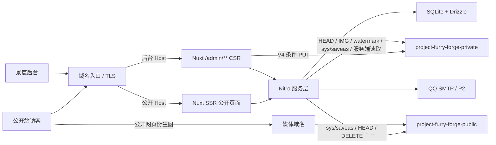

# 计划：兽装工作室主页

> **角色**：把 SPEC 翻译成有序、可验证的技术实施计划。
> **状态**：2026-08-05 T26-F1/T27-F1 新上下文独立 Review 已完成，结论 `PASS WITH FOLLOW-UP`；两项等待用户验收。当前按用户授权进入 T28–T34，不提前实现 P1。

## 1. 执行结论

一期采用单仓库、单 Nuxt 4 全栈应用、单 Docker 镜像和单 Node.js 进程。公开站 SSR，后台 `/admin/**` CSR，Nitro 提供 API；SQLite/Drizzle 负责持久化；阿里云 OSS 负责原图保存以及公开衍生图的最终像素转换和水印烘焙，内嵌 FFmpeg 只为超过 20 MB 的原图或经管理员确认的低分辨率站点大图生成私有处理源。

实施顺序不再按“先把所有基础设施做完，再做页面”横向推进，而是：

1. T04–T08：先锁定生产视觉方向；
2. T09–T21：跑通第一件作品的端到端垂直切片，并建立首页横竖双源轮播与基础品牌水印；
3. T22–T34：完成 P0 可部署核心；
4. T35–T42：完成 P1，形成一期功能闭环；
5. T43–T50：按价值选择 P2 和上线前质量工作；
6. T51–T53：正式素材、品牌衍生校准、部署与闭环。

## 2. 范围优先级

### P0 · 可部署核心

- 公开站与管理端生产视觉基线；
- 唯一管理员登录、退出、改密和受保护命令重置；
- 作品 CRUD、联系人私有字段、短属性和人民币价格；
- 私有原图直传、媒体角色校验、最小裁切/焦点、公开衍生图和基础水印；
- 首页 1–5 项横版/竖版配对轮播的管理、发布和 SSR 展示；
- 发布/下架、首页、作品列表/详情、委托、领养、关于（含联系）、服务条款、隐私政策；`/contact` 只保留兼容跳转；
- 基础营业状态、favicon/触控图标、SEO、SQLite 备份恢复和全链 E2E。

### P1 · 一期完整增强

- 多图、完整页面用途和返图轻量水印；
- 返图及可选授权记录；
- 展会关联、受限文字内容维护、回收站、slug 改址；
- 手机轻量维护。

### P2 · 独立后置

- 邮件找回密码；
- CSV 导出中心；
- 永久原图档案 UI 与批量下载；
- 最小化访问统计；
- CDN、复杂媒体恢复与高级批量能力。

P2 不进入 P0 数据表、导航或验收阻断项，除非用户后续明确提升优先级。

## 3. 总体架构



### 3.1 双访问面

- 公开 Host 允许公开页面和必要公开 API，不转发 `/admin/**`、`/api/admin/**`、`/api/auth/**`、`/preview/**`。
- 后台 Host 的 `/` 重定向到 `/admin/login`；Session Cookie 为 Host-only，不设置父域 `Domain`。
- Nitro Host 中间件重复校验；反向代理必须覆盖客户端伪造的 `X-Forwarded-*`。
- 普通页面错误交给 Nuxt `error.vue`；只有 API 返回统一 JSON 错误。

### 3.2 渲染

| 路径 | 策略 |
| --- | --- |
| `/`、`/works`、`/works/**`、`/commission`、`/adoptions`、`/returns`、`/about`、`/service`、`/privacy` | SSR，可索引 |
| `/adoptions/{slug}`、`/contact`、`/terms`、旧 slug | 301 |
| `/admin/**` | CSR，noindex |
| `/preview/**` | 认证 SSR 预览，noindex |
| `/api/admin/**`、`/api/auth/**` | 不缓存、不可索引 |

一期不启用共享 HTML 缓存，确保发布后下一次正常请求读取最新 SQLite 公开投影。首页 SSR 直出第一项轮播及两种方向的 `<source>`；客户端只负责后续切换，不能把首屏内容延迟到水合后。

## 4. 技术基线

| 层次 | 选择 | 约束 |
| --- | --- | --- |
| 运行时 | Node.js 24 LTS | 开发、测试、构建、Docker 一致 |
| 应用 | Nuxt 4、Vue 3、TypeScript strict、Nitro node-server | Nuxt 不低于 4.5.1 |
| 包管理 | pnpm + Corepack | frozen lockfile |
| 公开 UI | Tailwind/CSS 自有组件 | 白底、摄影优先，不套 SaaS 模板 |
| 后台 UI | Nuxt UI + 项目 Token | 安静内容工具，无 Dashboard 模板 |
| 校验 | Zod | 服务端为最终边界 |
| 数据 | SQLite + Drizzle + `better-sqlite3` | 单实例、版本化迁移 |
| 鉴权 | `nuxt-auth-utils` | 密封 HttpOnly Cookie |
| 安全 | `nuxt-security` + 自定义中间件 | Host/Origin/CSRF/限流按路由验证 |
| OSS | `ali-oss` | V4 PUT/GET、HEAD、IMG、水印、跨 Bucket `sys/saveas`、DELETE |
| 图片呈现 | 原生 `<picture>`/`source`/`srcset`/`sizes`；`@nuxt/image` 仅在验证不会改写 URL/像素时可选 | FFmpeg 只做超 20 MB 私有预处理或经确认的大图 Lanczos 适配；OSS 负责公开 recipe；横竖资源不得重复下载 |
| SEO | Sitemap、robots、Meta、有限 Schema.org、favicon/Touch Icon | 只输出可见事实与品牌源衍生物 |
| 测试 | Vitest、Nuxt Test Utils、Playwright | 单元、集成、OSS 契约、E2E、三视口媒体请求 |

## 5. 运行配置

唯一服务端配置加载器继续按“环境变量 > 活动配置文件 > 安全 fallback”解析。公开、后台、媒体和 OSS 上传 origin 在非测试环境没有内置 fallback，必须从 `.env`、进程环境变量或活动配置文件读取。配置项如下：

```text
PUBLIC_BASE_URL
ADMIN_BASE_URL
MEDIA_BASE_URL
OSS_UPLOAD_BASE_URL
DATABASE_FILE
OSS_REGION
OSS_ENDPOINT
OSS_PRIVATE_BUCKET=project-furry-forge-private
OSS_PUBLIC_BUCKET=project-furry-forge-public
OSS_ACCESS_KEY_ID
OSS_ACCESS_KEY_SECRET
SESSION_SECRET
SMTP_*                 # P2 前可以不启用
```

- production 仍要求 URL、数据库、OSS、AccessKey 和 `SESSION_SECRET` 显式完整；五项 SMTP 全部缺失合法，任一项存在时必须整组完整，且缺失时不生成 fallback 凭据。
- development 同样必须显式提供四个 origin；本机使用的 `localhost` / `127.0.0.1` 只写入被 Git 忽略的 `.env`，不进入版本化运行模板或运维脚本 fallback。
- 配置硬编码检查覆盖全部配置项，不只覆盖域名：除测试文件中的隔离值外，具体值不得出现在应用代码、脚本或版本化文档/模板中，只能由 `.env`、进程环境变量或不入库的活动配置文件提供。
- Bucket 名、地域、Endpoint 和域名不写入数据库；数据库只保存相对 Key。
- 水印 Logo、profile 参数和站点图标属于版本化部署资产，不由环境变量或万能 CMS 任意替换；正式源与摘要由 EXT-01 manifest 固定。
- 产品硬契约不能通过配置降低：30,000,000 字节、Host 隔离、私有 Bucket 匿名拒绝、公开 Bucket 禁止原图、日志脱敏、原图无水印且禁止覆盖。
- T02 已有配置模板；T09 修订 Schema 和旧字段时同步更新模板、测试和 root 摘要。

## 6. 数据与迁移

### 6.1 SQLite

启动验证：

```sql
PRAGMA journal_mode = WAL;
PRAGMA foreign_keys = ON;
PRAGMA busy_timeout = 5000;
PRAGMA synchronous = FULL;
```

- 数据库文件：本地 `.data/dev.db`，生产 `/app/data/studio.db`；测试使用独立临时文件。
- 写事务短小；OSS、邮件和图片处理不在 SQLite 事务中执行。
- 迁移前做一致性备份；镜像回滚不等于数据库回滚。

### 6.2 P0 表

`users`、`works`、`work_feature_tags`、`assets`、`asset_variants`、`work_assets`、`site_hero_slides`、`publication_operations`、`business_statuses`、`site_content`、`audit_logs`。

- `site_hero_slides` 保存展示位置 `home | commission`、横版/竖版 `assetId`、alt、排序、启用状态、版本、可选作品关联，以及启用前私有预览的两份精确 Key 和到期时间。既有记录回填为 `home`，启用顺位按展示位置分别唯一；不复制第二套上传表或媒体配方。
- `business_statuses` 只保留 `commission | adoption` 两个 kind；每行独立保存 `open | limited | closed`、短标签、短说明、固定 href 和版本。kind 与 href 由服务端/数据库成对约束，两个状态分别乐观并发更新。
- `site_content` 保存首页口号、公开业务邮箱/QQ/抖音、自动轮播设置，以及委托短说明、人工估价说明、邮件行动、关于页工作室事实、制作范围、服务条款纯文本、隐私政策纯文本和防诈骗文字；共用站点版本做乐观并发控制。FAQ 只使用专用 `commission_faq_json` 列保存经 Zod 严格校验的有序 `{ question, answer }` 纯文本数组，不作为通用 JSON 页面树。既有服务条款沿用 `basic_terms` 历史列；0015 只新增 `privacy_policy` 并为 NULL 写入用户授权的默认文案，不覆盖已有字段。
- `work_assets.role` 在 P0 只允许 `design_sheet | studio_photo`；P1 的返图由 `return_photos` 关联独立资产。
- Logo 与水印源不存成可由页面编辑器替换的数据库内容；variant 保存所用 profile 版本和摘要。
- `asset_variants.source_variant_id` 记录可验证的处理来源：`preprocess` 直接来自同一资产永久原图；公开 variant 可直接来自满足尺寸且不超过 OSS 上限的原图，超过上限或经确认适配的低分辨率大图必须引用同一资产下 READY 的 PRIVATE preprocess，且源输出摘要等于下游输入摘要。角色与 usage 按明确矩阵约束。

P1 再增加 `return_photos`、`events`、`slug_redirects`、`trash_entries`，并仅在真实维护需求超过 P0 固定字段时增加完整 FAQ 排序/文字内容表；P2 再增加 `password_reset_tokens`、统计或导出相关结构。

### 6.3 字段修正

- 删除 `depositNote`、`paymentNote` 与等价字段；联系人保留为后台私有字段。
- 价格使用 `price_amount_minor` + `price_currency`，一期非空时固定 `CNY`；不预留美元列。
- 返图授权记录三字段均 nullable，不作为发布校验条件。
- 管理 DTO 不返回私有 Object Key；服务端通过 `assetId` 解析。
- OQ-119 已回答：`ownerDisplay` 始终非空；工作室作品使用“有点小狗工作室”，隐私作品使用“不公开”；一期不增加 `ownerType`。T12 已将其建模为非空公开显示值，没有设置把漏填作品静默归类为工作室作品的默认值。
- 媒体关系保存角色、顺序、主图语义、EXIF 修正后的焦点/裁切和水印锚点；“作品主图”不替代首页横竖配对或领养设定图语义。

## 7. 双 Bucket 媒体方案

### 7.1 Bucket 职责

```text
project-furry-forge-private
├─ dev/original/{asset-id}/{uuid}.{ext}
├─ dev/draft/{asset-id}/{recipe-version}/...
├─ dev/temp/{run-id}/...
├─ dev/preview/{asset-id}/...
├─ test/{run-id}/...
└─ prod/...

project-furry-forge-public
├─ dev/web/{asset-id}/{recipe-version}/{usage}/{content-hash}.{ext}
├─ test/{run-id}/web/...
└─ prod/web/...
```

- 私有 Bucket 开启 Block Public Access，Bucket/Object 匿名读取均失败。
- 公开 Bucket 只保存已发布衍生图；不得出现 `original/`、联系人、文件原名或可识别私有信息。
- 两 Bucket 必须同账号、同地域；跨 Bucket `sys/saveas`、图片处理、水印与 CORS 在 T10/EXT-02 提前实测，避免完成数据库与认证后才发现外部能力不可用。
- 不自动修改账号级安全设置；需要控制台动作时明确暂停。

### 7.2 上传与角色校验

1. 管理端在申请上传会话时明确媒体角色和归属：作品设定图、作品出厂照、首页横版、首页竖版，P1 再增加返图。
2. 浏览器检查文件类型、30,000,000 字节、12,000 像素和数量上限，并计算 SHA-256 与 `Content-MD5`。
3. Nitro 创建上传会话和不可预测私有 Key，签发 5 分钟 V4 条件 PUT；固定 `Content-Type`、`Content-MD5`、`x-oss-forbid-overwrite: true`、摘要元数据。
4. 浏览器直传私有 Bucket。
5. 完成接口通过 HEAD/图片信息复核 Key、大小、MIME、摘要、真实格式、像素边界和角色方向：首页横版要求宽大于高，首页竖版要求高大于宽；设定图以横版为推荐并保留完整画布。失败对象进入可读状态并尝试精确清理。
6. 角色不是文件自身可随意改写的标签。改变用途必须经过服务端校验和重新生成相应用途的 variant，不能把同一关系静默从设定图改成返图。

### 7.3 大原图预处理、OSS 图片处理与水印权威

OSS 图片处理原图不能超过 20 MB，但产品永久原图上限为 30,000,000 字节。完成接口验证永久原图后：

- 不超过 20,000,000 字节时，直接以永久原图作为 OSS 处理源；
- 大于 20,000,000 字节时，Node 使用随应用安装且按绝对路径启动的固定版本 FFmpeg，生成最长边不超过 4,096 px、大小不超过 20,000,000 字节的私有处理中间件；
- 子进程不得从宿主机 `PATH` 查找 FFmpeg；预处理源 Key/identity 覆盖原图摘要、FFmpeg 版本和预处理参数，且不得公开或加水印；
- 预处理失败必须保留永久原图并给出可读错误，不得以降低原图保管上限或放宽 Bucket 边界静默兜底。

站点大图另有一条受限适配路径：横版/竖版方向校验仍是硬门禁；方向正确但小于 `1920×1080` / `1080×1920` 时允许保存草稿，页面显示风险并在启用前取得确认。确认后服务端从永久原图使用内嵌 FFmpeg 的固定 Lanczos 插值生成精确目标画布 PNG，记录为同一资产的 `PRIVATE + READY + preprocess`，identity 覆盖原图摘要、FFmpeg 版本/二进制摘要、目标尺寸、滤镜和参数版本。该源优先于普通原图进入站点大图公开配方；取消或失败均不创建公开 variant，且不得覆盖原图。作品媒体不进入这条路径。

OSS 是公开 variant、最终格式和水印的唯一配方权威。应用负责：

- 保存 EXIF 修正后的归一化焦点/裁切和水印安全角；
- 计算覆盖原图摘要、角色、用途、裁切、格式、质量、Logo 摘要、profile 版本与锚点的完整 recipe identity；
- 调用 OSS IMG、水印与 `sys/saveas`；
- 验证输出并写数据库。

私有原图保持无水印。首页横竖图、设定图和出厂照的公开 variant 使用当前活动 `brand-centered-v2`；返图在 P1 使用 `brand-subtle-v1`。当前公开选择必须匹配活动 profile ID、配置摘要、Logo 摘要、居中位置、不透明度和缩放；改变任一参数都生成新 Key，不原位覆盖旧图。

默认使用原生 `<picture>`/`srcset/sizes` 选择已生成 URL。若使用 `@nuxt/image`，必须先证明它不会改写 URL或追加裁切、质量、宽度、格式参数；无法证明时不引入。

### 7.4 `recipe-v2`

| 用途 | 比例/构图 | 宽度 | 格式 | 水印 |
| --- | --- | --- | --- | --- |
| `work-card` | 3:4 | 480 / 768 / 1200 | WebP + fallback | 活动 `brand-centered-v2` |
| `home-hero-landscape` | 16:9 | 768 / 1280 / 1920 | WebP + fallback | 活动 `brand-centered-v2` |
| `home-hero-portrait` | 9:16 | 480 / 768 / 1080 | WebP + fallback | 活动 `brand-centered-v2` |
| `design-sheet` | 完整横版画布，必要时 contain | 960 / 1600 / 2400 | WebP + fallback | 活动 `brand-centered-v2` |
| `detail` | 原比例 | 960 / 1600 / 2400 | WebP + fallback | 活动 `brand-centered-v2` |
| `return` | 原比例，P1 | 960 / 1600 / 2400 | WebP + fallback | `brand-subtle-v1` |

- fallback：透明度确有需要时 PNG，否则 JPEG。
- 只为该资产实际使用的用途生成，不默认生成全部组合。
- `recipe-v2` 把所有 P0 品牌水印的图形边长调整为 `recipe-v1` 的 1.6 倍；`design-sheet` 与首页/委托页横版大图使用不重叠的等大左右双水印，`studio_photo` 与首页/委托页竖版大图使用单个居中水印。`design-sheet` 的全部响应式宽度及横版大图按 960 px 设定图基准等比缩放水印，竖版大图按 480 px 作品卡基准保持相同视觉比例。
- `recipe-v1` 公开图只作为切换期间的只读 fallback；某一用途的 `recipe-v2` WebP 与 fallback 全部齐备后，公开投影整体优先 v2。
- 1:1、AVIF 或新宽度需新 recipe 版本和真实页面需求，不直接扩写 `recipe-v2`。

### 7.5 草稿、发布和下架

草稿预览：已保存的首页横竖原图复用 `/api/admin/v1/media/assets/{assetId}/preview` 同源鉴权、`no-store` 媒体接口在各自比例框中显示；未启用项的活动水印预览仍在私有 Bucket 生成草稿衍生图，通过独立同源管理 API 展示。已启用项不再发起服务端明确拒绝的启用前预览请求，页面改为说明当前公开图已使用活动水印。两类预览都不修改公开 Bucket，也不向浏览器返回签名 URL 或私有 Key。

发布：

1. 先验证当前版本、业务阻断项和有效处理源是否足以生成固定配方；低分辨率站点大图必须已完成管理员确认后的私有适配，通过后才写入 `publication_operations` 意图；
2. 从私有原图生成缺失的公开衍生图到公开 Bucket；
3. HEAD/图片信息/匿名 GET 验证；
4. SQLite 事务提交公开状态和公开 variant 引用；
5. 单个资产首次冷生成发生短暂 OSS 失败时，确定性生成器在同一请求内只补偿重试一次；第二次仍失败才保留阶段和错误，未引用公开对象进入精确清理列表。

管理端发布期间每秒读取既有发布检查，以 `missingVariantCount` 显示“已生成 / 总数 / 剩余”原生进度条。OSS 生成失败在服务端记录脱敏的错误码、状态和 requestId，不记录原图 Key、目标 Key、签名 URL 或请求正文。运行配置只在进程启动时装载，联调修改 `.env` 后先重启应用再重试发布。

这一模式适用于后续所有长耗时操作：先建立可查询的服务端操作状态，再尽快向浏览器返回操作标识；页面持续轮询或订阅真实阶段与计数。总量未知时显示不定进度，总量确定后显示完成量/总量；失败状态持久化并给出下一步，刷新后能够恢复。单进程阶段不引入队列或 worker，但不得以同步等待整个 HTTP 请求替代进度反馈。

站点大图启用即为原子发布，不另建一套重复的“已发布”布尔值。首页和委托页分别验证 1–5 项上限、横竖资产 READY、alt、位置内排序、可选关联作品，以及当前 `recipe-v2` 全部宽度的 PUBLIC READY WebP + fallback、usage、活动 `brand-centered-v2` profile、配置与 Logo 摘要、水印布局、输出摘要和字节数。低分辨率项先在同一操作区显示 FFmpeg 适配阶段，完成后沿用既有公开生成进度；首页不允许停用最后一项，委托页允许全部停用并隐藏引导区。生成期间旧公开投影不变，全部验证后才启用；失败不出现半套横竖资源。

停用轮播项可在启用前请求一次同步的真实水印预览：服务端复用活动 profile 与公开配方，在私有 `preview/` 前缀生成横版 768 px、竖版 480 px WebP，持久化两份精确 Key 与 5 分钟到期时间，并返回同源认证地址。编辑、删除、启用或停用时按清单精确删除。该预览不建立公开 variant、不改变轮播状态，也不允许管理 Host 绕过边界访问 `/api/public/**`。

下架：

1. SQLite 先从公开投影与 Sitemap 移除；
2. 删除公开 Bucket 中该发布版本的衍生对象；
3. 有 CDN 时执行精确失效；
4. 删除失败保留可重试清理记录。已经被访客保存的副本无法远程召回，不作绝对销毁承诺。

仍被启用首页轮播关联的作品先返回 409，要求停用或解除关联；下架事务异常写入 `FAILED/COMMITTING/UNPUBLICATION_COMMIT_FAILED`，不得留下活动操作。

P0 删除作品：只接受未发布作品的当前版本；逐项清理其公开 variant 对象与记录后删除作品聚合，永久私有原图资产不随作品删除。T40 上线后再由 30 天回收站替换这条受限永久删除流程。

## 8. 视觉实施计划

### 8.1 公开站

- 大面积区域只用白色或极浅中性色；摄影承担主要色彩。
- 明显蓝色常态 5%–10%，硬上限约 15%。
- `#324DAF`：主要行动、链接、焦点；`#293C84`：Hover/深强调；`#1D2D5A`：极少量反白；`#6274BB`：大字/装饰；`#CED3E5`：弱背景/边界。
- 禁止连续蓝底、蓝色卡片墙、渐变大按钮、同款圆角功能卡和视觉噪声。
- 首页首屏使用 1–5 项双源轮播；手动控制始终存在，自动轮播默认关闭。横屏与竖屏使用独立资产，不能仅切 `object-position`。
- Hero 文案区复用响应式页面安全边距，主行动与 Hero 底边至少保留一个完整区块间距；CSS 只能引用 `DESIGN_TOKENS.md` 已定义的间距值，未定义自定义属性视为构建前缺陷。
- T05 已比较横向精选轨道与编辑型网格；T08 用户验收选定横向轨道为精选组件，且不自动轮播。精选轨道不承担首页首屏轮播职责。
- `/works` 的用途与装型筛选使用两个原生链接组成的分段选择框：组容器有边界和轻量底部阴影，当前项为白底、有按钮边界与阴影；不增加筛选组件库。
- `/adoptions` 使用横版设定图；`/works` 使用竖版 3:4 出厂照；详情页把设定图和出厂照分区；`/returns` 使用原比例照片墙。
- `/adoptions` 在列表或真实空状态之前复用 `PublicBusinessStatus` 显示 `business_statuses.adoption`，不另建第二套状态文案。
- `/about` 合并原联系页的邮件行动、QQ、抖音和防诈骗提示，正文宽度使用约 52rem 的文章容器；`/contact` 永久重定向到 `/about#contact`。
- `/service` 与 `/privacy` 复用同一个纯文本长文组件；不解析 Markdown/HTML。原“基本约定”在全部可见界面改称“服务条款”，委托入口改为 `/service`。
- 桌面“关于我们”圆角矩形二级导航由 CSS Hover 与 `:focus-within` 共同控制，移动菜单直接展示子项；页脚删除联系方式，以更小纵向 padding 把版权、服务条款、隐私政策、`Design by Arktouros` 和工信部备案入口放入右下信息区；文案配置 FAQ 的“新增问题”按钮与最后一项之间保留管理端标准间距。
- 完整组合标用于页头，图形标用于 favicon/触控图标/水印；不得把完整纵向组合标直接缩成不可读的 16px 标签图标。
- 字体在正式 Logo/作品图下校准；宋体只是候选，不是强制品牌字体。

### 8.2 管理端

- 白色/浅灰工作区，主行动蓝只用于当前动作、焦点和少量导航状态。
- 无 Dashboard、KPI、消息中心或未实现导航。
- 当前管理导航固定为“大图管理 → 文案配置 → 全局水印 → 作品管理 → 修改密码”，五个入口的导航、一级标题和标签页标题同名；大图管理内部使用“首页大图 / 委托页大图”Tab，复用专用双源上传、排序、启停、预览和发布链路。横/竖槽位显示原图尺寸；低于推荐尺寸时以持续风险提示和确认对话框启动 FFmpeg 适配，不用通用 CMS 或第二套上传器。委托/领养营业状态及委托、关于/联系、服务条款、隐私政策固定文字仍留在独立“文案配置”，不建设万能 CMS、页面树或账号列表。
- 作品管理在既有一次性认证列表投影上提供角色名/物种查找、用途/装型/发布状态筛选和客户端分页；筛选结果保留人工顺序，控件复用管理端输入框/按钮 Token，不为当前规模新增服务端分页 API。
- 作品编辑器按“设定图”“出厂照”分组，P1 再增加“返图”；每组显示比例指导、公开用途、水印状态和对应预览。
- 出厂照上传进度卡紧邻当前上传控件，区分摘要、PUT 百分比和服务端校验；关系保存成功后用响应中的新作品版本重建 dirty 基线。
- 点击“发布”先顺序保存基础信息、设定图和出厂照的当前修改，再使用最终服务端版本重新执行发布检查；保存或检查失败时不发起发布。
- PC 完成横竖配对、复杂裁切、水印安全角和批量排序；手机只承诺登录、查看、状态、文字、单图和发布。

## 9. 安全

- Session：HttpOnly、Secure、SameSite=Strict、后台 Host-only、8 小时无操作过期；每次 API 校验管理员仍有效和 `sessionVersion`。
- 登录失败 5 次锁定 30 分钟；错误不泄露账号存在性。
- P0 密码重置使用受保护命令；P2 邮件找回 token 只存哈希并单次有效。
- 登录写请求执行精确 Host/Origin，不要求尚未建立的 Session/CSRF；其余受保护写请求执行 Session、精确 Host/Origin 和 CSRF。T13 已完成这些认证边界，体积限制和分层限流由 T32 收口。
- 日志只记录 requestId、方法、归一化路径、状态、错误码和耗时；不记录正文、作品私有联系人、授权备注、私有 Key 或签名 URL。公开页脚使用 `site_content` 的邮箱与 QQ 公开投影，不来自作品 DTO。
- T26–T27 管理 API 复用现有后台 Host/Session/Origin/CSRF 中间件并返回 `no-store`；公开站点内容 API 显式 `no-store`，每次查询 SQLite，只投影受限页面字段和工作室公开渠道，不返回资源版本、草稿标识、内部备注或任何作品联系人。
- 私有媒体 URL 不进入公开 HTML、Sitemap、OG 或公开 API。
- 水印不构成访问控制；私有原图安全依赖私有 Bucket、认证、服务端同源代理与最小权限；浏览器签名 URL 仅限当前上传所需的条件 PUT。

## 10. SEO、性能与备份

- 所有公开页面 SSR 输出独立 title、description、canonical、普通链接和 alt。
- 结构化数据只输出同页可见事实；价格不能暗示在线购买或库存。
- 首屏第一项横/竖图不懒加载，提供尺寸；非当前轮播项按需加载，禁止启动时请求全部大图。
- Nuxt head 显式声明 favicon、32/16 像素图标和 Apple Touch Icon；文件由 EXT-01 确认的 Logo 图形标确定性生成。
- 内容哈希静态资源和公开衍生图长缓存；动态 HTML P0 不共享缓存。
- SQLite 使用 Backup API 或 `VACUUM INTO`；禁止 WAL 活跃时只复制主 `.db`。
- 本地至少验证“空库迁移 → 夹具 → 发布 → 备份 → 新路径恢复 → 核心关联校验”。

## 11. 质量门禁

- 静态：lint、typecheck、依赖与配置检查、迁移一致性。
- 单元：枚举/状态矩阵、站点纯文本/FAQ/服务条款/隐私政策/邮箱/QQ/抖音校验、短属性、CNY 价格、可选授权记录、媒体角色、首页横竖配对、FFmpeg 大图适配尺寸/identity、recipe/watermark identity、公开 DTO 泄漏守卫。
- 集成：SQLite、0015 隐私政策默认值、Session、Host/Origin/CSRF、委托/领养状态独立版本冲突、站点内容空值/草稿和即时公开投影、角色化私有上传、OSS 水印、跨 Bucket `sys/saveas`、发布/下架和清理失败。
- E2E：管理员创建一件作品并发布；配置一组首页横竖轮播；公开访客在三视口浏览首页/列表/详情；竖屏只请求竖版首屏，横屏只请求横版首屏。每条用例按“前置状态 → 用户操作 → 可见中间状态 → 成功/失败/重载结果”写断言，并检查图片真实解码、布局溢出、焦点/键盘和关键请求；不得用用例数量、HTTP 成功、元素数量或选择器存在代替页面质量审查。失败时必须打开浏览器日志、截图或 trace 定位实际页面问题。
- 视觉：T08 已于 2026-07-30 经用户确认；新增首页轮播、设定图横版布局、媒体分区、水印和 favicon 在对应任务留截图，T51 使用正式素材二次校准。
- 无障碍：轮播控制可命名、可键盘操作、状态可播报；自动播放可暂停，减少动效下停止。
- 安全：私有 Bucket 匿名拒绝；公开 Bucket 不含原图；水印只存在于公开衍生图；日志和构建产物 secret scan。

## 12. 迁移与历史边界

- T01–T03 的代码作为已完成工程底座保留，但 T09 按新规格修订 DTO 和错误边界。
- T04–T09 的当前代码仍是单首屏夹具、单 `src` 图片组件和通用媒体样张；本轮只修正文档，不把未实现的横竖轮播、角色化上传、水印或 favicon 记为已完成。
- 历史原型和实施备注保留，不回写成“当时就是双 Bucket/双源轮播”；当前契约从本版起生效。
- root `CLAUDE.md`、代码注释或测试若引用旧字段/单 Bucket，T09 已同步修正；后续实现若仍把所有图片压成同一角色，应按 T12–T25 逐步迁移。
