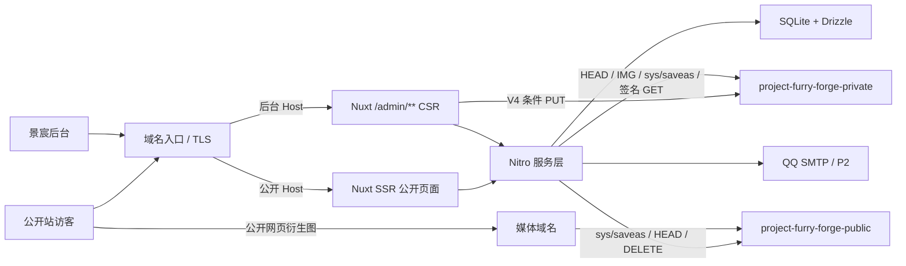

# 计划：兽装工作室主页

> **角色**：把 SPEC 翻译成有序、可验证的技术实施计划。
> **状态**：2026-07-30 执行版。T01–T08 已完成，下一项为 T09。

## 1. 执行结论

一期采用单仓库、单 Nuxt 4 全栈应用、单 Docker 镜像和单 Node.js 进程。公开站 SSR，后台 `/admin/**` CSR，Nitro 提供 API；SQLite/Drizzle 负责持久化；阿里云 OSS 负责原图保存与全部像素转换。

实施顺序不再按“先把所有基础设施做完，再做页面”横向推进，而是：

1. T04–T08：先锁定生产视觉方向；
2. T09–T21：跑通第一件作品的端到端垂直切片；
3. T22–T34：完成 P0 可部署核心；
4. T35–T42：完成 P1，形成一期功能闭环；
5. T43–T50：按价值选择 P2 和上线前质量工作；
6. T51–T53：正式素材、部署与闭环。

## 2. 范围优先级

### P0 · 可部署核心

- 公开站与管理端生产视觉基线；
- 唯一管理员登录、退出、改密和受保护命令重置；
- 作品 CRUD、联系人私有字段、短属性和人民币价格；
- 私有原图直传、最小裁切/焦点、公开衍生图生成；
- 发布/下架、首页、作品列表/详情、委托、领养、关于、联系；
- 基础营业状态、SEO、SQLite 备份恢复和全链 E2E。

### P1 · 一期完整增强

- 多图、完整页面用途和水印；
- 返图及可选授权记录；
- 展会关联、站点内容维护、回收站、slug 改址；
- 手机轻量维护。

### P2 · 独立后置

- 邮件找回密码；
- CSV 导出中心；
- 永久原图档案 UI 与批量下载；
- 最小化访问统计；
- CDN、复杂媒体恢复与高级批量能力。

P2 不进入 P0 数据表、导航或验收阻断项，除非用户后续明确提升优先级。

## 3. 总体架构



### 3.1 双访问面

- 公开 Host 允许公开页面和必要公开 API，不转发 `/admin/**`、`/api/admin/**`、`/api/auth/**`、`/preview/**`。
- 后台 Host 的 `/` 重定向到 `/admin/login`；Session Cookie 为 Host-only，不设置父域 `Domain`。
- Nitro Host 中间件重复校验；反向代理必须覆盖客户端伪造的 `X-Forwarded-*`。
- 普通页面错误交给 Nuxt `error.vue`；只有 API 返回统一 JSON 错误。

### 3.2 渲染

| 路径 | 策略 |
| --- | --- |
| `/`、`/works`、`/works/**`、`/commission`、`/adoptions`、`/returns`、`/about`、`/contact` | SSR，可索引 |
| `/adoptions/{slug}`、`/terms`、旧 slug | 301 |
| `/admin/**` | CSR，noindex |
| `/preview/**` | 认证 SSR 预览，noindex |
| `/api/admin/**`、`/api/auth/**` | 不缓存、不可索引 |

一期不启用共享 HTML 缓存，确保发布后下一次正常请求读取最新 SQLite 公开投影。

## 4. 技术基线

| 层次 | 选择 | 约束 |
| --- | --- | --- |
| 运行时 | Node.js 24 LTS | 开发、测试、构建、Docker 一致 |
| 应用 | Nuxt 4、Vue 3、TypeScript strict、Nitro node-server | Nuxt 不低于 4.5.1 |
| 包管理 | pnpm + Corepack | frozen lockfile |
| 公开 UI | Tailwind/CSS 自有组件 | 白底、摄影优先，不套 SaaS 模板 |
| 后台 UI | Nuxt UI + 项目 Token | 安静内容工具，无 Dashboard 模板 |
| 校验 | Zod | 服务端为最终边界 |
| 数据 | SQLite + Drizzle + `better-sqlite3` | 单实例、版本化迁移 |
| 鉴权 | `nuxt-auth-utils` | 密封 HttpOnly Cookie |
| 安全 | `nuxt-security` + 自定义中间件 | Host/Origin/CSRF/限流按路由验证 |
| OSS | `ali-oss` | V4 PUT/GET、HEAD、IMG、跨 Bucket `sys/saveas`、DELETE |
| 图片呈现 | 默认原生 `<picture>`/`srcset`；`@nuxt/image` 仅在验证不会改写 URL/像素时可选 | OSS 是唯一转换权威 |
| SEO | Sitemap、robots、Meta、有限 Schema.org | 只输出可见事实 |
| 测试 | Vitest、Nuxt Test Utils、Playwright | 单元、集成、OSS 契约、E2E |

## 5. 运行配置

唯一服务端配置加载器继续按“环境变量 > 活动配置文件 > 安全 fallback”解析。新增/调整配置：

```text
PUBLIC_BASE_URL
ADMIN_BASE_URL
MEDIA_BASE_URL
OSS_UPLOAD_BASE_URL
DATABASE_FILE
OSS_REGION
OSS_ENDPOINT
OSS_PRIVATE_BUCKET=project-furry-forge-private
OSS_PUBLIC_BUCKET=project-furry-forge-public
OSS_ACCESS_KEY_ID
OSS_ACCESS_KEY_SECRET
SESSION_SECRET
SMTP_*                 # P2 前可以不启用
```

- Bucket 名、地域、Endpoint 和域名不写入数据库；数据库只保存相对 Key。
- 产品硬契约不能通过配置降低：30,000,000 字节、Host 隔离、私有 Bucket 匿名拒绝、公开 Bucket 禁止原图、日志脱敏。
- T02 已有配置模板；T09 修订 Schema 和旧字段时同步更新模板、测试和 root 摘要。

## 6. 数据与迁移

### 6.1 SQLite

启动验证：

```sql
PRAGMA journal_mode = WAL;
PRAGMA foreign_keys = ON;
PRAGMA busy_timeout = 5000;
PRAGMA synchronous = FULL;
```

- 数据库文件：本地 `.data/dev.db`，生产 `/app/data/studio.db`；测试使用独立临时文件。
- 写事务短小；OSS、邮件和图片处理不在 SQLite 事务中执行。
- 迁移前做一致性备份；镜像回滚不等于数据库回滚。

### 6.2 P0 表

`users`、`works`、`work_feature_tags`、`assets`、`asset_variants`、`work_assets`、`publication_operations`、`business_statuses`、`site_content`、`audit_logs`。

P1 再增加 `return_photos`、`events`、`slug_redirects`、`trash_entries` 和完整 FAQ/内容表；P2 再增加 `password_reset_tokens`、统计或导出相关结构。

### 6.3 字段修正

- 删除 `depositNote`、`paymentNote` 与等价字段；联系人保留为后台私有字段。
- 价格使用 `price_amount_minor` + `price_currency`，一期非空时固定 `CNY`；不预留美元列。
- 返图授权记录三字段均 nullable，不作为发布校验条件。
- 管理 DTO 不返回私有 Object Key；服务端通过 `assetId` 解析。

## 7. 双 Bucket 媒体方案

### 7.1 Bucket 职责

```text
project-furry-forge-private
├─ dev/original/{asset-id}/{uuid}.{ext}
├─ dev/draft/{asset-id}/{recipe-version}/...
├─ dev/temp/{run-id}/...
├─ dev/preview/{asset-id}/...
├─ test/{run-id}/...
└─ prod/...

project-furry-forge-public
├─ dev/web/{asset-id}/{recipe-version}/{usage}/{content-hash}.{ext}
├─ test/{run-id}/web/...
└─ prod/web/...
```

- 私有 Bucket 开启 Block Public Access，Bucket/Object 匿名读取均失败。
- 公开 Bucket 只保存已发布衍生图；不得出现 `original/`、联系人、文件原名或可识别私有信息。
- 两 Bucket 必须同账号、同地域；跨 Bucket `sys/saveas` 与 CORS 在 T10/EXT-02 提前实测，避免完成数据库与认证后才发现外部能力不可用。
- 不自动修改账号级安全设置；需要控制台动作时明确暂停。

### 7.2 上传

1. 浏览器检查文件类型、30,000,000 字节、12,000 像素和数量上限，并计算 SHA-256 与 `Content-MD5`。
2. Nitro 创建上传会话和不可预测私有 Key，签发 5 分钟 V4 条件 PUT；固定 `Content-Type`、`Content-MD5`、`x-oss-forbid-overwrite: true`、摘要元数据。
3. 浏览器直传私有 Bucket。
4. 完成接口通过 HEAD/图片信息复核 Key、大小、MIME、摘要、真实格式和像素边界；失败对象进入可读状态并尝试精确清理。

### 7.3 图片处理唯一权威

OSS 图片处理是唯一像素转换权威。Node 不运行 Sharp/FFmpeg 作为第二套生产转换链。应用只负责：

- 保存 EXIF 修正后的归一化焦点/裁切；
- 计算完整 recipe identity；
- 调用 OSS IMG 与 `sys/saveas`；
- 验证输出并写数据库。

默认使用原生 `<picture>`/`srcset/sizes` 选择已生成 URL。若使用 `@nuxt/image`，必须先证明它不会改写 URL 或追加裁切、质量、宽度、格式参数；无法证明时不引入。

### 7.4 `recipe-v1`

| 用途 | 比例 | 宽度 | 格式 |
| --- | --- | --- | --- |
| `card` | 3:4 | 480 / 768 / 1200 | WebP + fallback |
| `hero` | 16:9 | 768 / 1280 / 1920 | WebP + fallback |
| `detail` | 原比例 | 960 / 1600 / 2400 | WebP + fallback |

- fallback：透明度确有需要时 PNG，否则 JPEG。
- 只为该资产实际使用的用途生成，不默认生成全部 18 个组合。
- 领养设定图在相关用途链路追加正式工作室水印。
- 1:1、AVIF 或新宽度需新 recipe 版本和真实页面需求，不直接扩写 `recipe-v1`。

### 7.5 草稿、发布和下架

草稿预览：在私有 Bucket 生成需要的草稿衍生图，通过短时签名 GET 展示，不修改公开 Bucket。

发布：

1. 写入 `publication_operations` 意图；
2. 从私有原图生成缺失的公开衍生图到公开 Bucket；
3. HEAD/图片信息/匿名 GET 验证；
4. SQLite 事务提交公开状态和公开 variant 引用；
5. 失败时保留阶段和错误，未引用公开对象进入精确清理列表。

下架：

1. SQLite 先从公开投影与 Sitemap 移除；
2. 删除公开 Bucket 中该发布版本的衍生对象；
3. 有 CDN 时执行精确失效；
4. 删除失败保留可重试清理记录。已经被访客保存的副本无法远程召回，不作绝对销毁承诺。

## 8. 视觉实施计划

### 8.1 公开站

- 大面积区域只用白色或极浅中性色；摄影承担主要色彩。
- 明显蓝色常态 5%–10%，硬上限约 15%。
- `#324DAF`：主要行动、链接、焦点；`#293C84`：Hover/深强调；`#1D2D5A`：极少量反白；`#6274BB`：大字/装饰；`#CED3E5`：弱背景/边界。
- 禁止连续蓝底、蓝色卡片墙、渐变大按钮、同款圆角功能卡和视觉噪声。
- T05 已比较横向精选轨道与编辑型网格；T08 用户验收选定横向轨道为最终组件，且不自动轮播。
- 字体在正式 Logo/作品图下校准；宋体只是候选，不是强制品牌字体。

### 8.2 管理端

- 白色/浅灰工作区，主行动蓝只用于当前动作、焦点和少量导航状态。
- 无 Dashboard、KPI、消息中心或未实现导航。
- P0 导航只显示已实现能力；P1/P2 页面实现后才出现。
- PC 完成复杂图片操作；手机只承诺登录、查看、状态、文字、单图和发布。

## 9. 安全

- Session：HttpOnly、Secure、SameSite=Strict、后台 Host-only、8 小时无操作过期；每次 API 校验管理员仍有效和 `sessionVersion`。
- 登录失败 5 次锁定 30 分钟；错误不泄露账号存在性。
- P0 密码重置使用受保护命令；P2 邮件找回 token 只存哈希并单次有效。
- 写请求执行精确 Host/Origin、CSRF、体积限制和分层限流。
- 日志只记录 requestId、方法、归一化路径、状态、错误码和耗时；不记录正文、联系人、授权备注、私有 Key 或签名 URL。
- 私有媒体 URL 不进入公开 HTML、Sitemap、OG 或公开 API。

## 10. SEO、性能与备份

- 所有公开页面 SSR 输出独立 title、description、canonical、普通链接和 alt。
- 结构化数据只输出同页可见事实；价格不能暗示在线购买或库存。
- 首屏图不懒加载，提供尺寸；下方图片按视口懒加载。
- 内容哈希静态资源和公开衍生图长缓存；动态 HTML P0 不共享缓存。
- SQLite 使用 Backup API 或 `VACUUM INTO`；禁止 WAL 活跃时只复制主 `.db`。
- 本地至少验证“空库迁移 → 夹具 → 发布 → 备份 → 新路径恢复 → 核心关联校验”。

## 11. 质量门禁

- 静态：lint、typecheck、依赖与配置检查、迁移一致性。
- 单元：枚举/状态矩阵、短属性、CNY 价格、可选授权记录、recipe identity、公开 DTO 泄漏守卫。
- 集成：SQLite、Session、Host、私有上传、跨 Bucket `sys/saveas`、发布/下架和清理失败。
- E2E：管理员创建一件作品并发布，公开访客浏览首页/列表/详情；三视口无横向溢出。
- 视觉：T08 已于 2026-07-30 经用户确认；T51 使用正式素材二次校准。
- 安全：私有 Bucket 匿名拒绝；公开 Bucket 不含原图；日志和构建产物 secret scan。

## 12. 迁移与历史边界

- T01–T03 的代码作为已完成工程底座保留，但 T09 按新规格修订 DTO 和错误边界。
- 历史原型和实施备注保留，不回写成“当时就是双 Bucket”；当前契约从本版起生效。
- root `CLAUDE.md`、代码注释或测试若引用旧字段/单 Bucket，T09 同步修正；本轮只改 `agent_docs/`。
