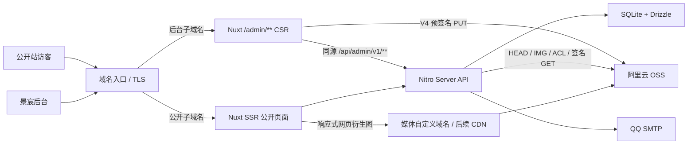

# 计划：兽装工作室主页

> **角色**：把 SPEC 翻译成有序、可执行的技术实现计划（对应 spec-kit `/plan`）。
> **写入时机**：阶段 2，SPEC 锁定后（即 SPEC 的 OQ 全部「已答」后）。
> **内容**：技术选型、执行顺序、关键约束；**不**含逐行代码任务（那是 `implementation/TASKS.md`）。

## 状态与执行结论

- 日期：2026-07-29。
- 2026-07-28 的新决策替换此前的 Java/Spring/MySQL 方案：一期采用 **单仓库、单 Nuxt 4 应用、单 Docker 镜像、单 Node.js 进程**。
- 公开站由 Nuxt SSR 输出可索引 HTML；后台仍是独立子域名和独立布局，但页面实现位于同一 Nuxt 工程的 `/admin/**`，采用 CSR；Nitro Server API 承担认证、内容 CRUD、发布、OSS 签名、图片处理编排、导出、邮件找回和轻量统计。
- 一期数据层采用 **SQLite + Drizzle ORM + `better-sqlite3`**。数据库文件位于本地持久卷，首版只运行一个应用实例；出现多实例、复杂事务或真实订单/支付业务后，再评估 PostgreSQL/RDS 或独立 API。
- 本地开发从第一天接入杭州 `project-furry-forge` OSS：浏览器使用短时 V4 预签名 URL 直传私有原图；OSS 图片处理生成去 EXIF、裁切/焦点、缩放和水印后的网页衍生组。草稿衍生图继续保持私有，作品发布时才切换允许匿名访问；公开站只访问已发布衍生结果。该杭州 Bucket 是本地开发与备案后杭州生产的目标，不代表备案前香港生产跨地域回源。
- 由于当前明确采用“同一 Bucket、按 Object 公开性区分”，一期**不启用 CDN 私有 OSS 全桶回源**。阿里云文档说明该能力会让加速域名获得 Bucket 内全部资源的回源能力且不能限制到前缀，和永久私有原图同桶存放的契约冲突。首版以私有原图 + `public-read` 网页衍生对象满足隔离；CDN 上线时只回源公开衍生对象，不授予私有 Bucket 全量读取权限。
- Node.js 基线更新为 **24 LTS**；本地旧有 Node 22.22 可作为历史环境记录，但不再是本计划的构建基线。依赖由 `pnpm-lock.yaml` 固定；实施开始时 Nuxt 版本不得低于已修复 2026-07 安全问题的 `4.5.1`，并锁定当时最新安全补丁。
- 开发机负责安装依赖、测试、`nuxt build` 和 Docker 多阶段构建；生产机只运行已构建镜像。远端域名、反向代理、证书、自动部署、RPO/RTO 和正式容量门槛仍在 `OQ-010–013` 后置，不阻塞本地实现。
- 用户和景宸已经锁定“简洁、图片为主、Logo/文字/符号只作辅助”的公开端原则；白底、全幅作品首屏、作品优先动线和现有 v5 快速原型继续有效。远端方案中的暖灰/黑底、联系表单、公告、后台看板等建议不覆盖 SPEC。
- 2026-07-28 复审补齐统一作品 canonical、发布后 slug 稳定、草稿媒体私有、OSS 条件写与内容摘要、EXIF 坐标系、OSS 环境前置检查及人工失败恢复；相关决策登记为 `OQ-019–023`。
- 2026-07-28 本轮修订后的无上下文 Reader Test 最终通过：blocker、P1、P2、P3 均为 0；OQ、索引、路径与模板状态已复核一致。
- `OQ-018–023` 已获用户确认，PLAN OQ 门禁已通过。用户于 2026-07-28 明确授权阶段 3，公开端/管理端的生产设计输入已写入 `.design/`，正式 `implementation/TASKS.md` 已完成；同日用户进一步授权阶段 4 并要求从 T01 开始，当前 T01 已完成。
- 2026-07-29 同步新业务与品牌事实：正式中文名为“有点小狗工作室”，英文暂用 `dite dog`；狗头加闪电不是正式 Logo；公开端一期显示适用领养/掉落作品的人民币价格和该作品自己的短属性；永久私有原图上限调整为 30,000,000 字节，并新增 OSS 图片处理源图配额达到该值的外部门禁。

## 迁移边界

### 本次明确替换

- Spring Boot、Spring MVC、Thymeleaf、Vue/Vite 独立后台工程 → 单 Nuxt 4 全栈工程。
- MySQL/JPA/Flyway → SQLite/Drizzle/版本化 SQL 迁移。
- Spring Security/Spring Session JDBC → `nuxt-auth-utils` 密封 Cookie Session + SQLite 中的管理员安全状态。
- Java OSS SDK/FFmpeg 子进程 → Node.js `ali-oss` V4 签名 + OSS 图片处理/另存为。
- JavaMail/QQ SMTP → Nodemailer/QQ SMTP。
- JVM/Native Image 双路线 → 单 Node.js 运行时；Native Image 决策失效。

### 本次不扩大

- 不增加站内委托表单、联系消息箱、公告/动态页面、订单、支付、排期、合同或客户生命周期管理。
- 不增加多管理员、复杂 RBAC、仪表盘、Redis、消息队列、微服务、Nuxt Studio 或 Git 驱动发布。
- 不改变 SPEC 已锁定的作品聚合、三类图片、营业状态、领养方式/状态、发布状态、回收站、永久原图档案、CSV 导出和唯一管理员边界。
- 不用远端方案的通用 UI Token 覆盖 v5：公开端仍以白色为主底；从景宸例图提取的 `#1D2D5A`、`#293C84`、`#324DAF`、`#6274BB`、`#CED3E5` 作为一期蓝色基础色阶，禁止凭“笼统的蓝色”继续扩色，也禁止大面积黑色、米色、赛博朋克和通用 SaaS 卡片风格。

## 总体架构

### 架构形态



- **单应用**：公开 Vue 组件、后台 Vue 组件、Nitro API、共享 Schema 和数据库迁移位于一个仓库和一个依赖图中。
- **双访问面**：公开站和后台使用同一正式域名的不同子域名。部署入口按 Host 隔离路径；公开 Host 不转发 `/admin/**`、`/api/admin/**` 或 `/preview/**`，后台 Session Cookie 不设置父域 `Domain`。
- **单数据库文件**：生产默认 `/app/data/studio.db`，只由一个 Node.js 进程写入；不放进镜像、不放在 NFS、不同时启动多个副本。
- **单对象存储 Bucket**：`private/original/`、`private/temp/`、`public/web/` 等只是 Object Key 前缀，不被当作真实目录或权限边界；真正权限由 Bucket/Object ACL 和 API 授权验证。
- **无应用内图片转码**：Node 容器不运行 Sharp、FFmpeg 或视频处理；图片二进制不经过 Nitro 上传接口，生产公开图片不依赖 Node 实时转码。

### 渲染策略

| 路径 | 策略 | 缓存与索引 |
| --- | --- | --- |
| `/`、`/works`、`/works/**` | SSR | 可索引；一期不启用共享 HTML 缓存 |
| `/commission`、`/adoptions`、`/returns`、`/about`、`/contact` | SSR | 可索引；后台发布后下一次请求立即读取新数据 |
| `/adoptions/{slug}` | 301 到 `/works/{slug}` | 兼容入口；不渲染第二份详情正文，不进入 Sitemap |
| `/terms` | 301 到 `/about#terms` | 不产生重复正文 |
| `/admin/**` | CSR，`ssr: false` | `noindex, nofollow, noarchive` |
| `/preview/**` | 受认证的 SSR 预览 | `noindex, nofollow, noarchive`，不进入 Sitemap |
| `/api/admin/**`、`/api/auth/**` | Nitro API | 不缓存、不可索引 |
| `/api/public/**` | 仅必要的公开数据接口 | 只返回公开投影；不得暴露敏感字段 |

- 一期不对动态 HTML 开启 SWR/ISR，避免发布后还要求景宸清缓存。只有测到 SSR/SQLite 查询成为真实瓶颈后，才为低变化页面增加 60–300 秒 SWR，并把发布接口的精确失效纳入同一变更。
- 公开站关键标题、正文、链接、图片 `alt` 和作品元数据必须出现在服务器返回的 HTML 中；筛选、灯箱、拖拽、上传和轻量动效再由客户端增强。
- 公开页面不退化为只有 `<div id="__nuxt"></div>` 的纯 CSR；后台不承担 SEO，因此使用 CSR 降低不必要的服务端渲染复杂度。

### 域名与本地路由

- 配置项至少包括 `PUBLIC_BASE_URL`、`ADMIN_BASE_URL`、`MEDIA_BASE_URL`、`OSS_UPLOAD_BASE_URL`、`DATABASE_FILE`、OSS region/bucket/endpoint、Session secret 和 SMTP 参数；上传域名与公开媒体域名不得复用为一个含义不清的配置。应用内原图上限固定为 30,000,000 字节，部署/测试记录必须另行证明目标 OSS 图片处理源图配额不低于该值，不能用环境变量静默降低产品契约。数据库只保存相对 Object Key 和稳定业务标识，不保存环境相关完整 URL。
- 本地默认 `http://127.0.0.1:3000` 运行 Nuxt。开发中通过 Host 模拟或两个明确 origin 验证公开/后台隔离；OSS CORS 必须列出实际使用的完整 origin，而不是只写模糊主机名。
- 正式公开 Host 只允许公开页面和必要公开 API；正式后台 Host 的 `/` 重定向到 `/admin/login`，并允许 `/admin/**`、`/api/admin/**`、`/api/auth/**`、`/preview/**`。
- Nitro Host 校验中间件重复执行同一隔离规则，避免反向代理误配时公开 Host 直接访问后台页面/API；健康检查等明确例外必须逐项列出。
- 未配置可在线预览的媒体自定义域名前，开发环境可提供受限 `/__dev/media/{assetId}/{variant}`：按数据库 ID 校验该 READY 衍生图正被已发布内容引用后才允许匿名读取，拒绝任意 Object Key、草稿/已下架衍生图和原图；管理员预览草稿仍使用短时签名 GET。生产环境不注册该开发路由。
- 媒体地基先验证当前 OSS 账号能否从两个开发 origin 通过 `OSS_UPLOAD_BASE_URL` 完成 V4 条件 PUT，并读取目标 Bucket 所在地域的图片处理源图大小配额。若配额低于 30,000,000 字节，必须先由用户在阿里云配额中心申请并完成复验；不得静默压缩原图或把产品上限退回 20 MB。若中国内地默认外网 Endpoint 因账号开通时间受到数据 API 限制，则必须由用户提供已正确绑定的 OSS 上传 CNAME 后继续；不为绕过该前置条件临时改成 Nitro 代理上传。杭州 Bucket 的正式公开媒体域名按阿里云要求完成绑定、CNAME、HTTPS 和 ICP 备案后再切换；CDN 属于上线阶段，不改变数据库内相对键。

## 产品体验与界面规划

### 视觉与内容原则

- **最高原则**：景宸确认“就是要简洁，以图片为主，Logo、文字介绍以及一些符号都是为兽装展示做辅助的”。公开页面按“作品图片 > 品牌/页名 > 必要事实与行动 > 装饰”组织。
- **品牌事实**：公开中文名固定为“有点小狗工作室”，英文暂用 `dite dog` 并保留后续整体替换能力；例图中的狗头加闪电只作方向参考，不得当作正式 Logo 提取或发布。
- **首页**：一张获授权代表作品图铺满首个可用视口；导航、名称、最多一句短口号、一个“作品展示”行动和向下提示叠加在安全区。禁止回到文字与图片等权的左右分栏。
- **下滑动线**：首屏后立即进入 3–6 件精选作品，再出现图片式自设委托/角色领养入口，之后才是营业状态和辅助信息。
- **内页**：页头紧凑，作品展示与角色领养直接进入大图；返图墙使用真实不等高照片墙或真实空状态；委托页以作品宽图、营业状态、邮件入口与 FAQ 组成。
- **白底约束**：公开端和后台都以白色为主底；深炭色只用于正文和必要对比；不使用大面积黑色、米色、霓虹、毛玻璃、随机 3D 球体、无意义统计或每屏同款大圆角卡片。
- **文案约束**：公开站不出现“原型、规划、后台维护、人工排序、骨架切换、实现说明、正式版将如何”等内部文字。所有按钮必须对应真实动作。
- **动效**：CSS Transition + Motion for Vue；首屏入场 600–900ms、常规交互 150–300ms、普通区块 250–450ms，图片 Hover 最大 `1.02`；尊重 `prefers-reduced-motion`，不引入 GSAP、滚动劫持、首屏视频、声音、粒子或 WebGL。

### 页面与交互基线

| 页面 | 路由 | 核心内容与行动 |
| --- | --- | --- |
| 首页 | `/` | 全幅作品首屏、精选作品、图片式委托/领养入口、营业状态、当前领养推荐 |
| 作品展示 | `/works`、`/works/{slug}` | 等大 3:4 人工排序网格；作品用途 × 装型交集筛选；稳定详情 URL、有序图集、适用的作品短属性与人民币价格 |
| 自设委托 | `/commission` | 代表作品宽图、全装/半装、营业状态、邮件行动、可复制邮箱、内嵌 FAQ；无站内表单 |
| 角色领养 | `/adoptions`；卡片进入 `/works/{slug}` | 水印设定图/作品图、方式、状态、当前展会、适用的作品短属性、人民币价格和邮件/线下后续；无登记、支付；不建立第二套领养详情 |
| 返图墙 | `/returns` | 不等高照片墙；零内容时真实空状态与短骨架，不伪造返图 |
| 关于我们 | `/about` | 工作室事实、制作范围、官方渠道与七类基本约定 |
| 联系 | `/contact` | 邮箱、QQ、抖音、反诈提示；邮件是唯一业务 CTA |

- 桌面导航固定展示“首页、作品展示、自设委托、角色领养、返图墙、关于我们”，联系作为独立强调入口；移动导航折叠但保留所有一级页面。
- 首页精选超过 5 件时支持左右箭头、触控横向滑动和键盘浏览；主内容不依赖自动轮播。
- 新建作品使用阶段门禁；编辑现有作品可直接修改发布/业务状态、展会、精选和图片，不重复新建流程。
- 后台必须有独立登录、作品管理、返图上传、首页/页面内容、营业状态和完整导出；“页面内容”按具体对象命名，不能保留含义不明的总括 Tab。
- 后台为安静的内容工具：PC 支持完整上传/裁切/排序/批量操作，手机支持 SPEC 要求的轻量操作；不把公开站的大字排版和装饰性动画搬入后台。

### 原型门禁

- 原型入口：[prototype-v1/index.html](./prototype-v1/index.html)；说明与后台直达链接：[prototype-v1/README.md](./prototype-v1/README.md)。
- v5 已覆盖七个公开一级页面、全幅首页首屏、精选横向浏览、图片式业务分流、作品双筛选、自设委托 FAQ、返图空状态，以及后台登录、新建、快速编辑、返图上传、首页/页面内容和完整导出。
- v5 中的占位工作室名、隐藏价格、20 MB 上限和旧辅助色只属于历史原型内容，已被 2026-07-29 契约覆盖；原型继续只锁定页面职责、内容顺序和关键交互。
- 已完成 `1440 × 900` 和 `390 × 844` 的原型视觉/交互检查；这些结果只证明快速原型，不代替生产代码 E2E。
- `OQ-018` 已确认，v5 只作为页面职责、内容顺序和关键交互基线；它的几何插画、字体、间距、组件造型、后台弹窗布局和完成度不进入生产。若要改变页面职责、首屏层级、CTA 或关键交互，先更新 PLAN；生产视觉则按 `.design/` 和 T04–T08 重新建立。

### 生产设计流程

- 设计路由见 [`.design/README.md`](../.design/README.md)；公开端和管理端分别维护 Design Brief、信息架构与 Design Token，避免把官网的摄影化表达和后台工具界面混成同一套组件审美。
- `.design/` 只保存设计依据，不另建可勾选任务清单；全部可执行工作以 `implementation/TASKS.md` 为唯一来源。
- 工程壳建立后先用类型化、虚构或明确授权的图片夹具交付首页、作品列表/详情和管理端工作台三个生产级视觉样张，在 `390 × 844`、`768 × 1024`、`1440 × 900` 下运行 design-review。
- T08 是第一次生产视觉硬门禁：用户确认前不扩展全站页面。正式授权素材到位后，T51 再校准 Logo、图片焦点/裁切、文字安全区和真实设备表现；两次审查都不能以 v5 截图通过代替。

## 仓库与模块规划

> 下列为阶段 4 的目标结构；阶段 3 只建立 `.design/` 与 `implementation/TASKS.md`，不提前创建业务源码。

```text
app/
├─ assets/css/
├─ components/
│  ├─ public/
│  ├─ admin/
│  └─ shared/
├─ layouts/
│  ├─ default.vue
│  └─ admin.vue
├─ middleware/
└─ pages/
   ├─ index.vue
   ├─ works/
   ├─ commission.vue
   ├─ adoptions/
   ├─ returns.vue
   ├─ about.vue
   ├─ contact.vue
   └─ admin/
server/
├─ api/
│  ├─ public/
│  ├─ admin/v1/
│  └─ auth/
├─ middleware/
├─ plugins/
└─ utils/
shared/
├─ schemas/
├─ types/
└─ constants/
db/
├─ schema/
├─ migrations/
└─ seed/
tests/
├─ unit/
├─ integration/
├─ e2e/
└─ fixtures/
deploy/                 本地镜像构建；远端拓扑在部署演练补齐
agent_docs/
```

- 公开组件不得依赖后台表格、编辑器或上传组件，避免后台依赖进入公开首屏 Bundle。
- Zod Schema、枚举、公开 DTO 和管理员 DTO 位于明确共享边界；数据库行对象不直接返回客户端。
- 所有数据库变更通过 Drizzle 生成并提交的版本化 SQL 迁移完成；禁止运行时自动推断/修改生产结构。
- 一个 `package.json`、一个 `pnpm-lock.yaml`、一个 Nuxt 构建产物和一个镜像；不拆第二个前端工程或独立 Nitro 服务。

## 技术基线

| 层次 | 选择 | 约束 |
| --- | --- | --- |
| 运行时 | Node.js 24 LTS | 开发、测试、构建、Docker 一致；不在生产机现场构建 |
| 应用 | Nuxt 4、Vue 3、TypeScript strict、Nitro node-server | Nuxt 不低于 4.5.1，锁定最新 4.x 安全补丁 |
| 包管理 | pnpm + Corepack | 提交 lockfile，CI/本地使用 frozen lockfile |
| 公开 UI | Tailwind CSS + 品牌自有组件 | 白底、图片主导；仅少量复用 Nuxt UI 无障碍基础组件 |
| 后台 UI | Nuxt UI | Form、Table、FileUpload、Modal、Toast；不使用 Dashboard 数据看板模板 |
| 动效 | CSS + Motion for Vue | 一期不引入 GSAP |
| 校验 | Zod | 前端提示与 Nitro 强制校验共用 Schema，服务端为最终权限边界 |
| 数据 | SQLite + Drizzle ORM + `better-sqlite3` | 单实例、本地持久卷、版本化迁移 |
| 鉴权 | `nuxt-auth-utils` | 密封 HttpOnly Cookie；管理员状态仍由数据库校验 |
| 安全 | `nuxt-security` + 自定义授权中间件 | CSP、请求大小、限流、CSRF/Origin 校验按路由配置 |
| OSS | `ali-oss` Node.js SDK | V4 签名、短时 PUT/GET、HEAD、IMG、ACL；AccessKey 不进浏览器 |
| 邮件 | Nodemailer + QQ SMTP | 日常找回可真发；自动化默认 mock |
| 图片 | OSS IMG/图片样式 + `@nuxt/image` 组件 | OSS 预生成公开响应式衍生组；Aliyun provider 只在 CDN 图片编辑启用并验证后采用 |
| SEO | `@nuxtjs/sitemap`、`@nuxtjs/robots`、`nuxt-schema-org`、页面 Meta | Sitemap 从 SQLite 公开投影生成；后台/预览/API noindex |
| 测试 | Vitest、`@nuxt/test-utils`、Playwright | 单元、Nitro/SQLite 集成、真实 OSS 契约、浏览器 E2E |

## 数据与持久化方案

- 数据库文件路径通过 `DATABASE_FILE` 注入；本地默认 `.data/dev.db`，测试使用每次独立的临时文件，生产默认 `/app/data/studio.db`。
- 启动时设置并验证：

```sql
PRAGMA journal_mode = WAL;
PRAGMA foreign_keys = ON;
PRAGMA busy_timeout = 5000;
PRAGMA synchronous = FULL;
```

- 首版运行单应用实例、单写入者。写事务必须短小；上传图片二进制和邮件发送不在数据库事务中执行。
- 数据表按 SPEC 建模，至少包括：`users`、`password_reset_tokens`、`works`、`work_feature_tags`、`slug_redirects`、`assets`、`work_assets`、`publication_operations`、`events`、`commission_faqs`、`site_content`、`business_statuses`、`trash_entries`、`audit_logs`、`page_view_daily`、`referrer_daily`、`device_daily`。
- `works` 仍是一件作品/一个角色的统一聚合；不拆委托、领养或展示作品表。发布状态固定为草稿/已发布/已下架；业务状态和领养方式使用 SPEC 的独立枚举。作品展示顺序、角色领养列表顺序和首页精选顺序独立保存，互不覆盖。
- 人民币价格以明确币种和最小货币单位保存；一期仅对已填写价格的领养/掉落作品公开，未填写时整个价格区域不渲染，委托继续人工估价。美元字段独立保留但一期禁用。未来启用美元字段或增加语言内容时不得改变作品 ID、slug 或现有关系，也不得把不同语言内容混进同一不可区分文本。
- `work_feature_tags` 是固定语义的有序子表，只保存每件作品 0–8 条短属性及位置；单条去首尾空白后 1–24 个字符，同一作品内不得重复。它不是通用 EAV，也不得把“纯海绵头、内置风扇、即买即穿”等单件作品事实提升为工作室级承诺。“全装掉落”由 `works` 的装型与领养方式组合表达，不重复写入短属性，避免同一事实双源漂移。
- `works.slug` 在首次发布后默认冻结。显式纠错改址时，同一事务写入新的唯一 slug 和 `slug_redirects(old_slug, work_id, created_at)`；解析旧 slug 时永久 301 到当前 `/works/{slug}`。`/adoptions/{slug}` 也只解析作品后重定向到该 canonical，不产生领养详情记录。
- `assets` 保存相对 Object Key、源类型、原文件名、MIME、字节数、宽高、校验值、焦点/裁切、处理配方版本、处理状态、创建/删除时间；不保存 Bucket 域名和完整公网 URL。
- `work_assets` 保存设定图/出厂照/返图来源、人工顺序和主图关系；数据库约束和服务端校验共同保证每类数量上限及互斥关系。
- 公开查询使用显式公开投影：包含已发布作品的有序短属性；仅为已填写价格的领养/掉落作品包含人民币金额和币种。类型上排除领养人联系方式、定金/付款备注、原图键、管理员邮箱、密码派生数据和找回令牌。
- SQLite 迁移使用 expand/contract 思路；迁移前先执行一致性备份。镜像回滚不等于数据库回滚，禁止依赖破坏性 down migration 作为常规回退。
- 未来迁移到 PostgreSQL/RDS 时，通过导出/导入和双读验证实施，不为了“方言兼容”提前牺牲 SQLite 约束或把 SQL 写成最低公分母。

## API 与发布边界

- 管理 API 统一使用 `/api/admin/v1/**`；所有端点先验证 Session、`sessionVersion`、锁定状态和同源写请求，再执行资源级校验。`/api/auth/**` 的登录、忘记密码和重置写请求同样执行精确 Host/Origin、CSRF、请求体限制和分层限流，并确保找回 token、完整重置 URL 与邮件凭据不进入日志。
- 公开页面可直接在 SSR 服务器层读取公开服务；仅当客户端筛选/详情导航确有需要时暴露最小 `/api/public/**`，并复用同一公开投影。
- 管理写接口使用幂等键或资源版本号防止重复发布/上传完成回调；更新冲突返回明确错误，不静默覆盖。
- 草稿预览使用管理员身份读取草稿投影；私有网页衍生图通过 5 分钟签名 GET 展示，绝不为了预览修改 Object ACL。预览 URL 不进入 Sitemap。
- `READY` 只表示衍生组处理、校验完整且仍为 `private`，不表示已经公开。发布/下架在修改 OSS ACL 前写入 `publication_operations`，逐对象持久化意图、进度、补偿状态和人工处置结果；该表不是自动队列，也不引入 worker。发布前为本次作品引用的 READY 衍生对象设置 `public-read` 并逐一验证匿名 GET；全部成功后才在 SQLite 事务中提交发布。数据库提交失败或进程中断时，管理员依据持久记录手动继续或回滚。
- 作品下架先记录操作意图并从公开投影和 Sitemap 移除，再把其网页衍生对象设回 `private`；启用 CDN 后同时执行精确缓存清理。任一步中断均保留逐对象进度供人工闭环；公开过的浏览器本地副本无法远程召回，不把下架描述为对既有副本的彻底销毁。
- 不建设万能 CMS/EAV；首页、关于、联系、委托说明、FAQ、营业状态使用明确字段/记录和受限编辑器，不允许任意脚本或未清洗 HTML。

## OSS 上传、处理与访问

### 对象布局

```text
dev/private/original/{asset-id}/{uuid}.{ext}
dev/public/web/{asset-id}/{recipe-version}/{crop}/{content-hash}.{ext}
test/{run-id}/private/...
test/{run-id}/public/...
prod/private/original/{asset-id}/{uuid}.{ext}
prod/public/web/{asset-id}/{recipe-version}/{crop}/{content-hash}.{ext}
```

- 前缀只用于组织、清理和审计；所有 Object Key 使用 UUID/内容摘要，不使用原文件名，不允许客户端自行指定完整 Key。上传失败后的再次上传必须创建新会话和新原图 Key，不复用已签名 Key。
- 公开衍生 Key 的身份输入必须覆盖：原图 SHA-256、裁切坐标、主体焦点、输出比例/宽度/格式/质量、自动方向规则、水印资产摘要/位置/透明度以及完整 `recipe-version`。任何会改变公开像素的修改都生成新 Key；已发布衍生 Object 永不原位覆盖，数据库发布事务只切换引用，旧对象按回收策略延迟清理。
- 所有新上传 Object 初始为 `private`。格式/大小/尺寸/完整性/处理结果验证通过后，网页衍生 Object 仍保持私有 READY；只有发布操作可以切换为 `public-read`，下架操作必须切回 `private`。`project-furry-forge` 作为该专用混合 Bucket，目标状态固定为允许对象级 `public-read`；媒体地基同时只读验证账号级与 Bucket 级 Block Public Access。若账号级开启，由用户在阿里云控制台手动确认是否关闭；应用和脚本不得自动修改账号级安全设置。若用户不允许达到目标状态，则重开 OQ-009/PLAN，不能临时公开原图或改写架构。
- 原图、临时对象、数据库备份和永久档案始终私有；这些**私有对象**的完整 Key 不进入公开 HTML、Sitemap、分享元数据或公开 API。`public/web/` 衍生 Key 可以作为公开媒体 URL 的路径，但不得包含业务敏感信息。

### 上传与处理链路

1. 管理员选择 JPG/PNG/WebP；浏览器先检查不超过 30,000,000 字节、12,000 像素和数量上限，并基于同一文件字节计算 SHA-256 与 `Content-MD5`，但服务端仍执行最终校验。
2. `POST /api/admin/v1/assets/presign` 校验登录、所属作品、图片类型、MIME、大小、数量、SHA-256 与 MD5，创建绑定资产、目标 Key、期望字节数和摘要的上传会话，生成不可预测的私有原图 Key 与 5 分钟 V4 PUT URL。
3. V4 签名固定 `Content-Type`、`Content-MD5`、`x-oss-forbid-overwrite: true` 和 `x-oss-meta-sha256`；浏览器带完全相同的签名请求头直接 PUT 到 OSS 并显示进度。AccessKey 不进入浏览器，上传流量不经过 Nitro，同一 URL 也不得覆盖已经存在的 Object。
4. `POST /api/admin/v1/assets/complete` 携带上传会话 ID、ETag 和客户端读取的宽高；Nitro 通过 HEAD 和 OSS 图片信息复核 Object Key、字节数、Content-Type、MD5/ETag、SHA-256 元数据、实际格式与像素边界。验证失败时资产进入 `FAILED`，服务端尝试删除无效对象；删除失败只记录待人工清理项，不自动循环重试。
5. 图片焦点和 3:4、16:9、1:1 裁切统一保存为 **EXIF 方向修正后显示画布上的归一化坐标**。处理配方必须先读取 EXIF 方向；针对最长边大于 OSS 旋转操作上限的图片，使用关闭自动方向的缩放步骤生成安全中间结果，再按方向显式旋转并换算焦点/裁切坐标，不能把一般 30,000 像素上限误当成旋转上限。
6. Nitro 在当前管理员请求内调用 OSS 图片处理并使用 `sys/saveas` 保存版本化网页衍生组：移除公开输出 EXIF、应用已换算焦点与 3:4/16:9/1:1 裁切，并为锁定宽度生成 WebP 与 JPEG/PNG fallback；领养设定图处理链追加工作室水印。
7. 处理结果保持私有；Nitro 再次 HEAD/解码信息验证预期格式、尺寸、水印配方和目标 Key，整组齐全后才把资产状态提交为 `READY`。发布与下架阶段另行管理公开 ACL。
8. 处理失败保留可读错误码和原图；管理员可在后台手动点击“重试处理”，同一完整身份输入幂等，不覆盖其他配方或历史输入。一期不建设持久化媒体任务队列、worker、租约、退避重试、定时扫描或容器重启自动续跑；容器中断后的未完成记录由用户手动检查和重试。旧的已发布图片继续可用，直到新衍生组完整 READY 且再次发布。

### 输出与安全

- 一期永久私有原图上限为 30,000,000 字节（等于上限可接受，UI 显示 30 MB），最长边仍为 12,000。OSS 图片处理默认源图限制不足以覆盖该产品上限，因此 T18 前必须取得目标地域源图配额不低于 30,000,000 字节的证据，并用无个人信息的 20–30 MB 合成图片完成 `sys/saveas` 冒烟；门禁未通过时停止，不静默重压缩原图。旋转/自动方向仍使用更低的独立限制，必须按前述“先安全缩放、再显式旋转与换算坐标”配方处理，不能只用一般上限判断可处理性。
- 一期输出 WebP + JPEG/PNG fallback；AVIF 只有在目标浏览器、实际作品画质、OSS/CDN 成本和缓存命中有证据后再启用。
- 公开衍生组最大 1,920px；响应式候选宽度为 320/480/640/960/1280/1600/1920。具体质量参数使用固定 `recipe-version`，在正式素材上视觉确认后锁定；实现可按页面用途裁减不可能命中的宽度，不能缺少手机/桌面两档。
- CDN 上线前，`@nuxt/image`/`<picture>` 直接使用数据库记录的预生成衍生 URL 构造 `srcset`；Aliyun provider 明确面向阿里云 CDN 图片编辑，只在 CDN 图片编辑、缓存键和回源安全通过专项验证后启用。公开站永不以原图 Key 作为 `src`。
- 当前一 Bucket 方案下，CDN 不启用私有 OSS 全桶回源授权。若未来坚持“私有源站 + CDN”，必须先新建只含公开网页资源的独立 Bucket，或提供具有等价路径隔离证明的方案，并变更 OQ-009/PLAN。
- OSS 地基任务必须先读取并记录账号级和 Bucket 级 Block Public Access 状态；账号级优先级高于 Bucket 级。目标测试状态必须允许已发布网页衍生 Object 设置 `public-read`，同时保持原图匿名拒绝。账号级变更由用户手动执行，Bucket 级变更也必须在明确任务中执行并复验；不得由应用启动过程静默修改。若用户届时不允许调整，则必须重开 OQ-009/PLAN，不能在实现中临时改双 Bucket，更不能把原图改成公共读。
- 原图下载由已认证管理员申请 5 分钟 V4 GET URL；下载地址不写日志正文、不返回给公开客户端。
- 开发 CORS 精确允许 `http://127.0.0.1:3000` 与 `http://localhost:3000`；若 Host 模拟产生其他 scheme/host/port，必须作为完整 origin 显式追加。方法最小化为 PUT/GET/HEAD/OPTIONS，允许签名所需的 `Content-Type`、`Content-MD5`、`x-oss-forbid-overwrite`、`x-oss-meta-sha256`，暴露 ETag 和完成校验需要的响应头；上线域名确定后更新，不使用 `*` 搭配凭据。
- 备案前的香港生产部署使用香港 ECS 同地域 OSS 的 `prod/` 命名空间，不从香港 ECS 长期跨地域访问杭州开发 Bucket；准确香港 Bucket 名在部署演练填写。备案完成后把 SQLite 与 `prod/` 对象按原相对 Key 复制到杭州 ECS/`project-furry-forge`，校验数量/校验值/匿名访问边界后切换公开、后台和媒体域名。数据库只存相对 Key 与环境无关 URL，因此迁移不改作品主键或详情 URL。

## 认证、邮件与安全

- `nuxt-auth-utils` 提供密封 HttpOnly Session Cookie 和密码哈希工具；Cookie 使用 `Secure`（HTTPS）、`HttpOnly`、`SameSite=Strict`、后台 Host-only、8 小时无操作过期。找回邮件链接依靠一次性 token 打开，不依赖已有 Cookie；找回成功后进入登录或由服务端重新签发 Strict Cookie。
- 每次有效后台活动按节流规则刷新密封 Cookie 的过期时间；超过 8 小时未活动不再刷新并要求重新登录，不能把固定 8 小时绝对过期误当作“无操作过期”。
- Session 只携带最小用户 ID、角色和 `sessionVersion`。每次管理员 API 请求从 SQLite 复核唯一管理员仍有效且版本一致；改密或找回成功后递增版本，使旧 Session 失效。
- 连续登录失败 5 次锁定 30 分钟；错误提示不区分用户名/邮箱是否存在。找回令牌只保存哈希，30 分钟单次有效，成功后立即作废。
- 不提供注册、第二管理员、OAuth、长期 JWT、`localStorage` 凭据、二次验证或设备列表。
- `users` 表使用固定单例键（例如 `singleton_key = 1` 的主键/检查约束），数据库层硬拒绝第二条管理员记录。初始化命令在无记录时创建；同用户名/邮箱重复执行时无操作且不静默改密；已有记录但身份参数不同则失败，密码重置必须走独立受保护命令或找回流程。
- QQ SMTP 使用 Nodemailer；真实找回只发给数据库中已维护的管理员邮箱。常规自动化使用进程内 transport/mock，只有显式 `smtp-smoke` 才真实发送到注入的测试收件人。
- `nuxt-security` 负责安全响应头、请求体限制和基础限流；CSP 明确允许站内脚本、媒体域名、后台直传 OSS origin 和必要连接。任何默认设置冲突都以实际页面/上传 E2E 验证后最小放行。
- Cookie 写请求使用 CSRF token 或严格 Origin/Host + SameSite 组合保护；不能只依赖客户端路由中间件。反向代理必须覆盖伪造 `X-Forwarded-*`，应用只信任明确代理。
- 日志不记录密码、Session、找回令牌、AccessKey、预签名完整查询串、领养人联系方式、付款备注或原图 URL。

## SEO、缓存与统计

- 首页、所有一级页面和每件作品详情由 SSR 输出独立 `title`、description、canonical、Open Graph、正常 `<a href>` 和图片 `alt`。
- `@nuxtjs/sitemap` 从 SQLite 公开投影生成页面/作品 URL 和图片项；`@nuxtjs/robots` 同时保护后台、预览、API、开发环境；`nuxt-schema-org` 首版只实现 `Organization`、`BreadcrumbList` 和适合的作品展示实体。结构化数据中的价格只能来自同页可见的实际人民币金额，不能虚构评价、库存或可在线购买能力。
- 首屏主图不懒加载并提供明确宽高/比例；首屏以下图片按视口懒加载，`srcset/sizes` 不请求原图。动效不阻塞正文和链接发现。
- 带内容哈希的 JS/CSS/字体使用 immutable 长缓存；公开网页母版键包含内容/配方版本，可长缓存。动态 HTML 一期不做共享缓存。
- CDN 上线前先用 OSS 自定义媒体域名；CDN 配置、缓存键、图片处理参数、刷新/预热和防盗链必须做专项验证，不能仅凭域名可访问宣称完成。
- 访问统计只在服务端归一化后累计页面浏览量、去查询参数/片段的来源和手机/平板/桌面；不存完整 IP、Cookie 标识、精确位置或设备指纹。

## 删除、导出、备份与恢复

- 内容删除进入 SQLite 回收站 30 天；恢复需同时恢复业务关联和仍存在的网页衍生对象。到期后删除业务记录和公开衍生对象，永久原图进入仅管理员可见档案。
- OSS 删除/覆盖需要结合版本控制与生命周期策略；正式开启前评估额外存储费用。不可恢复删除只用于 SPEC 允许的误传、返图撤回或合法删除请求，并要求二次确认和审计。
- 一期导出选择 UTF-8 BOM CSV：业务数据与图片清单分文件，包含 SPEC 最低字段；不含图片二进制、管理员凭据、Object Key、校验值或结构版本。原图继续通过复选短时授权下载。
- SQLite 备份使用 SQLite Backup API 或 `VACUUM INTO` 产生一致性文件；禁止在 WAL 活跃时只复制主 `.db` 文件并宣称可恢复。
- 本地实现阶段至少验证“空库迁移 → 载入夹具 → 导出 → 备份 → 新路径恢复 → 核心记录/关联校验”。正式 RPO/RTO、保留周期、异地副本和自动恢复演练由 `OQ-010` 在部署阶段确定。

## 本地开发、Docker 与可观测性

- 日常开发在 Windows 宿主机运行 Node.js 24/pnpm/Nuxt，直接连接杭州 OSS 和 QQ SMTP；不引入 MinIO、Mailpit、MySQL 或 Redis。
- 开发数据库为 `.data/dev.db`；自动化测试每次创建独立临时 SQLite 文件并使用独立 OSS `test/<run-id>/` 前缀。清理任务必须验证前缀包含当前 run-id，禁止作用于 `dev/` 或生产前缀。
- 仓库提供 `.env.example`，真实 OSS AccessKey、QQ SMTP 授权码、Session secret 和管理员初始凭据不提交。管理员由受保护、幂等的 CLI/一次性命令初始化。
- 开发机执行 `pnpm install --frozen-lockfile`、类型检查、测试、`pnpm build` 和 Docker 多阶段构建。运行镜像基于 Debian slim，避免 `better-sqlite3` 在 musl 上增加兼容成本。
- 运行镜像只包含 `.output`、数据库迁移和必要运行文件；使用非 root 用户、只读根文件系统、`/tmp` tmpfs、`/app/data` 持久卷、`no-new-privileges` 和 capability drop。
- 生产入口为 `node .output/server/index.mjs`，设置 `NODE_ENV=production`、`NITRO_HOST=0.0.0.0`、`NITRO_PORT=3000`。生产机不安装 pnpm、不执行 Nuxt 构建。
- 可观测项至少包括进程 RSS、事件循环延迟、公开 SSR/API P95、5xx、SQLite busy/迁移失败、登录锁定、OSS 上传/处理失败、SMTP 结果和磁盘/卷剩余空间。
- 2C/2 GB ECS 的正式容器上限、并发基线、日志轮转、Nginx/Caddy、Let's Encrypt 和发布维护窗口留到部署演练；本地先以 512 MiB 容器上限做探测，不据此提前宣称生产容量通过。

## 测试与质量门禁

- **静态门禁**：TypeScript strict、ESLint、Vue/Nuxt 类型检查、依赖安全审计、Drizzle 迁移一致性。
- **单元测试**：作品/领养状态矩阵、作品短属性边界、价格适用性/缺省隐藏、发布校验、首次发布后 slug 冻结、显式改址与 redirect 冲突、公开投影、访问统计归一化、Object Key、配方版本、认证锁定与找回令牌。
- **SQLite 集成测试**：每套件独立临时数据库，执行全部迁移；覆盖 WAL/外键、事务、唯一约束、回收站、导出和备份恢复。
- **Nitro 集成测试**：认证、同源写保护、管理 CRUD、发布、预览、公开投影、管理员初始化、邮件 mock 和错误响应。
- **OSS 契约测试**：真实杭州 Bucket 测试前缀覆盖上传 Endpoint 可用性、图片处理源图配额不低于 30,000,000 字节、V4 PUT、签名 `Content-Type`/`Content-MD5`/禁止覆盖/SHA-256 元数据、重复 PUT 被拒、HEAD、图片信息、20–30 MB 合成图片 `sys/saveas`、水印、账号级与 Bucket 级 Block Public Access、草稿衍生匿名拒绝、发布后匿名 GET、下架后匿名拒绝、原图匿名拒绝、短时签名 GET、精确 CORS 和清理。
- **图片夹具**：JPG/PNG/WebP、EXIF Orientation 1–8（含镜像方向）、透明通道、30,000,000 字节/12,000 像素边界、最长边大于 4,096 且带旋转/镜像方向的图片、错误魔数、管理员手动处理重试、水印、归一化焦点和 3:4/16:9/1:1；大文件 OSS 冒烟只使用不含个人信息的合成图片。
- **浏览器 E2E**：后台登录 → 新建/编辑作品 → 直传 → 处理 → 裁切/排序 → 预览 → 发布 → 公开 SSR 展示；另覆盖返图、领养/展会状态、营业状态、回收站、导出、原图授权下载和密码找回 mock。
- **SEO 门禁**：关闭 JavaScript仍有关键标题/正文/链接；所有领养卡片也链接 `/works/{slug}`，`/adoptions/{slug}` 和旧作品 slug 永久 301；canonical、Sitemap、robots、结构化数据和图片 `alt` 可验证；后台/预览/API 不可索引。
- **视觉回归**：按 v5 在 `390 × 844`、`768 × 1024`、`1440 × 900` 检查首屏裁切、导航、图片密度、文字遮挡、横向溢出和减少动效；使用正式素材后必须重跑。
- **资源探测**：记录 Node 进程冷启动、稳态/峰值 RSS、首个 SSR、后台上传完成和并发公开请求；正式阈值由部署演练重新确定。

## 执行顺序

1. **PLAN 门禁（已完成）**：用户已确认 `OQ-018–023`；v5、本轮文档一致性检查和无上下文 Reader Test 均通过。
2. **任务与设计输入（已完成）**：公开端/管理端 Design Brief、IA、Token 已写入 `.design/`；`implementation/TASKS.md` 已把工作映射到 SPEC 验收、迁移、API、UI 视口和测试证据。
3. **工程与生产设计门禁（阶段 4 实施中）**：T01 已建立 Node 24、pnpm、Nuxt 4、TypeScript strict、健康检查和测试壳；继续完成环境配置与公开端/管理端生产视觉样张，并取得 T08 用户确认；不得直接翻版 v5。
4. **SQLite 与认证**：Drizzle Schema/迁移、唯一管理员初始化、登录/改密/找回、锁定、Session、审计和备份恢复冒烟。
5. **OSS 媒体底座**：上传 Endpoint、图片处理 30 MB 源图配额与 Block Public Access 人工前置检查、V4 条件直传、上传会话、MD5/SHA-256、HEAD/图片信息、EXIF 坐标转换、OSS 另存处理、网页母版、水印、草稿/发布/下架 ACL、管理员手动处理重试、dev 媒体显示和原图授权下载。
6. **后台内容流**：作品列表、四步新建、快速编辑、图片管理、返图上传、营业状态、委托 FAQ、关于/联系、首页精选、回收站、原图档案和 CSV 导出。
7. **公开 SSR**：按 v5 实现首页、作品、委托、领养、返图、关于我们和联系；公开 DTO 与后台 DTO 分离。
8. **SEO 与响应式**：Meta、canonical、Sitemap、robots、结构化数据、响应式图片、轻量动效、桌面/手机裁切与浏览器兼容。
9. **完整 E2E**：真实 OSS 契约、QQ SMTP 显式冒烟、SQLite 恢复、核心业务 E2E、SEO、视觉和资源探测。
10. **部署演练回到 PLAN**：确定稳定域名、反向代理、TLS、媒体域名/CDN、镜像发布、RPO/RTO、资源限制、维护窗口和回滚，再形成部署任务。

## 技术决策摘要

- **总体架构（OQ-006，2026-07-28 覆盖旧答案）**：单 Nuxt 4 全栈应用；公开 SSR、后台 CSR、Nitro API；单仓库、单镜像、单 Node.js 进程。
- **数据栈（OQ-007，2026-07-28 覆盖旧答案）**：SQLite + Drizzle + `better-sqlite3`；单实例、本地卷；实验室 MySQL 不再进入本项目运行链路。
- **运行时（OQ-008，2026-07-28 覆盖旧答案）**：Node.js 24 LTS；JVM/Native Image 不再适用。
- **前端边界**：公开与后台共享 Vue/Nuxt 工程，但布局、组件依赖、渲染策略和访问 Host 分离。
- **媒体边界**：OSS 直传和 OSS 图片处理；Node 不接收图片流、不运行本地转码。私有原图和公开网页母版使用不同 Object，公开站只看到网页母版。
- **媒体恢复边界（OQ-023）**：一期由管理员手动重试失败上传/处理和人工检查容器中断状态；不引入队列、worker、自动重试或自动恢复。
- **URL 边界（OQ-019、OQ-021）**：所有作品只以 `/works/{slug}` 为 canonical；领养详情兼容路径和历史 slug 只做永久重定向。
- **CDN 边界**：当前同 Bucket 模式不启用私有全桶回源；若未来改用私有回源，先解决原图路径隔离并变更计划。
- **缓存边界**：动态 HTML 不共享缓存；发布后下一次 SSR 立即可见。版本化静态资源和网页母版长缓存。
- **会话边界**：密封 Cookie + 数据库 `sessionVersion`，不使用长期 JWT/Redis。
- **部署边界**：开发机完成构建和镜像；生产机只运行镜像。正式入口、证书和发布流程仍后置。
- **UI 边界**：景宸图片优先原则、`.design/` 与 v5 的职责/交互边界高于远端通用风格建议；v5 的具体视觉不是生产实现目标，未被 SPEC 接纳的页面/控件不得实现。

## 官方兼容依据

- [Nuxt 4 安装要求](https://nuxt.com/docs/4.x/getting-started/installation)：要求 Node.js 22.x 或更高，并建议使用活跃 LTS；本项目固定 Node 24 LTS。
- [Nuxt Node Server 部署](https://nuxt.com/docs/4.x/getting-started/deployment)：`nuxt build` 生成 `.output/server/index.mjs`，支持 Nitro `node-server` preset。
- [Nuxt 4 Rendering Modes 与 routeRules](https://nuxt.com/docs/4.x/guide/concepts/rendering)：支持按路由控制渲染/缓存；后台采用 `ssr:false`。
- [Nuxt 4.5.1 安全更新](https://nuxt.com/blog/v4-5-security)：2026-07-27 发布的安全修复版本；实施不得回退到存在已知问题的旧版本。
- [Node.js 发布状态](https://nodejs.org/en/about/previous-releases)：Node 24 当前为 LTS。
- [Drizzle SQLite](https://orm.drizzle.team/docs/sqlite/get-started-sqlite)：原生支持 `better-sqlite3`。
- [Nuxt Auth Utils](https://nuxt.com/modules/auth-utils)：支持 Nuxt 混合渲染、密码哈希和密封 Cookie Session，要求运行 Nuxt Server。
- [Nuxt Security](https://nuxt.com/modules/security)：支持 Nuxt 4，可提供安全头、请求限制、CORS、CSRF 等能力。
- [Nuxt Image Aliyun provider](https://image.nuxt.com/providers/aliyun)：支持阿里云 CDN/图片处理 URL 生成。
- [Motion for Vue](https://motion.dev/docs/vue)、[`useReducedMotion`](https://motion.dev/docs/vue-use-reduced-motion)：用于克制的 Vue 动效增强和减少动态效果降级。
- [Nuxt Sitemap](https://nuxt.com/modules/sitemap)、[Nuxt Robots](https://nuxt.com/modules/robots)、[Nuxt Schema.org](https://nuxt.com/modules/schema-org)：用于动态 Sitemap、抓取控制和结构化数据。
- [OSS Node.js V4 预签名上传](https://help.aliyun.com/en/oss/developer-reference/upload-objects-using-a-signed-url-generated-with-oss-sdk-for-node-js)：`ali-oss` 支持 `signatureUrlV4`，浏览器无需 AccessKey 即可 PUT。
- [OSS PutObject](https://help.aliyun.com/en/oss/developer-reference/putobject)：可使用 `Content-MD5` 校验上传完整性，并通过 `x-oss-forbid-overwrite` 阻止覆盖同名 Object。
- [OSS 图片处理限制](https://help.aliyun.com/zh/oss/user-guide/limits)：默认源图最大 20 MB；一般处理单边最大 30,000 像素。
- [OSS 图片缩放与配额调整](https://help.aliyun.com/zh/oss/user-guide/resize-images-4/)：源图大小属于可在配额中心申请调整的图片处理配额；本项目必须在 T18 前证明目标地域达到 30,000,000 字节。
- [OSS 图片旋转 FAQ](https://help.aliyun.com/en/oss/user-guide/faq-2)：大尺寸源图的自动方向可能触发独立旋转限制，需要关闭自动方向、先缩放再显式旋转。
- [OSS 图片样式](https://help.aliyun.com/zh/oss/user-guide/image-styles/)：支持缩放、裁切、方向、质量、格式和水印组合。
- [OSS `sys/saveas`](https://help.aliyun.com/zh/oss/user-guide/sys-or-saveas)：可把处理结果保存为同地域 Object，便于建立公开网页母版。
- [OSS Node.js SDK](https://help.aliyun.com/en/oss/developer-reference/nodejs-sdk/)：支持 V4 签名、对象上传下载与权限管理。
- [OSS 自定义域名](https://help.aliyun.com/zh/oss/user-guide/access-buckets-via-custom-domain-names)：正式在线预览使用自定义媒体域名并按大陆地域要求完成备案/证书。
- [OSS 中国内地数据 API 域名限制](https://www.alibabacloud.com/help/tc/oss/user-guide/access-oss-via-bucket-domain-name)：2025-03-20 后新开通 OSS 的用户在中国内地 Bucket 不能依赖默认外网域名调用上传/下载等数据 API，需验证并使用有效 CNAME。
- [OSS Block Public Access](https://help.aliyun.com/en/oss/user-guide/block-public-access)：账号级优先于 Bucket 级；启用时会覆盖对象公开 ACL。
- [CDN 私有 OSS 回源](https://help.aliyun.com/zh/cdn/user-guide/grant-alibaba-cloud-cdn-access-permissions-on-private-oss-buckets)：启用后加速域名可访问源 Bucket 全部资源且不能限制到部分资源，因此当前混合 Bucket 不采用该模式。

## 开放问题（OQ）

> **门禁（硬性）**：所有 OQ 状态必须为「已答」或有明确理由的「已搁置」，才能进入阶段 3。
> 2026-07-28 的技术路线替换已覆盖 `OQ-006–008、014–016` 的旧答案；旧方案仅作为决策历史，不再具有实施效力。

| 编号 | 状态 | 问题 | 影响范围 | 提问日期 | 解答 |
| --- | --- | --- | --- | --- | --- |
| OQ-001 | 已答 | 正式上线部署地域、备案和公开/后台域名如何安排？ | 域名、备案、SEO、隔离 | 2026-07-26 | 最终完成中国大陆 ICP 备案并部署境内；此前先部署境外。备案后切换解析到境内 ECS。公开站和后台使用同一正式域名下不同子域名。 |
| OQ-002 | 已答 | 已有哪些基础设施？ | 资源与成本 | 2026-07-26 | 境内/境外阿里云 ECS 各 2C/2GB/40GB，可升级；OSS 可扩容；已有前期域名，后续按已确认中文名和最终英文名申请新域名；邮件复用 QQ SMTP。 |
| OQ-003 | 已答 | 一期预算和扩容态度？ | 架构复杂度 | 2026-07-26 | 当前 Demo 优先复用已有资源；增加投入前说明必要性、选项与成本，由用户和景宸讨论。 |
| OQ-004 | 已答 | 谁负责运维和内容？ | 运维模型 | 2026-07-26 | 用户承担全部技术与 Docker 部署；景宸只使用后台维护业务内容。 |
| OQ-005 | 已答 | 用户熟悉和愿意维护的技术栈？ | 开发效率 | 2026-07-26 | 用户完全熟悉 Java/Spring/MySQL/Vue/Vite，也有 JS 基础；经过对 SEO、视觉迭代、资源与后台边界的再次比较，接受 Nuxt/Node 全栈路线。 |
| OQ-006 | 已答 | 总体架构如何选择？ | 仓库、服务、资源 | 2026-07-26 | **2026-07-28 覆盖旧答案**：采用单仓库、单 Nuxt 4 应用、单 Docker 镜像、单 Node.js 进程；公开端 SSR，后台 `/admin/**` CSR，Nitro 提供服务端 API。 |
| OQ-007 | 已答 | 初期数据库选择？ | 数据、备份、迁移 | 2026-07-26 | **2026-07-28 覆盖旧答案**：采用 SQLite + Drizzle + `better-sqlite3`，数据库位于本地持久卷并只运行单实例；复杂度达到演进条件后再迁移 PostgreSQL/RDS。 |
| OQ-008 | 已答 | Native Image 是否作为可选优化？ | 构建与运行时 | 2026-07-26 | **2026-07-28 新路线下不适用**：Java/JVM/Native Image 退出一期运行链路；固定 Node.js 24 LTS。 |
| OQ-009 | 已答 | OSS 地域和 Bucket 隔离？ | 媒体安全、CDN | 2026-07-26 | 香港 ECS/OSS 同地域，境内 ECS/OSS 在杭州；同地域不拆公开/私有 Bucket，以 Object ACL 区分。开发使用杭州 `project-furry-forge` 的 `dev/`/`test/`；备案前香港生产使用香港同地域 Bucket 的 `prod/`，备案后把同一 `prod/` 相对 Key 迁移到杭州 `project-furry-forge`。当前禁止 CDN 私有全桶回源，公开站只读公开网页衍生对象。 |
| OQ-010 | 已搁置 | RPO/RTO、备份频率与恢复目标？ | 备份与恢复 | 2026-07-26 | 远端部署阶段重开；本地必须完成 SQLite 一致性备份和新路径恢复测试。 |
| OQ-011 | 已搁置 | 源码托管、镜像仓库和 CI/CD？ | 发布与审计 | 2026-07-26 | 远端部署阶段重开；当前锁定开发机构建 Nuxt 与 Docker 镜像，生产不现场构建。 |
| OQ-012 | 已搁置 | 2C/2GB 的正式并发与扩容门槛？ | 容量与监控 | 2026-07-26 | 部署演练重开；本地记录 Node/SQLite/SSR 和合法极限图片流程资源数据，不提前宣称生产容量。 |
| OQ-013 | 已搁置 | 单机发布是否接受维护窗口？ | 可用性与回滚 | 2026-07-26 | 部署演练重开；一期不为零停机强行运行双实例，因为 SQLite 单实例是当前明确约束。 |
| OQ-014 | 已答 | 本地开发和部署演练基线？ | 启动方式、集成 | 2026-07-26 | **2026-07-28 覆盖旧答案**：宿主机 Node 24/pnpm/Nuxt 热更新，直接连接杭州 OSS 与 QQ SMTP；SQLite 使用本地文件，不引入 MinIO/Mailpit/MySQL。开发机同时负责可重复 Docker 镜像构建。 |
| OQ-015 | 已答 | 数据库连接与环境变量如何处理？ | 配置、迁移、测试 | 2026-07-26 | **2026-07-28 新路线下不再使用实验室 MySQL**。SQLite 路径由 `DATABASE_FILE` 注入；本地默认 `.data/dev.db`，生产 `/app/data/studio.db`。 |
| OQ-016 | 已答 | 开发与测试数据库如何隔离？ | 自动化安全 | 2026-07-26 | **2026-07-28 覆盖旧答案**：开发使用固定本地 SQLite 文件；每次自动化测试使用独立临时 SQLite 文件，测试结束清理，不接触开发库。 |
| OQ-017 | 已答 | 开发 OSS 使用哪个 Bucket、如何隔离？ | CORS、对象清理 | 2026-07-26 | 使用杭州 `project-furry-forge`；开发 CORS 精确允许 `http://127.0.0.1:3000` 与 `http://localhost:3000`，正式 origin 后续显式追加。开发与测试使用 `dev/`、`test/<run-id>/`；原图和草稿衍生图私有，只有已发布内容引用的验证完成衍生 Object 设为 `public-read`。 |
| OQ-018 | 已答 | 是否确认 [prototype-v1](./prototype-v1/README.md) 目录内 v5 作为一期公开站与后台的 UI/交互方向？重点确认全幅作品首屏、下滑先看精选作品、图片式委托/领养、等大筛选网格、委托 FAQ、返图墙、白底、紧凑内页、关于我们合并、后台登录及后台各工作流。 | PLAN 锁定、设计基线、TASKS 门禁 | 2026-07-28 | 用户确认 v5 的页面职责、作品优先动线、图片式业务入口及既有公开端/后台流程；当次确认只关闭 PLAN 门禁。2026-07-28 后续已另行授权阶段 3 TASKS，并明确生产视觉必须重做，v5 的几何插画、字号、间距、组件造型和后台弹窗布局不作为生产标准。 |
| OQ-019 | 已答 | 领养作品是否同时拥有 `/works/{slug}` 与 `/adoptions/{slug}` 两份详情？ | canonical、Sitemap、内部链接 | 2026-07-28 | 用户接受统一 canonical：所有作品只在 `/works/{slug}` 输出详情正文；角色领养列表链接该地址，`/adoptions/{slug}` 永久 301 到对应作品，不进入 Sitemap。 |
| OQ-020 | 已答 | 草稿、已发布、已下架三个阶段的网页衍生图如何控制匿名访问？ | 草稿隐私、对象 ACL、CDN | 2026-07-28 | 用户接受草稿/预览衍生图保持私有并通过管理员短时签名 URL 预览；发布成功后才设为 `public-read`；下架后设回私有，启用 CDN 时同时清理对应缓存。 |
| OQ-021 | 已答 | 作品首次发布后是否允许修改 slug？ | 稳定链接、外部分享、SEO | 2026-07-28 | 用户接受首次发布后默认冻结 slug；确需纠错时执行显式改址并保存永久 301，canonical、内部链接、分享元数据和 Sitemap 只使用新地址。 |
| OQ-022 | 已答 | 杭州 OSS 直传、30 MB 图片处理和对象级公开依赖哪些环境前置条件？ | 上传 Endpoint、图片处理配额、CORS、Block Public Access | 2026-07-28 | 不假设当前阿里云账号状态。媒体地基先验证 `OSS_UPLOAD_BASE_URL`、目标地域图片处理源图配额不低于 30,000,000 字节、两个完整开发 origin、签名请求头及账号级/Bucket 级 Block Public Access；需要配额申请、账号级配置或上传 CNAME 时由用户手动完成，应用不得自动修改账号级安全设置，也不回退为 Nitro 代理上传或静默压缩原图。 |
| OQ-023 | 已答 | 媒体处理失败或容器中断后是否建设自动重试与恢复？ | 运维复杂度、处理状态 | 2026-07-28 | 不建设消息队列、后台 worker、租约、退避重试、定时扫描或容器重启自动续跑；保存可读失败/未完成状态，由用户在后台手动检查和重试。重新上传必须创建新会话和新 Object Key。 |
