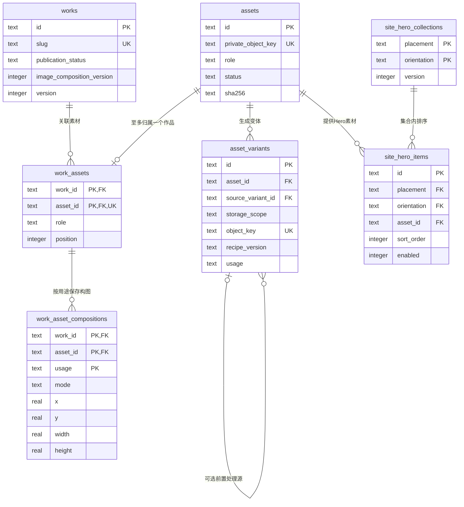
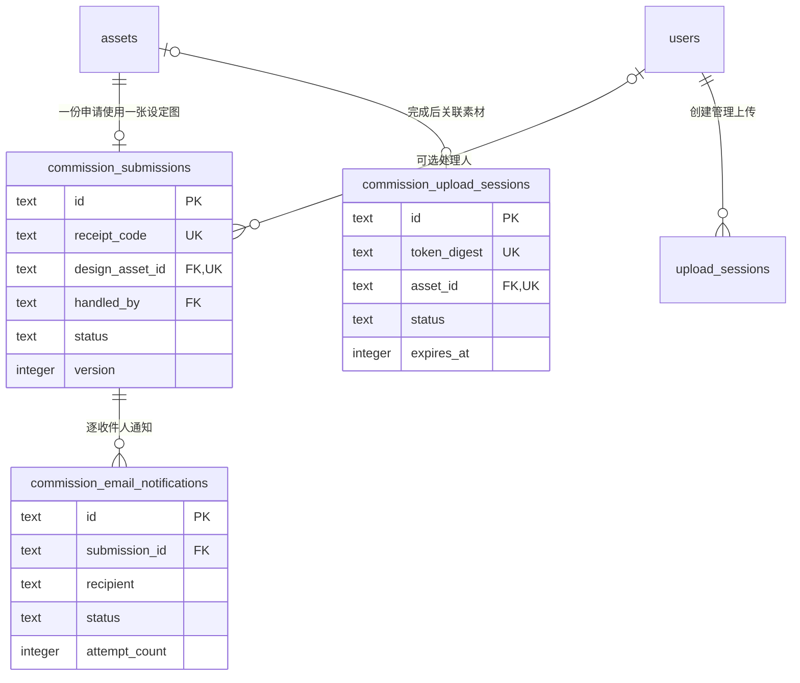
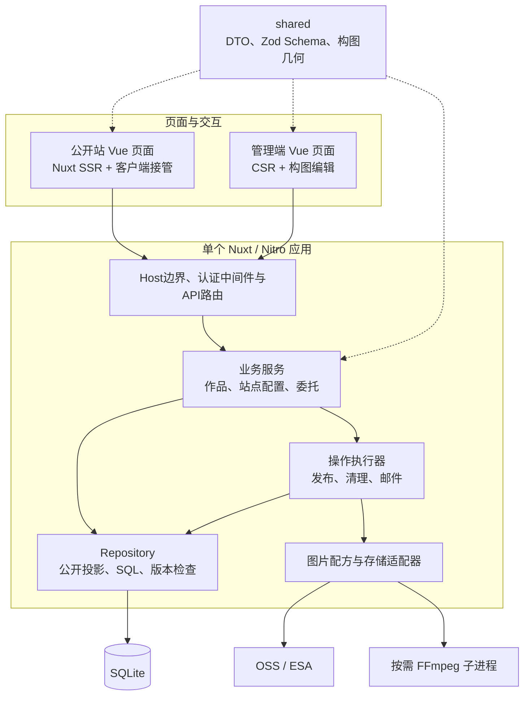
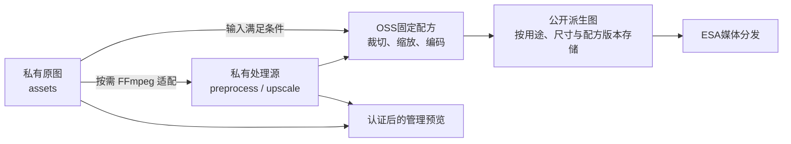
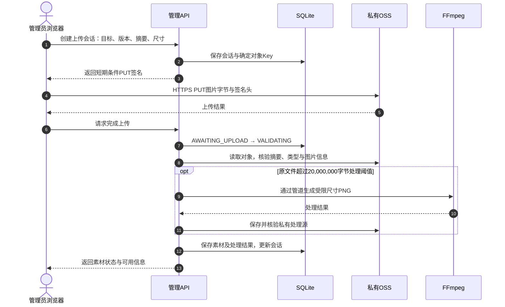
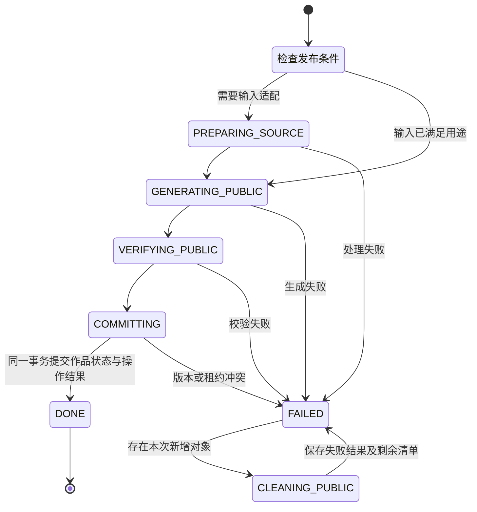
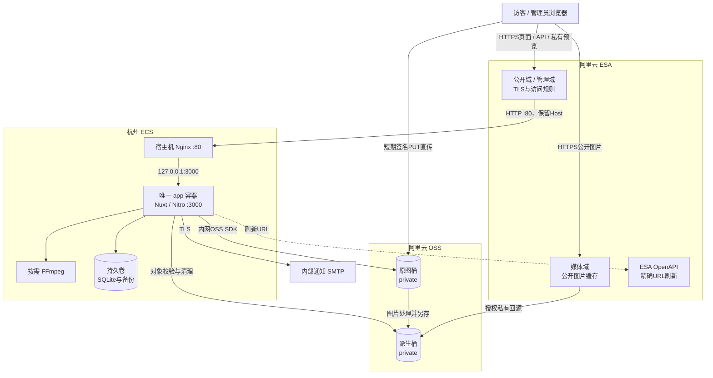
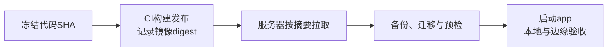

# 有点小狗工作室架构与部署设计

> 评审稿 · 2026-09-11  
> 代码基线：`WangMinan/project-fur-forge`，`main@866ac4ee29f696798cd391526534406175574d52`

本文描述有点小狗工作室（DITE DOG）官网的应用架构、数据模型、图片处理链路和部署方式。实现说明以本次固定提交的代码为准；生产拓扑采用仓库中的部署手册及配置基线。服务器规格、线上镜像摘要和云端规则的实际生效值由部署记录补充。技术选型部分给出与当前业务相匹配的设计理由，i18n 单独标为规划。

系统采用 **单个 Nuxt/Nitro 应用、SQLite 元数据存储、OSS 图片存储、ESA 边缘分发**。公开站使用服务端渲染，管理端使用客户端渲染；两者共享应用与业务服务，通过域名、路由和认证策略划分访问范围。[S01]、[S02]、[S03]

## 1. 技术选型

### 1.1 Vue + Nuxt：统一页面开发与服务端渲染

官网以作品浏览、领养展示和工作室介绍为主，公开页面需要可直接读取的首屏内容与分享元数据；管理端需要图片上传、构图编辑、排序和发布状态反馈。Vue 负责组件与交互，Nuxt 统一页面路由、SSR、客户端接管和构建，Nitro 承担 HTTP API 与服务端运行。[S01]、[S02]

| 方案 | 对本项目的适配方式 | 主要取舍 |
| --- | --- | --- |
| Vue + Nuxt | 公开站 SSR，管理端 CSR，API 与页面在同一应用交付 | 复用 Vue 组件、TypeScript 类型及校验规则，维持单一运行时 |
| Spring Boot + Thymeleaf | 服务端模板输出公开页面，管理交互按需引入前端组件 | 适合围绕 Java 服务组织的项目；本项目的图片编辑与富交互后台需要另行协调模板和前端状态 |
| 其他 SSR 框架 | 同样可以组织公开页面与服务端接口 | 需要迁移现有 Vue 组件、组合式逻辑和管理端交互，当前收益有限 |

本项目选择 Nuxt 的核心收益是开发复用和部署收敛。应用进程主要承担页面渲染、业务校验和元数据访问，公开图片分发交给 ESA 与 OSS。管理端私有图片回显、上传后校验和按需 FFmpeg 处理仍会消耗 ECS 的带宽、内存与 CPU，应纳入容量评估。

上述取舍属于架构分析。仓库未提供 Nuxt 与 Spring Boot 在同一服务器上的对照压测，运行时内存和吞吐量仍应通过实测确定。

### 1.2 SQLite：围绕单实例与轻量写入组织持久化

数据库保存作品信息、素材元数据、站点配置、委托申请和操作记录，图片字节保存在 OSS。现有部署只有一个常驻应用实例，后台维护和委托投递属于较低频写入，SQLite 可在应用进程内完成持久化，省去独立数据库服务和数据库网络连接。[S03]、[S04]

| 方案 | 常驻资源与运维工作 | 本项目取舍 |
| --- | --- | --- |
| SQLite | 本地数据库文件、备份、迁移和完整性检查 | 当前采用，适合单机应用与有限写并发 |
| ECS 上独立 MySQL | 数据库进程、内存配置、账号与端口管理、独立升级备份 | 持续写并发增加、数据库服务需要独立管理时再评估 |
| 阿里云 RDS | 云数据库实例、网络连接、权限配置及持续实例费用 | 应用多实例化或需要独立数据库高可用时再评估 |

应用通过 `better-sqlite3` 访问 SQLite，使用 Drizzle 维护表结构和迁移，同时在 Repository 中编写参数化 SQL。生产数据库位于 `/app/data/studio.db`，由 Docker 命名卷持久化。[S04]

当前连接参数如下：

| 参数 | 配置 | 目的 |
| --- | --- | --- |
| `journal_mode` | `WAL` | 允许读取与写入在 WAL 机制下并行推进 |
| `foreign_keys` | `ON` | 执行实体引用约束 |
| `busy_timeout` | `5000 ms` | 为短暂写锁竞争提供等待窗口 |
| `synchronous` | `FULL` | 采用较强的事务持久化策略 |

SQLite 同一时刻仍由一个写者执行写入。业务通过短事务、版本检查和持久化操作记录协调写入，OSS 请求与图片生成放在数据库事务外执行。后续扩容应优先观察写锁等待、查询时延、数据库体积和备份耗时，再决定迁移时机。[S04]、[S16]、[E01]、[E02]

### 1.3 ESA：统一站点接入、分发与防护

站点同时存在公开页面、管理页面、API 和图片资源，它们具有不同的回源与缓存要求。ESA 可集中管理域名接入、边缘 TLS、按 Host/路径划分的规则、缓存与安全防护；仓库也已围绕 ESA 建立媒体回源、精确 URL 刷新和上线验证流程。[S03]、[S17]、[S18]、[E03]

普通 CDN 适合以静态文件分发为中心的接入方式。本项目采用 ESA，主要看重站点级规则管理：页面和 API 回源 ECS，媒体域回源 OSS，管理端与会话请求绕过共享缓存。这样可以在同一套边缘配置中维护域名职责和缓存边界。费用比较需要结合实际套餐、请求量和流量账单，本设计不预设成本排名。

### 1.4 OSS：承载原图、处理源和公开派生图

工作室官网的主要存储增量来自图片。将图片放入 OSS，可以降低本地磁盘容量对作品规模的约束，使 ECS 数据卷集中保存数据库与运维文件。当前 `ali-oss` 适配层已覆盖条件上传签名、对象校验、图片处理、处理结果另存、读取和精确删除，ESA 通过私有 OSS 回源分发公开派生图。[S05]、[S03]

OSS 同时承担图片派生计算：应用提交固定配方，OSS 完成裁切、缩放、格式转换并保存结果。由此形成“应用控制业务与素材身份、OSS 执行存储及常规图片处理、ESA 分发结果”的职责划分。[S05]、[S12]

### 1.5 关键技术基线

以下版本取自本次提交，升级时以锁文件和构建产物为准。[S01]、[S02]、[S19]

| 层次 | 当前技术 |
| --- | --- |
| 页面与服务端 | Vue `3.5.42`、Nuxt `4.5.2`、Nitro `node-server` |
| 运行环境 | Node.js 24；生产基础镜像 `node:24.21.0-bookworm-slim`；pnpm `11.18.0` |
| 数据访问 | `better-sqlite3 13.0.3`、Drizzle ORM |
| 图片构图 | `cropperjs 2.2.0` |
| 本地图片处理 | `ffmpeg-static 5.3.0` |
| 云服务适配 | `ali-oss 6.23.0`、阿里云 ESA SDK |

## 2. 实体关系与数据模型设计

### 2.1 表结构总览

当前 Schema 定义 **18 张业务表**。Drizzle 另使用 `__drizzle_migrations` 保存迁移历史，SQLite 内部辅助表由数据库管理。[S06]、[S04]

#### 2.1.1 作品、素材与站点内容

| 表 | 职责 | 关键字段与约束 |
| --- | --- | --- |
| `works` | 作品及领养状态 | 唯一 `slug`；角色名、物种、用途；发布状态；精选与排序；详情可见性；构图版本 |
| `assets` | 原图身份与基础信息 | 唯一私有对象 Key；SHA-256、字节数、MIME、宽高、方向、角色和处理状态 |
| `asset_variants` | 私有处理源及公开派生图 | 关联原素材与可选前置变体；存储范围、用途、配方、尺寸、格式、摘要；对象 Key 唯一 |
| `work_assets` | 作品与素材的关联 | 联合主键 `work_id + asset_id`；素材 ID 同时唯一；角色、顺序、主图、alt、旧版焦点及裁切参数 |
| `work_asset_compositions` | 按展示用途保存人工构图 | 联合主键 `work_id + asset_id + usage`；`crop/contain` 模式与归一化选区 |
| `site_hero_collections` | 首页和委托页的横、竖版 Hero 集合 | `placement + orientation` 联合主键；四个集合独立维护版本 |
| `site_hero_items` | Hero 集合中的素材项 | 关联集合与素材；alt、排序、启用状态、预览信息；每组启用位置为 0—4 |
| `site_content` | 站点文案与联系配置 | `id=site` 单例；委托、关于、条款、隐私、联系信息；分区版本；内部通知收件列表 |
| `business_statuses` | 委托开放状态 | 当前 `kind=commission`；`open/closed`；标签及固定委托入口 |

#### 2.1.2 委托申请与通知

| 表 | 职责 | 关键字段与约束 |
| --- | --- | --- |
| `commission_upload_sessions` | 匿名委托附件上传 | 上传令牌摘要、预期摘要与尺寸、可选素材 ID、过期时间；独立于管理员上传会话 |
| `commission_submissions` | 委托申请 | 唯一回执码、申请资料、唯一设定图素材、处理状态、内部备注、处理人及版本 |
| `commission_email_notifications` | 内部邮件发送记录 | `submission_id + recipient` 唯一；发送状态、尝试次数、租约、下次尝试及发送时间 |

#### 2.1.3 认证、操作恢复与记录

| 表 | 职责 | 关键字段与约束 |
| --- | --- | --- |
| `users` | 管理账号 | 用户名唯一、密码哈希、会话版本、失败次数、锁定时间与启用状态 |
| `upload_sessions` | 管理员上传会话 | 所属作品或站点位置、预期文件信息、创建者、状态与版本；有效期 5 分钟 |
| `publication_operations` | 发布、下架及相关适配操作 | 目标实体、请求版本、阶段、清理清单；租约与心跳；独立 ESA 刷新状态 |
| `site_display_reconcile_operations` | 站点展示素材补齐与核对 | 扫描范围、生成/跳过/失败计数、清理清单和恢复信息 |
| `analytics_events` | 最小第一方访问统计 | 服务端时间、规范事件与页面枚举、可选作品 ID、联系动作和会话 HMAC |
| `audit_logs` | 管理操作审计 | 操作者、动作、实体标识、结果与时间 |

### 2.2 实体关系

作品可以关联多张素材；`work_assets.asset_id` 的唯一约束使同一素材至多归属于一个作品。一张素材可生成多个变体，每个作品素材关联又可保存多个用途的构图。`asset_variants.source_variant_id` 记录派生链中的前置处理源。[S06]



委托申请直接引用私有设定图。一个申请按收件人生成多条内部邮件通知记录，处理人关联管理账号。[S06]



`publication_operations.entity_type/entity_id`、`upload_sessions.owner_type/owner_id` 使用多态标识，由服务层检查目标对象；`site_content` 中的二维码引用保存在 JSON 配置中。这些关系与图中的数据库外键分别管理。[S06]

### 2.3 一致性与状态设计

**业务状态与素材状态分开维护。** 作品发布状态为 `draft/published/unpublished`；素材和变体状态为 `PENDING/READY/FAILED`。上传完成后，业务仍按素材就绪情况决定能否使用或发布。公开查询从已发布作品及就绪素材构建结果。[S06]、[S07]、[S11]

**并发修改采用版本检查。** 作品、站点文案分区、Hero 集合和操作记录各自保存 `version`。更新携带预期版本，通过带版本条件的更新确认写入，冲突返回后由管理界面重新读取。独立版本域减少文案编辑与图片维护之间的相互影响。[S06]、[S16]

**外部副作用通过操作清单追踪。** OSS 对象生成、删除和 ESA 刷新跨越数据库事务边界，操作表保存进度、待清理 Key 和刷新状态。数据库提交使用短事务，失败处理依据清单继续执行。[S16]、[S17]

## 3. 主站与管理端实现

### 3.1 前后端职责分层与统一交付

前端与后端按职责分层，最终交付为同一个 Nuxt/Nitro 应用。公开页面在服务端取得公开数据并渲染 HTML，浏览器接管后继续处理导航和交互；管理页面采用 CSR，通过管理 API 完成读写。[S01]、[S02]、[S07]



`app/` 保存页面、组件和客户端逻辑；`server/` 保存路由、中间件与业务实现；`shared/` 保存前后端共用的契约和纯函数。公开 Repository 通过显式字段投影与 Schema 校验输出公开数据，管理读写使用独立入口。[S07]、[S13]

域名与路径共同决定入口范围：[S08]

| 入口 | 访问规则 |
| --- | --- |
| 公开 Host | 提供公开页面和公开 API；管理、认证及预览路径返回 404 |
| 管理 Host | 根路径跳转 `/admin/login`；按白名单开放管理、认证及所需资源路径 |
| 媒体 Host | 由 ESA 回源 OSS；请求误入应用时拒绝 |
| 未配置 Host | 应用返回 421；Nginx 默认站点同样拒绝 |

### 3.2 SEO 与分享元数据

公开页面使用 Nuxt 的 `useSeoMeta` 和 `useHead` 在 SSR 阶段输出标题、描述与分享信息。公共布局集中维护 canonical、Open Graph、Twitter Card 和 `Organization` JSON-LD；具体页面提供各自的标题与描述。[S02]、[S09]

| 能力 | 当前实现 |
| --- | --- |
| canonical | 公共布局按请求 Origin 与 `route.path` 构造 URL，查询参数不进入该布局生成的 canonical |
| 社交分享 | 公共布局设置站点名、语言、页面 URL 及带版本指纹的品牌分享图 |
| 结构化数据 | 输出工作室 `Organization` JSON-LD |
| `robots.txt` | 声明公开站 Sitemap，限制爬取 `/admin/` 与 `/api/` |
| `sitemap.xml` | 汇总固定页面和公开作品、领养列表返回的详情链接，并去重 |
| 管理页面 | CSR 路由配置 `noindex, nofollow, noarchive` |

Sitemap 当前调用列表接口的默认查询。作品规模扩大后，应核查默认分页范围并补齐全量详情链接枚举。这是 SEO 覆盖项，与页面自身的 SSR 能力分别验收。[S10]

### 3.3 原图桶与公开派生桶

两个 Bucket 的访问权限均为 **private**，部署基线要求开启 Block Public Access。“公开派生桶”中的图片通过 ESA 媒体域对外分发。[S03]

| 存储位置 | 内容 | 读取和写入路径 |
| --- | --- | --- |
| `project-furry-forge-private` | 永久原图、私有处理源、委托设定图等 | 浏览器持条件 PUT 签名上传；应用通过 OSS SDK 读取和处理；管理预览经过认证 API |
| `project-furry-forge-public` | 供页面引用的公开派生图 | 应用使用 OSS 图片处理另存结果；ESA 通过授权私有回源读取 |
| ECS 数据卷 | SQLite、迁移前备份等 | 应用与同镜像运维命令访问 |

ESA 媒体回源采用同账号私有 OSS 授权及阿里云托管 STS。应用使用服务器端 OSS 凭据管理对象，浏览器只取得具体上传任务的短时签名。生产环境的服务端 OSS Endpoint 与浏览器上传 Origin 分开配置，前者使用杭州内网 Endpoint，后者使用浏览器可达的私有桶公网 Origin。[S03]、[S05]

### 3.4 图片素材管理

#### 3.4.1 素材分层与原图保存

素材按三层组织：**原图、私有处理源、公开派生图**。`assets` 记录原图身份，`asset_variants` 记录后续生成结果及依赖关系。原图 Key、摘要和宽高作为后续构图与重建的基础；裁切和尺寸适配生成独立对象，保留原图。[S06]、[S11]、[S12]



作品素材包含设定图、出厂照和领养封面；站点素材包含横竖版 Hero 与联系二维码；委托设定图使用独立角色 `commission_design_reference`，其变体受数据库约束保持私有。[S06]

对象路径包含环境前缀。典型用途为：

```text
<env>/original/…                                      永久原图
<env>/processing/<assetId>/<recipeVersion>/…png        私有处理源
<env>/web/<assetId>/<recipeVersion>/<usage>/<width>/…  公开派生图
```

生产媒体域的开放路径限定为 `/prod/web/**`，其他路径由边缘规则拒绝。[S11]、[S12]、[S18]

#### 3.4.2 条件直传与上传完成校验

管理端先创建上传会话，提交文件类型、字节数、MD5、SHA-256 和尺寸等信息。服务端确认目标作品或站点位置及版本，生成指向确定对象 Key 的短期 PUT 签名。图片文件由浏览器直接上传 OSS。[S05]、[S06]、[S11]

签名绑定 `Content-Type`、`Content-MD5`、`x-oss-meta-sha256` 和 `x-oss-forbid-overwrite: true`。管理上传会话有效期为 5 分钟，过期、重复完成与版本冲突由服务端状态检查处理。[S05]、[S06]、[S11]



上传后的校验以 OSS 中的实际对象为依据，检查文件内容与预期信息是否一致。普通管理素材允许的文件上限为 30,000,000 字节；委托附件和联系二维码上限为 20,000,000 字节。格式限定 JPEG、PNG 和 WebP，并执行尺寸及素材角色约束。[S06]、[S11]

上传会话、素材处理和业务绑定具有各自状态。后台应分别呈现上传结果与素材可用状态，例如预处理失败可通过素材错误字段反映，作品发布检查继续按 `READY` 条件判断。[S06]、[S11]

#### 3.4.3 FFmpeg 的嵌入、调用与资源控制

应用通过 `ffmpeg-static` 随生产依赖携带 FFmpeg 二进制，调用时使用包提供的绝对路径。Node.js 使用 `spawn` 启动子进程，通过 `stdin/stdout` 管道传入和接收图片 Buffer；命令参数采用数组传递。运行镜像基于 Debian/glibc，构建阶段检查二进制可执行性。[S14]、[S19]

FFmpeg 主要执行以下适配任务：[S11]、[S12]、[S14]

| 任务 | 处理方式 | 保存结果 |
| --- | --- | --- |
| 大文件预处理 | 超过 20,000,000 字节阈值时，将图片按比例缩至 4096 × 4096 范围，输出 PNG | 私有 `preprocess-v1` 处理源 |
| 作品有效像素适配 | 根据选区和最大输出档位计算最低输入尺寸，使用 Lanczos 等比缩放 | 带独立配方身份的私有处理源 |
| Hero 尺寸适配 | 横版目标 3840 × 2160；竖版目标 1080 × 1920；使用 Lanczos 缩放及目标裁切 | 私有 Hero 处理源 |

单次执行设置 120 秒超时，标准输出上限 30,000,000 字节，标准错误上限 1,000,000 字节；图片命令设置 `-threads 1`、单帧输出和元数据移除。供 OSS 后续处理的 PNG 还需满足 20,000,000 字节输出限制。[S14]

尺寸适配结果按摘要、实际宽高和存储结果再次校验。放大配方身份还记录 FFmpeg 二进制版本及 SHA-256，使配方更新能够生成新的处理源身份。Lanczos 提供几何插值，清晰度评估仍以原图或选区的有效像素为依据。[S12]、[S14]

管道调用减少了本地中间文件，处理期间仍会同时占用 Node Buffer 与 FFmpeg 进程内存。当前 Compose 未配置 CPU、内存硬限额，容量验证应覆盖大图校验、FFmpeg 执行和管理预览同时发生的情况。[S03]、[S14]

#### 3.4.4 非破坏性构图与裁切参数

管理端通过 `ImageCompositionControls.vue` 按需加载 Cropper.js，为同一张素材编辑不同展示位置的选区。保存内容为 **用途、模式和归一化矩形**，公开图片由服务端根据这些参数生成。[S13]

| 用途 | 允许的构图 | 默认行为 |
| --- | --- | --- |
| `detail-thumbnail`：详情缩略图 | 固定 1:1 裁切 | 使用方形选区 |
| `work-catalog`：作品目录 | 4:5 裁切或完整展示 | 出厂照默认裁切；设定图、领养封面默认完整展示 |
| `home-featured`：首页代表作品 | 3:4 裁切或完整展示 | 主出厂照默认裁切 |
| `adoption-catalog`：领养目录 | 自由比例裁切或完整展示 | 默认完整展示 |
| `home-adoption`：首页当前领养 | 自由比例裁切或完整展示 | 默认完整展示 |

构图保存在 `work_asset_compositions`。裁切模式的 `x/y/width/height` 均以原图为参照，取值归一化到 0—1；完整展示模式使用空选区字段。前端预览与服务端共用 `pixelCrop`，对矩形边界统一取整，减少预览与成图的像素偏差。[S06]、[S13]

图片设计包含三个独立维度：**原图尺寸、人工选区、页面画框**。固定裁切比例约束生成内容；`contain` 保留完整图像并允许画框留白；自由比例领养选区保留管理员选择的构图。桌面端和移动端的布局继续使用各自画框，资源选择通过输出尺寸档位完成。[S12]、[S13]

当选区过小，服务端会结合最大输出档位计算所需处理尺寸；预计边长超过 12,000 像素时返回校验错误。构图编辑同时提供低分辨率提示，便于管理员在清晰度与主体范围之间取舍。[S12]、[S13]

#### 3.4.5 公开派生配方与尺寸档位

应用通过 OSS `processObjectSave` 将处理结果保存至派生桶，并设置对应 MIME 和缓存头。生成参数由服务端固定配方决定，包含用途、尺寸、格式、质量、构图及配方版本。[S05]、[S12]

当前作品图片主要使用以下档位，单位为像素：

| 用途 | 输出宽度 | 图像比例与复用 |
| --- | --- | --- |
| 详情缩略图 | 96 / 192 / 288 | 1:1 |
| 作品目录裁切图 | 480 / 768 / 1200 | 4:5 |
| 首页代表作品裁切图 | 480 / 768 / 1200 | 3:4 |
| 领养目录、首页领养裁切图 | 768 / 1200 / 1600 | 按选区比例 |
| 完整出厂照、设定图及封面 | 960 / 1600 / 2400 | 保留完整图像比例 |

选择 `contain` 时，构图用途复用 `detail` 或 `design-sheet` 完整派生图，实际档位随被复用用途。首页领养与领养目录的选区相同时也会复用结果，减少重复对象。[S12]

站点展示图片使用独立的 `site-display-v2` 配方：[S15]

| 展示位置 | 输出宽度 | 比例 |
| --- | --- | --- |
| 首页横版 Hero | 768 / 1280 / 1920 / 2880 / 3840 | 16:9 |
| 首页竖版 Hero | 480 / 768 / 1080 | 9:16 |
| 委托页横版 Hero | 768 / 1280 / 1920 | 16:9 |
| 委托页竖版 Hero | 480 / 768 / 1080 | 9:16 |
| 首页委托、领养入口配方 | 480 / 768 / 1080 | 3:2 |

作品公开配方的 WebP 质量参数为 82，JPEG 为 86，PNG 为 100；Hero 的 `site-display-v2` WebP 质量参数为 90。读取层按可用格式和尺寸组织图片资源集合。联系二维码采用独立方形 PNG 配方。[S06]、[S12]、[S15]

当前版本使用 `work-composition-v1` 标识按用途构图，通用作品派生版本为 `recipe-v4`。本提交的这些处理串包含裁切、缩放、质量和格式转换，构图用途还包含自动方向纠正，未配置水印步骤。历史配方与素材通过版本字段保留兼容关系。[S12]

`works.image_composition_version` 区分旧版展示参数与按用途构图。旧记录仍可沿用 `work-card`、`adoption-card` 等旧用途，新的编辑和发布流程按构图版本选择处理规则。部署后的存量素材升级应同时核对记录版本与已有变体。[S06]、[S12]

#### 3.4.6 不可变资源身份与完整性校验

公开对象 Key 使用环境、素材 ID、配方版本、用途、尺寸和身份摘要组合，例如：

```text
prod/web/<assetId>/work-composition-v1/work-catalog/1200/<identityHash>.webp
```

身份摘要涵盖输入摘要、前置处理源、素材角色、构图或焦点、输出尺寸、格式、质量与配方版本。修改选区或配方会形成新路径，页面在发布后引用对应新资源，便于长缓存与历史结果区分。[S12]

生成后执行三路核验：通过 OSS HEAD 读取对象信息，通过 `image/info` 确认图像尺寸与格式，再通过媒体域匿名 GET 验证实际分发结果。应用比较字节数、MIME、MD5、SHA-256 和宽高，通过后将变体登记为可用。[S05]、[S12]

公开媒体生成与校验阶段，候选派生对象已可经媒体域读取；数据库发布事务控制公开页面对这些对象的引用。原图和私有处理源保持在私有访问链路中。发布失败时依据本次新增对象清单清理候选结果。[S05]、[S12]、[S16]

#### 3.4.7 发布事务与失败恢复

作品发布使用 `publication_operations` 保存目标版本和执行阶段。发布执行器在应用进程内运行，通过租约、尝试次数和心跳协调执行；当前部署保持单个常驻 `app` 服务。[S03]、[S16]



执行顺序为输入准备、派生生成、公开验证和业务提交。源码对素材生成失败提供一次间隔 1 秒的有限重试。提交阶段在同一 SQLite 事务内检查作品版本和操作租约、切换发布状态、写入审计并将操作标记为 `DONE`。[S16]

对象生成以稳定 Key 复用结果；清理以确定对象列表逐项推进。租约失效后，原执行者停止修改操作和删除对象，避免影响接管执行。持久化状态为中断恢复提供依据。[S16]

#### 3.4.8 下架、对象清理与 ESA 刷新

下架首先在数据库事务内切换作品状态，登记待删除对象 Key 和待刷新的媒体 URL。随后执行器逐项删除派生桶对象、更新数据库变体及剩余清单，再向 ESA 提交精确 URL 刷新请求。[S16]、[S17]

下架结果分为三个可检查的层次：

| 层次 | 判断依据 |
| --- | --- |
| 页面引用已撤下 | 作品状态为 `unpublished`，公开查询不再返回该作品 |
| 派生对象已清理 | 操作中的待清理 Key 清单已完成 |
| 边缘刷新已完成 | `edge_purge_status=COMPLETE`，结合任务结果确认 |

ESA 刷新当前由应用进程异步发起，数据库记录清单、任务 ID 和刷新状态。业务操作 `DONE` 与边缘刷新完成分别表示，刷新提交失败记录独立错误状态。运行维护需跟进提交失败或中断遗留项；当前提交逻辑采用进程内尽力提交，持续重试队列属于后续演进范围。[S17]

边缘刷新作用于 ESA 缓存；已经进入浏览器缓存或被保存的图片按各自生命周期保留。因此，下架验收应分别查看页面结果、OSS 对象与 ESA 状态，明确公开内容的撤回范围。[S05]、[S17]、[S18]

#### 3.4.9 管理预览与原图访问

当前管理端使用认证后的同源 GET 返回图片字节：应用读取私有 OSS 原图或 OSS 缩略处理结果，再响应浏览器。浏览器侧的私有图片 GET 保持在管理域内，浏览器直传继续使用独立的 PUT 签名链路。[S03]、[S05]

预览尺寸按场景选择：列表与卡片 320、出厂照 640、Hero 编辑及作品设定图、领养封面、委托详情 1280。原图入口返回对应图片 MIME 和 `Content-Disposition: inline`，支持在新窗口中使用浏览器原生预览。[S03]

这些响应采用 `no-store`。图片请求与被动会话检查不延长八小时闲置登录，正常业务操作按会话规则更新活动时间。管理预览的图片字节经过 ECS，访问量和缩略图档位直接影响源站带宽与内存使用。[S03]、[S20]

### 3.5 安全与隔离设计

安全边界覆盖入口、身份、数据投影和存储权限，而各层职责保持独立。[S03]、[S06]、[S08]、[S20]、[S21]

| 层次 | 当前机制 |
| --- | --- |
| 域名与路由 | ESA 按域名回源；Nginx 拒绝未知 Host 与误入的媒体 Host；应用再次检查 Host 和路径 |
| 身份与会话 | 密码哈希、账号锁定字段、会话版本；`__Host-` 会话 Cookie 使用 Secure、HttpOnly、SameSite=Strict |
| 管理写请求 | 认证会话、精确管理 Origin 和 CSRF Token 校验；按管理员维度限制写入频率 |
| 滥用控制 | 登录、未认证管理探测及统计请求使用独立限流范围；临时客户端地址摘要保存在进程内 |
| 公开数据 | 独立公开查询与 DTO 校验；仅引用符合公开条件的素材和已发布实体 |
| 图片权限 | 两桶 private；原图走认证读取；浏览器上传权限限定为具体 Key、签名头和有效期 |
| 容器 | 非 root、只读根文件系统、临时目录 tmpfs、移除 Linux capabilities、禁止权限提升 |
| 审计与统计 | 审计保存动作和结果；统计使用规范字段及会话 HMAC，不保存原始 IP、UA、Referer 和完整 URL |

当前部署手册记录 OSS 与 ESA API 共用一套既有阿里云 AK/SK，权限范围较大。凭据写入服务器 `.env`，通过运行环境注入，排除在 Git、镜像和公开配置之外。后续可评估按用途收敛权限；本设计将该项保留为运维改进。[S03]

私有桶 CORS 需要覆盖真实使用上传功能的 Origin、PUT 方法和签名请求头。CORS 配置与条件签名分别验收；对象读取权限仍由 Bucket 权限及服务端认证链路管理。[S03]、[S05]

### 3.6 委托申请与内部邮件通知

匿名委托使用独立上传会话及令牌摘要，完成上传后将私有设定图绑定申请。申请记录保存唯一回执码、处理状态和版本，同一手机号的待处理申请受部分唯一索引约束。当前数据约束覆盖中国大陆手机号，委托资料与设定图属于受控业务数据。[S06]

邮件通知按“申请 × 收件人”记录发送状态，通过应用内执行器发送给工作室内部收件人。SMTP 配置来自环境变量，收件列表在站点配置中维护。通知停用、配置异常或发送失败时，已提交的申请仍保留在后台。[S03]、[S06]

发送过程记录尝试次数、租约和传输状态。部署手册规定每个收件人最多尝试两次；结果不确定的已开始传输任务由管理员核对后决定重试。已发送邮件的副本随收件系统保留，网站中的申请删除与邮件副本管理分别执行。[S03]

### 3.7 【规划】有限范围的 i18n

本节承接已确定的语言范围，描述后续设计。当前 Nuxt 全局语言为 `zh-CN`，尚未配置 i18n 模块。[S02]

英文支持集中在公开页面的导航、按钮、固定说明和工作室介绍。作品名称、物种和图片替代文本继续使用现有内容；管理菜单、运维工具和内部通知保持中文。国际手机号、支付、运输及面向客户的自动邮件均保持在本轮范围之外。

语言策略沿用同一组页面路径，根据浏览器语言选择中文或英文。服务端可依据 `Accept-Language` 确定首屏语言，并将结果传入客户端，保持 SSR 与客户端接管一致。现有 HTML 绕过共享缓存的策略与这一设计匹配；未来开启页面缓存时，需要把语言纳入缓存键。

## 4. 部署设计

### 4.1 生产拓扑

仓库部署基线为杭州 ECS、宿主机 systemd Nginx 和单个 Docker `app` 容器。部署手册记录源站地址 `120.26.51.205`、工作目录 `/root/project-fur-forge`。公开域为 `ditedog.com`，媒体域为 `public-media.ditedog.com`，管理域由 `ADMIN_BASE_URL` 对应的精确 Host 配置。[S03]、[S21]



浏览器侧 HTTPS 在 ESA 终止；当前基线中的 ESA 至 ECS 页面回源采用 HTTP 80。源站安全组要求仅允许 ESA 回源地址访问 80，3000 仅绑定宿主机回环地址。该链路的传输保护边界应在生产网络验收中明确记录。[S03]、[S21]

### 4.2 请求与数据流

#### 4.2.1 公开页面和公开 API

浏览器访问公开域，ESA 按规则将 HTML 或 API 请求回源至 ECS。Nginx 保留 Host 并代理到 `127.0.0.1:3000`，应用完成路由检查，通过 Repository 读取 SQLite，渲染 HTML 或返回公开 DTO。页面中的图片 URL 指向媒体域。[S02]、[S07]、[S18]、[S21]

#### 4.2.2 公开图片

浏览器向媒体域请求 `/prod/web/**`。缓存命中时由 ESA 返回；缓存未命中时，ESA 使用私有 OSS 回源授权读取派生桶。常规公开图片读取直接发生在 ESA 与 OSS 之间，应用只在生成、校验和清理阶段参与对象管理。[S03]、[S05]、[S18]

#### 4.2.3 管理读写和私有预览

管理员通过管理域访问同一应用，管理请求经过会话检查，写请求再执行 Origin、CSRF 和版本校验。元数据读写访问 SQLite；私有预览由应用从 OSS 取得原图或缩略结果后返回，响应保持 `no-store`。[S03]、[S08]、[S20]

#### 4.2.4 上传、派生和发布

浏览器先通过业务 API 获取具体文件的条件 PUT 签名，再直传私有 OSS。上传完成校验和必要的 FFmpeg 适配由应用执行。发布阶段由 OSS 生成公开派生图，应用验证分发结果并提交作品发布状态。完整上传与发布顺序见 3.4 节。[S05]、[S11]、[S12]、[S16]

### 4.3 容器、反向代理与持久化

Compose 的唯一常驻服务为 `app`。Nginx 由宿主机 systemd 管理；迁移、预检、管理员初始化、备份、恢复等任务通过同一应用镜像的一次性命令执行。[S03]

| 项目 | 配置基线 |
| --- | --- |
| 应用启动 | `tini -- node .output/server/index.mjs` |
| 主机端口映射 | `127.0.0.1:3000:3000` |
| 容器网络 | `app-egress`，桥接网段 `172.30.250.0/24` |
| 数据卷 | `app-data → /app/data` |
| 运维卷 | `app-backups → /app/backups` |
| 迁移前自动备份 | `/app/data/backups/pre-migrate-*.db`，随数据卷持久化 |
| 临时目录 | `/tmp` 为 64 MiB tmpfs |
| 文件系统与身份 | 根文件系统只读；应用使用 `node` 用户 |
| 生命周期 | `restart: unless-stopped`；Nitro 停止超时 4 秒；Compose 停止宽限期 5 秒 |

容器内的 `HOST=0.0.0.0` 用于监听容器网络接口，宿主机对外暴露范围由回环端口映射控制。更换镜像时保留两个命名卷，数据库及备份沿用原持久化位置。[S03]、[S19]

Nginx 模板对精确公开域和管理域提供代理，拒绝其他 Host；将外部来源协议写为 HTTPS，透传请求 Host 与代理链信息。应用配置 `TRUSTED_PROXY_CIDRS`，涵盖 Docker 网关及实际 ESA 代理网段，供可信客户端地址解析使用。[S03]、[S21]

Nginx 对外屏蔽 `/api/health` 及其子路径，健康检查直接访问本地容器入口。模板同时配置响应安全头、上传请求体上限和代理超时。[S21]

### 4.4 缓存策略

边缘缓存按域名、路径及请求性质划分，部署时按 `deploy/esa/cache-policy.json` 的优先级设置。[S18]

| 请求范围 | ESA 缓存 | 浏览器缓存 |
| --- | --- | --- |
| 管理域全部请求 | 绕过 | 0；私有响应 `no-store` |
| 公开域与管理域 `/api/**` | 绕过 | 0 |
| 公开站 HTML | 绕过 | 0 |
| 公开域 `/_nuxt/**` | 365 天 | 365 天 |
| 媒体域 `/prod/web/**` | 30 天 | 7 天 |
| 媒体域其他路径 | 拒绝 | 0 |

不可变资源规则忽略查询参数，更新通过对象路径或构建指纹体现。Nuxt 静态资源与媒体资源的 404 缓存时间为 60 秒，配置关闭源站错误时的过期内容回送。[S18]

OSS 写入公开派生对象时设置 `Cache-Control: public, max-age=31536000, immutable`；边缘策略另规定媒体的 30 天边缘缓存与 7 天浏览器缓存。部署验收需从媒体域读取实际响应头，确认 ESA 对源站缓存头的覆盖结果，并核对路径规则优先级。[S05]、[S18]

### 4.5 构建与发布

Dockerfile 使用依赖、构建和运行等阶段，锁定依赖后离线安装，构建 Nuxt 输出和 `ops/ops.mjs`。运行阶段保留生产依赖、迁移文件与运维程序，并验证 SQLite 原生模块、OSS/ESA SDK 和 FFmpeg 可加载或执行。[S19]

正式镜像通过 GitHub Actions 的 `release-image` 工作流发布。发布记录保留冻结 Git SHA 和 `repository@sha256:…` 镜像摘要，服务器按摘要拉取和部署；构建过程在 CI 完成。[S03]



首次部署使用同一镜像依次完成迁移、无网络预检、云端预检和管理员初始化，再启动服务。以下命令体现主要步骤，环境变量、镜像摘要和云端规则按部署手册准备：[S03]

```bash
# 预先在服务器 .env 中设置 APP_IMAGE_REF 及所需生产配置。
docker compose config --quiet
docker compose pull app

docker compose run --rm --no-deps app node ops/ops.mjs migrate
docker compose run --rm --no-deps app node ops/ops.mjs preflight
docker compose run --rm --no-deps app node ops/ops.mjs preflight --no-dry-run

# 首次建立管理账号时执行，交互输入凭据。
docker compose run --rm --no-deps app node ops/ops.mjs init-admin

docker compose up --detach --no-build --no-deps app
```

后续升级先保存当前镜像摘要与数据库备份，再按部署手册执行对应版本迁移和启动检查。迁移文件随镜像交付，应用启动时核对数据库迁移历史。回退方案应同时考虑镜像与数据库结构的兼容性。[S03]、[S04]

### 4.6 备份与恢复

数据库备份使用 `better-sqlite3` 的备份接口创建独立文件，完成后执行完整性检查。已有数据库执行待应用迁移前会自动生成备份，保存在数据库目录下的 `backups` 子目录。[S04]

恢复流程先检查源备份的完整性、外键和迁移历史，再恢复到新的目标文件并再次验证。代码要求恢复目标与当前活动数据库分开，经过部署流程确认后再切换使用。[S04]

SQLite 备份覆盖业务记录与图片索引，图片内容由 OSS 单独持久化。完整恢复应同时考虑数据库版本、原图对象和公开变体之间的对应关系；素材补齐、对象核对和发布恢复使用现有运维程序处理。[S01]、[S03]、[S06]

两个 Docker 卷位于同一 ECS 的本地持久化范围。异地数据库备份、OSS 数据保护设置、保留周期及恢复演练结果需要另行记录，作为整机故障恢复方案的一部分。

### 4.7 健康检查与验收记录

Compose 每 15 秒访问一次容器本地 `/api/health/ready`，使用正式公开 Host，超时 5 秒、连续失败判定次数 5 次、启动等待窗口 30 秒。外部业务链路另通过公开域、管理域和媒体域验证。[S03]、[S21]

部署手册要求关注流量、4xx/5xx、刷新任务、证书、ECS 磁盘、Nginx、容器和 ready 状态。容量验证应覆盖 SSR 请求、数据库短事务、大图校验、FFmpeg 和管理预览，保留当时服务器规格与测试条件。[S03]

评审与上线时补齐以下记录：

| 记录项 | 需要保留的结果 |
| --- | --- |
| 运行版本 | Git SHA、镜像 digest、数据库迁移状态 |
| 入口与权限 | 正式管理 Host、ESA 回源设置、安全组、Bucket 权限与 CORS |
| 媒体闭环 | 条件上传、私有预览、各构图用途成图、发布、下架及 ESA 刷新结果 |
| 缓存行为 | HTML/API 绕过缓存、媒体响应头、不可变路径和 404 规则 |
| 数据恢复 | 数据库备份位置、异地副本、OSS 数据保护设置及恢复演练 |
| 容量与覆盖 | ECS 规格、资源峰值、图片处理时延、Sitemap 详情链接覆盖范围 |

## 附录 A. 代码与配置索引

以下链接均固定到本文基线提交，便于评审时定位实现。

| 标记 | 主要依据 |
| --- | --- |
| S01 | [项目说明][readme]；[依赖与运维命令][package] |
| S02 | [Nuxt 配置、渲染与会话参数][nuxt] |
| S03 | [生产部署手册][deployment]；[Compose 编排][compose] |
| S04 | [数据库连接、迁移、备份与恢复][database] |
| S05 | [OSS 存储适配与签名、处理、读取][storage] |
| S06 | [完整数据模型][schema] |
| S07 | [公开查询与数据投影][public-repository] |
| S08 | [Host 策略][host-policy]；[Host 中间件][host-middleware] |
| S09 | [公开布局与通用 SEO][public-layout]；[首页 SEO][home-page]；[关于页][about-page] |
| S10 | [robots.txt][robots]；[Sitemap][sitemap] |
| S11 | [上传完成校验与预处理][media-completion] |
| S12 | [作品图片配方、尺寸适配与公开校验][media-recipe] |
| S13 | [构图编辑组件][composition-component]；[共用构图几何与规则][composition-utils] |
| S14 | [嵌入式 FFmpeg][ffmpeg] |
| S15 | [站点展示图片配方][site-display] |
| S16 | [作品发布、下架与恢复执行][publication] |
| S17 | [ESA 精确刷新提交][purge] |
| S18 | [ESA 缓存规则][cache-policy] |
| S19 | [生产镜像构建][dockerfile] |
| S20 | [认证、CSRF、会话活动与限流中间件][auth-middleware] |
| S21 | [Nginx 代理模板][nginx] |

## 附录 B. 外部技术依据

以下资料仅用于解释选型与通用机制；项目实现及部署参数以附录 A 为准。

| 标记 | 官方资料 | 用途 |
| --- | --- | --- |
| E01 | [SQLite：Appropriate Uses][sqlite-uses] | 单机应用适配与写并发边界 |
| E02 | [SQLite：Write-Ahead Logging][sqlite-wal] | WAL、读写并发及持久化机制 |
| E03 | [阿里云：什么是 ESA][esa-overview] | 站点级边缘加速、安全与配置能力 |

[readme]: https://github.com/WangMinan/project-fur-forge/blob/866ac4ee29f696798cd391526534406175574d52/README.md
[package]: https://github.com/WangMinan/project-fur-forge/blob/866ac4ee29f696798cd391526534406175574d52/package.json
[nuxt]: https://github.com/WangMinan/project-fur-forge/blob/866ac4ee29f696798cd391526534406175574d52/nuxt.config.ts
[deployment]: https://github.com/WangMinan/project-fur-forge/blob/866ac4ee29f696798cd391526534406175574d52/docs/DEPLOYMENT.md
[compose]: https://github.com/WangMinan/project-fur-forge/blob/866ac4ee29f696798cd391526534406175574d52/docker-compose.yaml
[database]: https://github.com/WangMinan/project-fur-forge/blob/866ac4ee29f696798cd391526534406175574d52/server/utils/database.ts
[storage]: https://github.com/WangMinan/project-fur-forge/blob/866ac4ee29f696798cd391526534406175574d52/server/utils/media-storage.ts
[schema]: https://github.com/WangMinan/project-fur-forge/blob/866ac4ee29f696798cd391526534406175574d52/server/database/schema.ts
[public-repository]: https://github.com/WangMinan/project-fur-forge/blob/866ac4ee29f696798cd391526534406175574d52/server/utils/repository/public-site-repository.ts
[host-policy]: https://github.com/WangMinan/project-fur-forge/blob/866ac4ee29f696798cd391526534406175574d52/server/utils/route/host-policy.ts
[host-middleware]: https://github.com/WangMinan/project-fur-forge/blob/866ac4ee29f696798cd391526534406175574d52/server/middleware/01.host-boundary.ts
[public-layout]: https://github.com/WangMinan/project-fur-forge/blob/866ac4ee29f696798cd391526534406175574d52/app/layouts/default.vue
[home-page]: https://github.com/WangMinan/project-fur-forge/blob/866ac4ee29f696798cd391526534406175574d52/app/pages/index.vue
[about-page]: https://github.com/WangMinan/project-fur-forge/blob/866ac4ee29f696798cd391526534406175574d52/app/pages/about.vue
[robots]: https://github.com/WangMinan/project-fur-forge/blob/866ac4ee29f696798cd391526534406175574d52/server/routes/robots.txt.get.ts
[sitemap]: https://github.com/WangMinan/project-fur-forge/blob/866ac4ee29f696798cd391526534406175574d52/server/routes/sitemap.xml.get.ts
[media-completion]: https://github.com/WangMinan/project-fur-forge/blob/866ac4ee29f696798cd391526534406175574d52/server/utils/service/media-completion.ts
[media-recipe]: https://github.com/WangMinan/project-fur-forge/blob/866ac4ee29f696798cd391526534406175574d52/server/utils/recipe/media-recipe.ts
[composition-component]: https://github.com/WangMinan/project-fur-forge/blob/866ac4ee29f696798cd391526534406175574d52/app/components/admin/ImageCompositionControls.vue
[composition-utils]: https://github.com/WangMinan/project-fur-forge/blob/866ac4ee29f696798cd391526534406175574d52/shared/utils/image-composition.ts
[ffmpeg]: https://github.com/WangMinan/project-fur-forge/blob/866ac4ee29f696798cd391526534406175574d52/scripts/embedded-ffmpeg.mjs
[site-display]: https://github.com/WangMinan/project-fur-forge/blob/866ac4ee29f696798cd391526534406175574d52/server/utils/recipe/site-display-recipe.ts
[publication]: https://github.com/WangMinan/project-fur-forge/blob/866ac4ee29f696798cd391526534406175574d52/server/utils/runner/work-publication.ts
[purge]: https://github.com/WangMinan/project-fur-forge/blob/866ac4ee29f696798cd391526534406175574d52/server/utils/runner/public-media-purge.ts
[cache-policy]: https://github.com/WangMinan/project-fur-forge/blob/866ac4ee29f696798cd391526534406175574d52/deploy/esa/cache-policy.json
[dockerfile]: https://github.com/WangMinan/project-fur-forge/blob/866ac4ee29f696798cd391526534406175574d52/Dockerfile
[auth-middleware]: https://github.com/WangMinan/project-fur-forge/blob/866ac4ee29f696798cd391526534406175574d52/server/middleware/02.auth-security.ts
[nginx]: https://github.com/WangMinan/project-fur-forge/blob/866ac4ee29f696798cd391526534406175574d52/deploy/nginx/app.conf.template
[S01]: https://github.com/WangMinan/project-fur-forge/blob/866ac4ee29f696798cd391526534406175574d52/package.json
[S02]: https://github.com/WangMinan/project-fur-forge/blob/866ac4ee29f696798cd391526534406175574d52/nuxt.config.ts
[S03]: https://github.com/WangMinan/project-fur-forge/blob/866ac4ee29f696798cd391526534406175574d52/docs/DEPLOYMENT.md
[S04]: https://github.com/WangMinan/project-fur-forge/blob/866ac4ee29f696798cd391526534406175574d52/server/utils/database.ts
[S05]: https://github.com/WangMinan/project-fur-forge/blob/866ac4ee29f696798cd391526534406175574d52/server/utils/media-storage.ts
[S06]: https://github.com/WangMinan/project-fur-forge/blob/866ac4ee29f696798cd391526534406175574d52/server/database/schema.ts
[S07]: https://github.com/WangMinan/project-fur-forge/blob/866ac4ee29f696798cd391526534406175574d52/server/utils/repository/public-site-repository.ts
[S08]: https://github.com/WangMinan/project-fur-forge/blob/866ac4ee29f696798cd391526534406175574d52/server/utils/route/host-policy.ts
[S09]: https://github.com/WangMinan/project-fur-forge/blob/866ac4ee29f696798cd391526534406175574d52/app/layouts/default.vue
[S10]: https://github.com/WangMinan/project-fur-forge/blob/866ac4ee29f696798cd391526534406175574d52/server/routes/sitemap.xml.get.ts
[S11]: https://github.com/WangMinan/project-fur-forge/blob/866ac4ee29f696798cd391526534406175574d52/server/utils/service/media-completion.ts
[S12]: https://github.com/WangMinan/project-fur-forge/blob/866ac4ee29f696798cd391526534406175574d52/server/utils/recipe/media-recipe.ts
[S13]: https://github.com/WangMinan/project-fur-forge/blob/866ac4ee29f696798cd391526534406175574d52/shared/utils/image-composition.ts
[S14]: https://github.com/WangMinan/project-fur-forge/blob/866ac4ee29f696798cd391526534406175574d52/scripts/embedded-ffmpeg.mjs
[S15]: https://github.com/WangMinan/project-fur-forge/blob/866ac4ee29f696798cd391526534406175574d52/server/utils/recipe/site-display-recipe.ts
[S16]: https://github.com/WangMinan/project-fur-forge/blob/866ac4ee29f696798cd391526534406175574d52/server/utils/runner/work-publication.ts
[S17]: https://github.com/WangMinan/project-fur-forge/blob/866ac4ee29f696798cd391526534406175574d52/server/utils/runner/public-media-purge.ts
[S18]: https://github.com/WangMinan/project-fur-forge/blob/866ac4ee29f696798cd391526534406175574d52/deploy/esa/cache-policy.json
[S19]: https://github.com/WangMinan/project-fur-forge/blob/866ac4ee29f696798cd391526534406175574d52/Dockerfile
[S20]: https://github.com/WangMinan/project-fur-forge/blob/866ac4ee29f696798cd391526534406175574d52/server/middleware/02.auth-security.ts
[S21]: https://github.com/WangMinan/project-fur-forge/blob/866ac4ee29f696798cd391526534406175574d52/deploy/nginx/app.conf.template
[sqlite-uses]: https://www.sqlite.org/whentouse.html
[sqlite-wal]: https://www.sqlite.org/wal.html
[esa-overview]: https://help.aliyun.com/zh/edge-security-acceleration/esa/product-overview/what-is-esa
[E01]: https://www.sqlite.org/whentouse.html
[E02]: https://www.sqlite.org/wal.html
[E03]: https://help.aliyun.com/zh/edge-security-acceleration/esa/product-overview/what-is-esa
